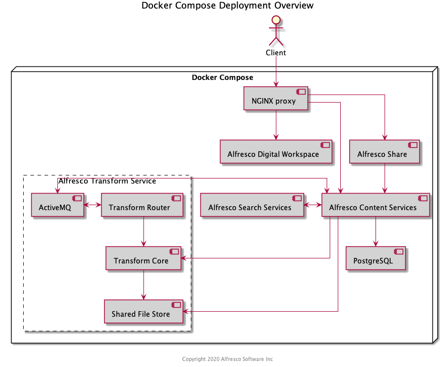

# Deploying Alfresco Content Services using Docker Compose

Use this information to quickly start up Alfresco Content Services (ACS) using Docker Compose.

## Prerequisites

To deploy Alfresco Content Services using _docker-compose_, you'll need to install the following software:

| Component      | Installation Guide |
| ---------------| ------------------ |
| Download Trial | [30-day trial](https://www.alfresco.com/platform/content-services-ecm/trial/download) for Enterprise |
| Docker         | https://docs.docker.com/ |
| Docker Compose | https://docs.docker.com/compose/install/ |

## Structure



## Deploying Alfresco Content Services
1. Clone this repository or download a single file - [docker-compose](../docker-compose/docker-compose.yml).
2. Navigate to the folder where the _docker-compose.yml_ file is located.
3. Log in to Quay.io with your credentials: ```docker login quay.io```
* Alfresco customers can request Quay.io credentials by logging a ticket with [Alfresco Support](https://support.alfresco.com/).
4. Run ```docker-compose up```
5. Navigate to the Admin Console and apply your license:
* [http://<machine_ip>:8080/alfresco/service/enterprise/admin/admin-license](http://localhost:8080/alfresco/service/enterprise/admin/admin-license) (```<machine_ip>``` will usually just be ```localhost```)
* Default username and password is ```admin```
* See [Uploading a new license](https://docs.alfresco.com/6.1/tasks/at-adminconsole-license.html) for more details
6. Open the following URLs in your browser to check that everything starts up:
* Administration and REST APIs: [http://<machine_ip>:8080/alfresco](http://localhost:8080/alfresco)
* Alfresco Digital Workspace: [http://<machine_ip>:8080/workspace](http://localhost:8080/workspace)
* Share: [http://<machine_ip>:8080/share](http://localhost:8080/share)
* Search administration: [http://<machine_ip>:8083/solr](http://localhost:8083/solr)

**Note:**
* Make sure that exposed ports are open on your host. Check the _docker-compose.yml_ file to determine the exposed ports - refer to the ```host:container``` port definitions. You'll see they include 5432, 8080, 8083 and others.
* If Docker is running on your local machine, the IP address will be just _localhost_.
* If you're using the [Docker Toolbox](https://docs.docker.com/toolbox/toolbox_install_windows), run the following command to find the IP address:
```bash
docker-machine ip
```
* If you run ```docker-compose up``` after deleting a previous Docker Compose cluster, then replace step 4 with the following command:
```bash
docker-compose down && docker-compose build --no-cache && docker-compose up
```
