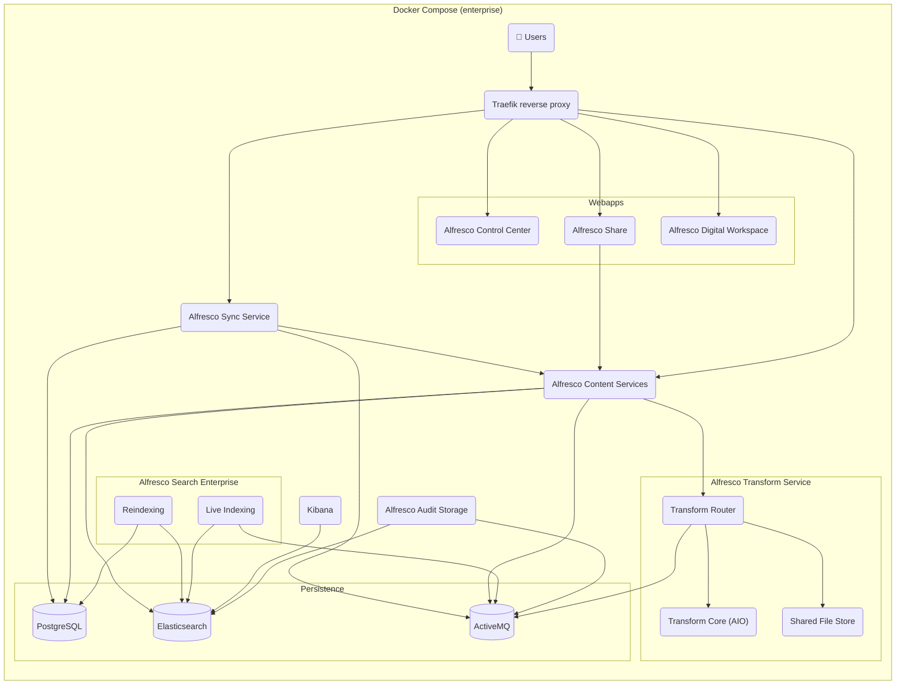
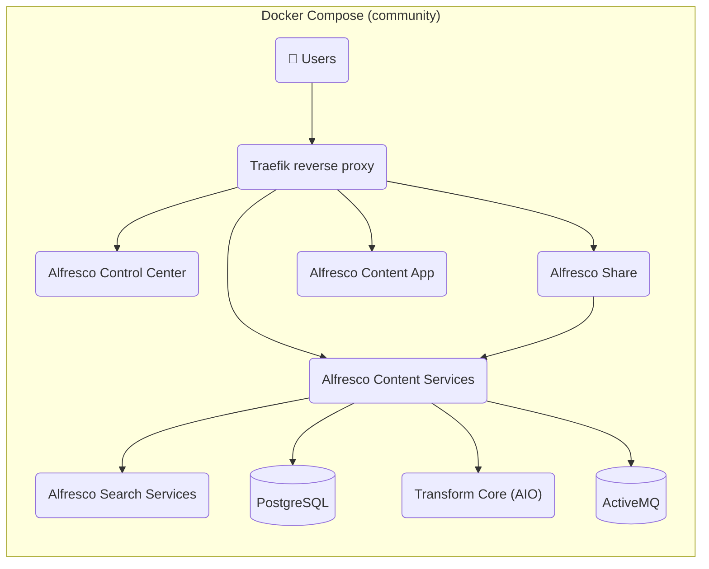
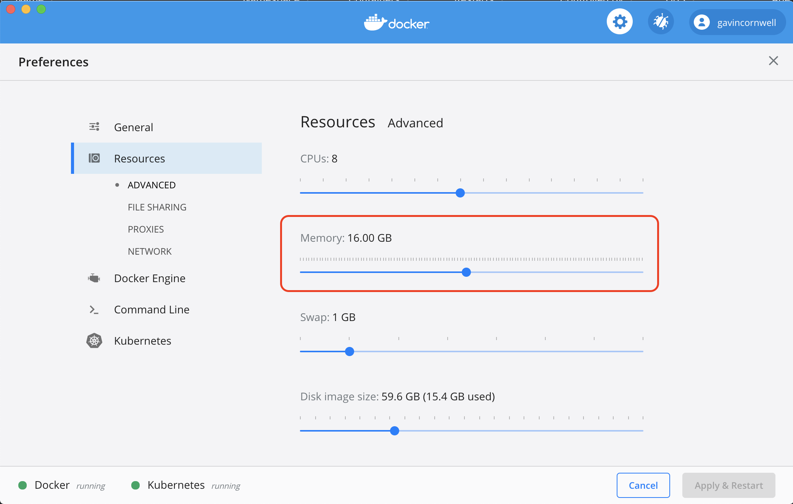

# Alfresco Content Services Docker Compose Deployment

This page describes how to quickly deploy Alfresco Content Services (ACS) using
Docker Compose.

## Architectures

### Enterprise edition

Using one of the Enterprise compose files will deploy the following system:



### Community edition

Using the Community compose file will deploy the following system:



## Considerations

The Docker Compose files are provided to easy spin up ACS environments. It is
suited for test or demo environment but certainly not ready for production use.

## Prerequisites

As well as the prerequisites mentioned on the [main README](../index.md#prerequisites) you will need a machine with at least 13GB of
free memory and the following software installed:

* [Docker](https://www.docker.com/products/docker-desktop)
* [Docker Compose](https://docs.docker.com/compose/install)

## Configure Docker for Desktop

In order to deploy onto Docker for Desktop we need to allocate at least 16Gb to
the Docker engine on the "Resources" tab in Docker for Desktop's preferences
pane as shown in the screenshot below.
This is required because insufficient memory will cause containers to exit
without warning (the very minimum is 13GB but 16 brings some freedom to your
Docker Daemon).



## Deploy

1. Clone this repository or download the repository zip archive from
   [here](https://github.com/Alfresco/acs-deployment)

2. Enter the `docker-compose` directory:
  
   ```bash
   cd docker-compose
   ```

3. If you want to run one of the Enteprise editions, log in to Quay.io with your credentials:
  
   ```bash
   docker login quay.io
   ```
  
4. Run `docker compose up` to spin up latest Enterprise edition
  
   ```bash
   docker compose up -d
   ```
  
   or provide an alternate compose config, e.g. to spin up the Community edition:
  
   ```bash
   docker compose -f community-compose.yaml up -d
   ```

   or to spin up a specific version of the Enterprise edition:
  
   ```bash
    docker compose -f 7.4.N-compose.yaml up -d
    ```

    or to spin up the pre-release version of the Enterprise edition:

    ```bash
    docker compose -f pre-release-compose.yaml up -d
    ```
  
   This will download the required Docker images and start the containers. The
   first time you run this command it will take a while to download the images.

5. Once the containers are up and running you can access the following services:
   * Administration and REST APIs: `http://localhost:8080/alfresco`
   * Control Center: `http://localhost:8080/control-center` (`http://localhost:8080/admin` still works but is deprecated)
   * Alfresco Digital Workspace: `http://localhost:8080/workspace`
   * Share: `http://localhost:8080/share`
   * Search administration: `http://localhost:8083/solr` (for community and older enterprise versions)

6. If you requested an extended trial license navigate to the Admin Console and
   apply your license:
   * `http://localhost:8080/alfresco/service/enterprise/admin/admin-license`
   * Default username and password is `admin`
   * See [Alfresco Products Official Documentation][alfresco-docs-site]
     for more details

## Stop and cleanup

To bring the system down and cleanup the containers run the following command:

```bash
docker compose -f compose.yaml down
```

This will stop, remove containers and lose any data. If you want to just stop
the containers without removing them, you can use the `stop`/`start` command:

```bash
docker compose -f compose.yaml stop
```

If you want to recover some space from previously run containers, you can use:

```sh
docker volume prune
```

## Additional deployment options

### Enabling Knowledge Retrieval with ACS

To enable ACS with Knowledge Retrieval, apply the `hxi-overrides.yaml` file.
Before doing so, you must build a repository image that includes the HXI
extension.

For detailed instructions, refer to the
[alfresco-dockerfiles-bakery](https://github.com/Alfresco/alfresco-dockerfiles-bakery)
repository, particularly the [simple_modules section](https://github.com/Alfresco/alfresco-dockerfiles-bakery/tree/main/repository/simple_modules).

**Important Notes:**

* Ensure that the versions of the repository extension and the live ingester
  images match.
* In the `hxi-overrides.yaml` file, configure the credentials for your Knowledge
  Retrieval service.
* These same credentials must also be added to the repository properties using
  the `-Dhxi` prefix.

Once configured, you can run and verify the installation with the following
command:

```bash
docker compose -f compose.yaml -f hxi-overrides.yaml up -d
```

### Running Only the Live Ingester with an Existing Repository

If you want to run **only the Live Ingester** with an already running repository
instance, follow these steps:

* Remove the `alfresco` service from the `hxi-overrides.yaml` file to
  prevent it from starting a new repository container.
* Update the environment variables in the `knowledge-retrieval` service to
  point to the correct ActiveMQ and Shared File Store services:

```yaml
SPRING_ACTIVEMQ_BROKERURL: failover:(nio://activemq:61616)?timeout=3000&jms.useCompression=true
ALFRESCO_TRANSFORM_SHAREDFILESTORE_BASEURL: http://shared-file-store:8099
```

* If ActiveMQ requires authentication, also set:

```yaml
SPRING_ACTIVEMQ_USER: admin
SPRING_ACTIVEMQ_PASSWORD: admin
```

* **Map the Live Ingester settings to repository Java properties**:  
  For the Live Ingester to properly connect and authenticate, the repository
  must include equivalent settings using the `-Dhxi` prefix in `JAVA_OPTS`.
  Here's how the mapping works:

| Live Ingester Env Variable                        | Repository `JAVA_OPTS` Property                              |
|---------------------------------------------------|--------------------------------------------------------------|
| `AUTH_PROVIDERS_HYLANDEXPERIENCE_TOKENURI`        | `-Dhxi.auth.providers.hyland-experience.token-uri`           |
| `AUTH_PROVIDERS_HYLANDEXPERIENCE_CLIENTID`        | `-Dhxi.auth.providers.hyland-experience.client-id`           |
| `AUTH_PROVIDERS_HYLANDEXPERIENCE_CLIENTSECRET`    | `-Dhxi.auth.providers.hyland-experience.client-secret`       |
| `AUTH_PROVIDERS_HYLANDEXPERIENCE_ENVIRONMENTKEY`  | `-Dhxi.auth.providers.hyland-experience.environment-key`     |
| `APPLICATION_SOURCEID`                            | `-Dhxi.connector.source-id`                                  |
| `HYLANDEXPERIENCE_INSIGHT_INGESTION_BASEURL`      | *(No equivalent needed)*                                     |
| *(not directly in ingester)*                      | `-Dhxi.discovery.base-url`                                   |
| *(not directly in ingester)*                      | `-Dhxi.knowledge-retrieval.url`                              |

* Run the compose

```bash
docker compose -f hxi-overrides.yaml up -d
```

Ensure these `-Dhxi` values are defined in the `JAVA_OPTS` section of the repository service.

### Switching to previous solr search engine

Alfresco comes either with Solr or Elasticsearch as a Full Text Search engine.
By default ACS enterprise flavor 23 and above are shipped with Elasticsearch.
Versions 7.x enterprise and all Community versions are shipped with Solr.

It is still possible to use Solr on the latest Enterprise
versions by using the `solr6-overrides.yaml` file:

```bash
docker compose -f compose.yaml -f solr6-override-docker-compose.yml up -d
```

### Troubleshooting Search Enterprise

Make sure that exposed ports are open on your host. Check the
`compose.yaml` file to determine the exposed ports - refer to the
`host:container` port definitions. You'll see they include 5432, 8080, 8083 and
others.

If Docker is running on your local machine, the IP address will be just
*localhost*.

## Configure

The provided Docker compose file provides some default configuration, the
sections below show the full set of environment variables exposed by each of
the containers in the deployment.

### Set max upload size

The default maximum upload size is 5GB provided the upload do not last more than
20 minutes. This restriction applies to the Alfresco repository APIs, Share and
Alfresco Sync Service. Trying to upload files which do not conform to these
limits will result in errors such as HTTP 413 (Request Entity Too Large) or HTTP
504 (Gateway Timeout).

To change this behavior, you need to set to different values for:

* `entrypoints.web.transport.respondingTimeouts.readTimeout` in the
  as a command argument in `.services.proxy.command`. Check the
  [Traefik documentation](https://doc.traefik.io/traefik/routing/entrypoints/#respondingtimeouts)
  for more information.
* each `traefik.http.middlewares.limit.buffering.maxRequestBodyBytes` label
  of each service where the restriction applies: `.services.alfresco`,
  `.services.share` & `.services.sync-service`.

> Setting these values to 0 to disable limits is not a good idea.

### Alfresco Content Repository (alfresco)

| Property          | Description                                                                                                                                                                                                                                                                                                                                                                         | Default value |
|-------------------|-------------------------------------------------------------------------------------------------------------------------------------------------------------------------------------------------------------------------------------------------------------------------------------------------------------------------------------------------------------------------------------|---------------|
| JAVA_TOOL_OPTIONS | Adding this environment variable, allows to set sensitive values (like passwords) that are not passed as arguments to the Java Process.                                                                                                                                                                                                                                           |               |
| JAVA_OPTS         | A set of properties that are picked up by the JVM inside the container. Any ACS property can be passed to the container using the following format `"-Dproperty=value"` (e.g. `-Ddb.driver=org.postgresql.Driver`). | |

### Alfresco Share (share)

| Property            | Description                                                            | Default value |
|---------------------|------------------------------------------------------------------------|---------------|
| JAVA_OPTS           | A set of properties that are picked up by the JVM inside the container |               |
| REPO_HOST           | Share needs to know how to register itself with Alfresco               | localhost     |
| REPO_PORT           | Share needs to know how to register itself with Alfresco               | 8080          |
| CSRF_FILTER_REFERER | CSRF Referrer                                                          |               |
| CSRF_FILTER_ORIGIN  | CSRF Origin                                                            |               |
| USE_SSL             | Enables ssl use if set to `"true"`                                     | `false`       |

```yml
share:
   image: quay.io/alfresco/alfresco-share:23.1.1
      mem_limit: 1g
      environment:
         REPO_HOST: "alfresco"
         REPO_PORT: "8080"
         USE_SSL: "true"
         JAVA_OPTS: "
            -XX:MinRAMPercentage=50
            -XX:MaxRAMPercentage=80
            -Dalfresco.host=localhost
            -Dalfresco.port=8080
            -Dalfresco.context=alfresco
            -Dalfresco.protocol=http
            "
```

### Alfresco Digital Workspace (digital-workspace)

| Property                                     | Description                                                                                            | Default value           |
|----------------------------------------------|--------------------------------------------------------------------------------------------------------|-------------------------|
| BASE_PATH                                    |                                                                                                        | `./`                    |
| APP_CONFIG_OAUTH2_HOST                       | The address of the Identity Service including the realm name configured.                               |                         |
| APP_CONFIG_AUTH_TYPE                         | The authentication type. To use Single Sign-on mode you must change this property to OAUTH.            | BASIC                   |
| APP_CONFIG_OAUTH2_CLIENTID                   | The name of the client configured for Digital Workspace                                                |                         |
| APP_CONFIG_OAUTH2_REDIRECT_SILENT_IFRAME_URI | The address that Digital Workspace uses to refresh authorization tokens.                               |                         |
| APP_CONFIG_OAUTH2_REDIRECT_LOGIN             | The URL to redirect to after a user is successfully authenticated                                      |                         |
| APP_CONFIG_OAUTH2_REDIRECT_LOGOUT            | The URL to redirect to after a user successfully signs out                                             |                         |
| APP_BASE_SHARE_URL                           | Base Share URL. e.g. `'{protocol}//{hostname}{:port}/workspace/#/preview/s'`                           |                         |
| AUTH_TYPE                                    | The authentication type. To use Single Sign-on mode you must change this property to OAUTH.            | BASIC                   |
| PROVIDER                                     |                                                                                                        | ALL                     |
| ENVIRONMENT_SUFFIX                           | Only for Process Cloud instance                                                                        | `_CLOUD`                |
| API_HOST                                     |                                                                                                        |                         |
| API_CONTENT_HOST                             |                                                                                                        |                         |
| API_CONTENT_HOST_LOCAL                       |                                                                                                        | `http://localhost:8080` |
| API_PROCESS_HOST                             |                                                                                                        |                         |
| OAUTH_HOST                                   |                                                                                                        |                         |
| IDENTITY_HOST                                | The address of the Identity Service including the realm name configured.                               |                         |
| E2E_HOST                                     |                                                                                                        | `http://localhost`      |
| E2E_PORT                                     |                                                                                                        | 80                      |
| API_HOST_CLOUD                               |                                                                                                        |                         |
| API_CONTENT_HOST_CLOUD                       |                                                                                                        |                         |
| API_PROCESS_HOST_CLOUD                       |                                                                                                        |                         |
| OAUTH_HOST_CLOUD                             |                                                                                                        |                         |
| IDENTITY_HOST_CLOUD                          |                                                                                                        |                         |
| E2E_HOST_CLOUD                               |                                                                                                        | `http://localhost`      |
| E2E_PORT_CLOUD                               |                                                                                                        | 4200                    |
| APP_CONFIG_APPS_DEPLOYED                     | The name of the application deployed (e.g. `"[{"name": "\<the name of the application deployed\>"}]"`) |                         |

### Alfresco Content App (content-app)

| Property                                     | Description                                                                                 | Default value                                            |
|----------------------------------------------|---------------------------------------------------------------------------------------------|----------------------------------------------------------|
| BASE_PATH                                    |                                                                                             | `./`                                                     |
| APP_CONFIG_PROVIDER                          | BPM/ECM/ALL                                                                                 | ECM                                                      |
| APP_CONFIG_AUTH_TYPE                         | The authentication type. To use Single Sign-on mode you must change this property to OAUTH. | BASIC                                                    |
| APP_CONFIG_BPM_HOST                          | BPM Host address                                                                            | {protocol}//{hostname}{:port}                            |
| APP_CONFIG_ECM_HOST                          | ECM Host address                                                                            | {protocol}//{hostname}{:port}                            |
| APP_CONFIG_IDENTITY_HOST                     |                                                                                             |                                                          |
| APP_CONFIG_OAUTH2_HOST                       | The address of the Identity Service including the realm name configured.                    | {protocol}//{hostname}{:port}/auth/realms/alfresco       |
| APP_CONFIG_OAUTH2_CLIENTID                   | The name of the client configured for Content App                                           | alfresco                                                 |
| APP_CONFIG_OAUTH2_IMPLICIT_FLOW              |                                                                                             | true                                                     |
| APP_CONFIG_OAUTH2_SILENT_LOGIN               |                                                                                             | true                                                     |
| APP_CONFIG_OAUTH2_REDIRECT_SILENT_IFRAME_URI | The address that Content App uses to refresh authorization tokens.                          | {protocol}//{hostname}{:port}/assets/silent-refresh.html |
| APP_CONFIG_OAUTH2_REDIRECT_LOGIN             | The URL to redirect to after a user is successfully authenticated                           | `./`                                                     |
| APP_CONFIG_OAUTH2_REDIRECT_LOGOUT            | The URL to redirect to after a user successfully signs out                                  | `./`                                                     |
| APP_BASE_SHARE_URL                           | Base Share URL e.g. `'{protocol}//{hostname}{:port}/aca/#/preview/s'`                       | ${APP_CONFIG_ECM_HOST}/#/preview/s                       |
| APP_CONFIG_PLUGIN_AOS                        | Enable AOS plugin                                                                           | true                                                     |
| APP_CONFIG_PLUGIN_CONTENT_SERVICE            | Enable Content Service plugin                                                               | true                                                     |
| APP_EXTENSIONS_IGNORE_REFS                   | Plugins references to exclude                                                               |                                                          |

### Control Center (control-center)

| Property             | Description                                                                                 | Default value |
|----------------------|---------------------------------------------------------------------------------------------|---------------|
| BASE_PATH            |                                                                                             | `./`          |
| APP_CONFIG_AUTH_TYPE | The authentication type. To use Single Sign-on mode you must change this property to OAUTH. | BASIC         |
| APP_CONFIG_PROVIDER  | config provider                                                                             | ECM           |

### Alfresco Search Enterprise (elasticsearch)

| Property                                             | Description                                                                       | Default value                                                                       |
|------------------------------------------------------|-----------------------------------------------------------------------------------|-------------------------------------------------------------------------------------|
| ALFRESCO_ACCEPTED_CONTENT_MEDIA_TYPES_CACHE_BASE_URL | URL where to fetch supported media type (typically t-router URL)                  | `http://transform-core-aio:8090/transform/config`                                   |
| ALFRESCO_SHAREDFILESTORE_BASEURL                     | URL where to fetch renditions from (typically the shared filestore URL)           | `http://shared-file-store:8099/alfresco/api/-default-/private/sfs/versions/1/file/` |
| SPRING_ACTIVEMQ_BROKERURL                            | URL of the ACTIVEMQ message broker                                                | `nio://activemq:61616`                                                              |
| SPRING_ELASTICSEARCH_REST_URIS                       | URL of the Elastisearch REST API                                                  | `http://elasticsearch:9200`                                                         |
| SPRING_DATASOURCE_URL (reindexing only)              | JDBC URL of the repository database                                               | `jdbc:postgresql://postgres:5432/alfresco`                                          |
| SPRING_DATASOURCE_USERNAME (reindexing only)         | Username to authenticate to the repository database                               | `alfresco`                                                                          |
| SPRING_DATASOURCE_PASSWORD (reindexing only)         | Password to authenticate to the repository database                               | `alfresco`                                                                          |

### Alfresco Search Services (solr6)

| Property                      | Description                                                                                                                                                                                                                                  | Default value    |
|-------------------------------|----------------------------------------------------------------------------------------------------------------------------------------------------------------------------------------------------------------------------------------------|------------------|
| SOLR_ALFRESCO_HOST            | Solr needs to know how to register itself with Alfresco                                                                                                                                                                                      | alfresco         |
| SOLR_ALFRESCO_PORT            | Solr needs to know how to register itself with Alfresco                                                                                                                                                                                      | 8080             |
| SOLR_SOLR_HOST                | Alfresco needs to know how to call solr                                                                                                                                                                                                      | solr6            |
| SOLR_SOLR_PORT                | Alfresco needs to know how to call solr                                                                                                                                                                                                      | 8983             |
| SOLR_CREATE_ALFRESCO_DEFAULTS | Create the default alfresco and archive cores                                                                                                                                                                                                | alfresco,archive |
| SOLR_OPTS                     | Options to pass when starting the Java process.                                                                                                                                                                                              |                  |
| SOLR_HEAP                     | The Java heap assigned to Solr.                                                                                                                                                                                                              | 2g               |
| SOLR_JAVA_MEM                 | The exact memory settings for Solr. Note that SOLR_HEAP takes precedence over this.                                                                                                                                                          | -Xms2g -Xmx2g    |
| MAX_SOLR_RAM_PERCENTAGE       | The percentage of available memory (an integer value) to assign to Solr. Note that SOLR_HEAP and SOLR_JAVA_MEM take precedence over this.                                                                                                    | 2                |
| SEARCH_LOG_LEVEL              | The root logger level (`ERROR`, `WARN`, `INFO`, `DEBUG` or `TRACE`).                                                                                                                                                                         | INFO             |
| ENABLE_SPELLCHECK             | Whether spellchecking is enabled or not (`true` or `false`).                                                                                                                                                                                 |                  |
| DISABLE_CASCADE_TRACKING      | Whether cascade tracking is enabled or not (`true` or `false`). Disabling cascade tracking will improve performance, but result in some feature loss (e.g. path queries).                                                                    |                  |
| ALFRESCO_SECURE_COMMS         | Whether communication with the repository is secured (`https` or `none`). See this [page](https://github.com/Alfresco/SearchServices/blob/master/search-services/README.md) for more details.                                                 | none             |
| SOLR_SSL_KEY_STORE            | Path to SSL key store. See this [page](https://github.com/Alfresco/SearchServices/blob/master/search-services/README.md) for more details.                                      |                  |
| SOLR_SSL_KEY_STORE_PASSWORD   | Password for key store. See this [page](https://github.com/Alfresco/SearchServices/blob/master/search-services/README.md) for more details.                                     |                  |
| SOLR_SSL_KEY_STORE_TYPE       | Key store type. See this [page](https://github.com/Alfresco/SearchServices/blob/master/search-services/README.md) for more details.                                             | JCEKS            |
| SOLR_SSL_TRUST_STORE          | Path to SSL trust store. See this [page](https://github.com/Alfresco/SearchServices/blob/master/search-services/README.md) for more details.                                    |                  |
| SOLR_SSL_TRUST_STORE_PASSWORD | Password for trust store. See this [page](https://github.com/Alfresco/SearchServices/blob/master/search-services/README.md) for more details.                                   |                  |
| SOLR_SSL_TRUST_STORE_TYPE     | Trust store type. See this [page](https://github.com/Alfresco/SearchServices/blob/master/search-services/README.md) for more details.                                           | JCEKS            |
| SOLR_SSL_NEED_CLIENT_AUTH     | This variable is used to configure SSL (`true` or `false`). See this [page](https://github.com/Alfresco/SearchServices/blob/master/search-services/README.md) for more details. |                  |
| SOLR_SSL_WANT_CLIENT_AUTH     | This variable is used to configure SSL (`true` or `false`). See this [page](https://github.com/Alfresco/SearchServices/blob/master/search-services/README.md) for more details. |                  |

### Alfresco Transform Router (transform-router)

| Property                         | Description                                                            | Default value                                           |
|----------------------------------|------------------------------------------------------------------------|---------------------------------------------------------|
| JAVA_OPTS                        | A set of properties that are picked up by the JVM inside the container |                                                         |
| ACTIVEMQ_URL                     | ActiveMQ URL (in this case the name of the container is used)          | `nio://activemq:61616`                                  |
| ACTIVEMQ_USER                    | ActiveMQ user                                                          | admin                                                   |
| ACTIVEMQ_PASSWORD                | ActiveMQ password                                                      | admin                                                   |
| TRANSFORM_REQUEST_QUEUE          |                                                                        | org.alfresco.transform.t-request.acs                    |
| TRANSFORM_REPLY_QUEUE            |                                                                        | org.alfresco.transform.t-reply.acs                      |
| TRANSFORM_ENGINE_REPLY_QUEUE     |                                                                        | org.alfresco.transform.engine.t-reply.acs               |
| JMS_LISTENER_CONCURRENCY         |                                                                        | 1-10                                                    |
| IMAGEMAGICK_URL                  | URL for the ImageMagick T-Engine                                       |                                                         |
| PDF_RENDERER_URL                 | URL for the PDF Renderer T-Engine                                      |                                                         |
| LIBREOFFICE_URL                  | URL for the LibreOffice T-Engine                                       |                                                         |
| TIKA_URL                         | URL for the Tika T-Engine                                              |                                                         |
| MISC_URL                         | URL for the Miscellaneous T-Engine                                     |                                                         |
| CORE_AIO_URL                     | URL for the All-In-One T-Engine                                        |                                                         |
| FILE_STORE_URL                   | URL for the Shared File Store                                          |                                                         |
| IMAGEMAGICK_QUEUE                | Name of the queue used by the ImageMagick T-Engine                     | org.alfresco.transform.engine.imagemagick.acs           |
| PDF_RENDERER_QUEUE               | Name of the queue used by the PDF Renderer T-Engine                    | org.alfresco.transform.engine.alfresco-pdf-renderer.acs |
| LIBREOFFICE_QUEUE                | Name of the queue used by the LibreOffice T-Engine                     | org.alfresco.transform.engine.libreoffice.acs           |
| TIKA_QUEUE                       | Name of the queue used by the Tika T-Engine                            | org.alfresco.transform.engine.tika.acs                  |
| MISC_QUEUE                       | Name of the queue used by the Miscellaneous T-Engine                   | org.alfresco.transform.engine.misc.acs                  |
| CORE_AIO_QUEUE                   | Name of the queue used by the All-In-One T-Engine                      | org.alfresco.transform.engine.aio.acs                   |
| TRANSFORMER_ENGINE_PROTOCOL      | This value can be one of the following (http, jms)                     | jms                                                     |
| TRANSFORMER_ROUTES_FILE_LOCATION |                                                                        | transformer-pipelines.json                              |
| MAX_TRANSFORM_RETRIES            |                                                                        | 3                                                       |
| INITIAL_RETRY_TIMEOUT            |                                                                        | 10000                                                   |
| INCREASE_RETRY_TIMEOUT           |                                                                        | 10000                                                   |
| MAX_IN_MEMORY_SIZE               | Double default limit to 512KiB                                         | 524288                                                  |
| HOSTNAME                         |                                                                        | t-router                                                |

### Alfresco Transform Core AIO (transform-core-aio)

| Property                       | Description                                                            | Default value                         |
|--------------------------------|------------------------------------------------------------------------|---------------------------------------|
| JAVA_OPTS                      | A set of properties that are picked up by the JVM inside the container |                                       |
| ACTIVEMQ_URL                   | ActiveMQ URL (in this case the name of the container is used)          |                                       |
| FILE_STORE_URL                 | Shared file store URL (in this case the name of the container is used) |                                       |
| TRANSFORM_ENGINE_REQUEST_QUEUE | Name of the queue                                                      | org.alfresco.transform.engine.aio.acs |
| PDFRENDERER_EXE                | Location of the PDF Renderer binary                                    | `/usr/bin/alfresco-pdf-renderer`      |
| LIBREOFFICE_HOME               | Location of the LibreOffice installation                               | `/opt/libreoffice6.3`                 |
| IMAGEMAGICK_ROOT               | Location of the ImagMagick installation                                | `/usr/lib64/ImageMagick-7.0.10`       |
| IMAGEMAGICK_DYN                | Location of the ImageMagick dynamic libraries                          | `/usr/lib64/ImageMagick-7.0.10/lib`   |
| IMAGEMAGICK_EXE                | Location of the ImageMagick binary                                     | `/usr/bin/convert`                    |
| IMAGEMAGICK_CODERS             | Location of the ImageMagick coders folder                              |                                       |
| IMAGEMAGICK_CONFIG             | Location of the ImageMagick configuration folder                       |                                       |

### Alfresco Shared File Store (shared-file-store

| Property                     | Description                                                            | Default value         |
|------------------------------|------------------------------------------------------------------------|-----------------------|
| JAVA_OPTS                    | A set of properties that are picked up by the JVM inside the container |                       |
| fileStorePath                | Shared File Store content storing path                                 | `/tmp/Alfresco`       |
| scheduler.contract.path      | Cleanup Scheduler contract path                                        | `/tmp/scheduler.json` |
| scheduler.content.age.millis | Content retention period                                               | 86400000              |
| scheduler.cleanup.interval   | Cleanup Scheduler interval                                             | 86400000              |

### Alfresco Sync Service (sync-service)

| Property  | Description                                                                                                                                                                                                                                                                                                                                                                                                                    | Default value |
|-----------|--------------------------------------------------------------------------------------------------------------------------------------------------------------------------------------------------------------------------------------------------------------------------------------------------------------------------------------------------------------------------------------------------------------------------------|---------------|
| JAVA_OPTS | A set of properties that are picked up by the JVM inside the container. Any Sync Service property can be passed to the container using the following format `"-Dproperty=value"` (e.g. `-Dsql.db.username=alfresco`) . For a complete list of properties that can be passed through JAVA_OPTS enviroment variable, please check the [documentation][alfresco-docs-site] |               |

### Alfresco Proxy (proxy)

Traefik is a modern HTTP reverse proxy and load balancer that makes deploying
microservices easy. In particular it makes dynamic configuration easy and
integrates with docker compose using
[labels](https://docs.docker.com/reference/compose-file/deploy/#labels).

Please refer to Traefik documentation for more information on how to configure
it:

* [Traefik routers](https://doc.traefik.io/traefik/routing/routers/)
* [Traefik services](https://doc.traefik.io/traefik/routing/services/)
* [Traefik middlewares](https://doc.traefik.io/traefik/middlewares/overview/)
* [Traefik TLS](https://doc.traefik.io/traefik/https/tls/)

In particular you may want to tweak the max file upload settings. This is
handled by the Traefik routing & buffering middleware. Check out
[maxRequestBodyBytes](https://doc.traefik.io/traefik/middlewares/http/buffering/#maxrequestbodybytes)
and [readTimeouts](https://doc.traefik.io/traefik/routing/entrypoints/#respondingtimeouts)
for details and amend compose services labels accordingly to your needs (these
labels are used in alfresco & share services).

## Customise

To customise the Docker Compose deployment, for example applying AMPs, we recommend following the best practice of creating your own custom Docker image(s). The [Customisation Guide](./examples/customisation-guidelines.md) walks you through this process.

## Troubleshooting

If you have issues running `docker compose up` after deleting a previous Docker Compose cluster, try replacing step 4 with the following command:

```bash
docker compose down && docker compose build --no-cache && docker compose up
```

If you are experiencing issues running `docker compose up` on Windows environments due to unavailable or reserved ports and get errors such as:

> bind: An attempt was made to access a socket in a way forbidden by its access permissions

would mean that Windows winnat service has reserved the port range that docker compose is trying to use. To remedy the issue execute the following in a terminal:

```bash
net stop winnat
docker compose up
net start winnat
```

## Reference

The list below shows the location of the publicly available `Dockerfile` for the containers used in the Community deployment.

* [alfresco](https://github.com/Alfresco/acs-packaging/blob/master/docker-alfresco/Dockerfile)
* [share](https://github.com/Alfresco/share/blob/master/packaging/docker/Dockerfile)
* [content-app](https://github.com/Alfresco/alfresco-content-app/blob/master/Dockerfile)
* [solr6](https://github.com/Alfresco/SearchServices/blob/master/search-services/packaging/src/docker/Dockerfile)
* [transform-core-aio](https://github.com/Alfresco/alfresco-transform-core/blob/master/engines/aio/Dockerfile)
* [activemq](https://github.com/Alfresco/alfresco-docker-activemq/blob/master/Dockerfile)

[alfresco-docs-site]: https://support.hyland.com/r/alfresco
