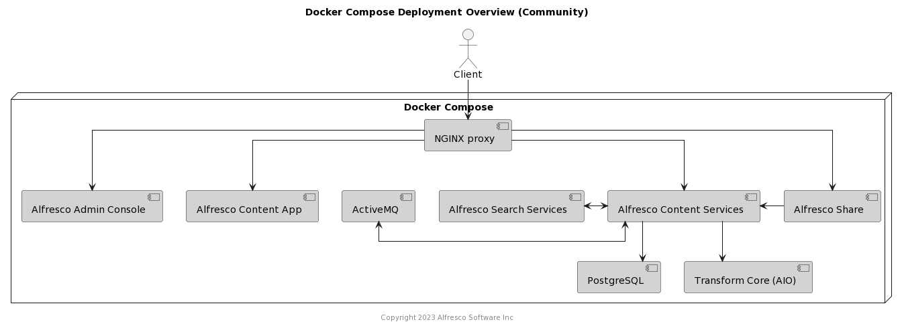

# Alfresco Content Services Docker Compose Deployment

This page describes how to quickly deploy Alfresco Content Services (ACS) using Docker Compose.

Using one of the Enterprise compose files will deploy the following system:


Using the Community compose file will deploy the following system:



## Considerations

The Docker Compose file is undergoing continual development and improvement, and should not be used "as is" for your production environments, but should help you save time and effort deploying Alfresco Content Services for your organisation.

## Prerequisites

As well as the prerequisites mentioned on the [main README](/README.md#prerequisites) you will need a machine with at least 13GB of memory and the following software installed:

* [Docker](https://www.docker.com/products/docker-desktop)
* [Docker Compose](https://docs.docker.com/compose/install)

## Configure Docker for Desktop

In order to deploy onto Docker for Desktop we need to allocate at least [13 Gb](../../docker-compose/docker-compose.yml) (preferably 16 Gb) to the Docker Engine on the "Resources" tab in Docker for Desktop's preferences pane as shown in the screenshot below. This is required because insufficient memory will cause containers to exit without warning. 


## Deploy

1. Clone this repository or download one of the docker compose files from [here](../../docker-compose)
2. Navigate to the folder where the docker compose file you want to use is located
3. Log in to Quay.io with your credentials: ```docker login quay.io``` (only required if you're running an Enterprise version)
4. Run ```docker-compose up``` to use the latest version of ACS Enterprise or ```docker-compose -f major.minor.N-docker-compose.yml up``` to use a specific version of ACS
5. Open the following URLs in your browser to check that everything starts up:
   * Administration and REST APIs: [http://<machine_ip>:8080/alfresco](http://localhost:8080/alfresco)
   * Alfresco Digital Workspace: [http://<machine_ip>:8080/workspace](http://localhost:8080/workspace)
   * Share: [http://<machine_ip>:8080/share](http://localhost:8080/share)
   * Search administration: [http://<machine_ip>:8083/solr](http://localhost:8083/solr)
6. If you requested an extended trial license navigate to the Admin Console and apply your license:
   * [http://<machine_ip>:8080/alfresco/service/enterprise/admin/admin-license](http://localhost:8080/alfresco/service/enterprise/admin/admin-license) (```<machine_ip>``` will usually just be ```localhost```)
   * Default username and password is ```admin```
   * See [Uploading a new license](https://docs.alfresco.com/6.1/tasks/at-adminconsole-license.html) for more details

### Notes

Make sure that exposed ports are open on your host. Check the _docker-compose.yml_ file to determine the exposed ports - refer to the ```host:container``` port definitions. You'll see they include 5432, 8080, 8083 and others.

If Docker is running on your local machine, the IP address will be just _localhost_.

If you're using the [Docker Toolbox](https://docs.docker.com/toolbox/toolbox_install_windows), run the following command to find the IP address:

```bash
docker-machine ip
```

## Configure

The provided Docker compose file provides some default configuration, the sections below show the full set of environment variables exposed by each of the containers in the deployment.

### Alfresco Content Repository (alfresco)

| Property | Description | Default value |
|----------|-------------|---------------|
| JAVA_TOOL_OPTIONS | Adding this environment variable, allows to set sensisitive values (like passwords) that are not passed as arguments to the Java Process. |  |
| JAVA_OPTS | A set of properties that are picked up by the JVM inside the container. Any ACS property can be passed to the container using the following format `"-Dproperty=value"` (e.g. `-Ddb.driver=org.postgresql.Driver`) . For a complete list of properties that can be passed through JAVA_OPTS enviroment variable, please check the [property reference](../properties-reference.md).  |  |

### Alfresco Share (share)

| Property | Description | Default value |
|----------|-------------|---------------|
| JAVA_OPTS | A set of properties that are picked up by the JVM inside the container |  |
| REPO_HOST | Share needs to know how to register itself with Alfresco | localhost |
| REPO_PORT | Share needs to know how to register itself with Alfresco | 8080 |
| CSRF_FILTER_REFERER | CSRF Referrer | |
| CSRF_FILTER_ORIGIN | CSRF Origin | |
| USE_SSL | Enables ssl use if set to `"true"` | `false` |

```yml
share:
   image: quay.io/alfresco/alfresco-share:7.1.0-M1
      mem_limit: 1g
      environment:
         REPO_HOST: "alfresco"
         REPO_PORT: "8080"
         USE_SSL: "true"
         JAVA_OPTS: "
            -XX:MinRAMPercentage=50
            -XX:MaxRAMPercentage=80
            -Dalfresco.host=localhost
            -Dalfresco.port=8080
            -Dalfresco.context=alfresco
            -Dalfresco.protocol=http
            "
```

### Alfresco Digital Workspace (digital-workspace)

| Property | Description | Default value |
|----------|-------------|---------------|
| BASE_PATH |  | `./` |
| APP_CONFIG_OAUTH2_HOST | The address of the Identity Service including the realm name configured. |  |
| APP_CONFIG_AUTH_TYPE | The authentication type. To use Single Sign-on mode you must change this property to OAUTH. | BASIC |
| APP_CONFIG_OAUTH2_CLIENTID | The name of the client configured for Digital Workspace |  |
| APP_CONFIG_OAUTH2_REDIRECT_SILENT_IFRAME_URI | The address that Digital Workspace uses to refresh authorization tokens. |  |
| APP_CONFIG_OAUTH2_REDIRECT_LOGIN | The URL to redirect to after a user is successfully authenticated |  |
| APP_CONFIG_OAUTH2_REDIRECT_LOGOUT | The URL to redirect to after a user successfully signs out |  |
| APP_BASE_SHARE_URL | Base Share URL. e.g. `'{protocol}//{hostname}{:port}/workspace/#/preview/s'` |   |
| AUTH_TYPE | The authentication type. To use Single Sign-on mode you must change this property to OAUTH. | BASIC |
| PROVIDER |  | ALL |
| ENVIRONMENT_SUFFIX | Only for Process Cloud instance | `_CLOUD` |
| API_HOST |  |  |
| API_CONTENT_HOST |  |  |
| API_CONTENT_HOST_LOCAL |  | `http://localhost:8080` |
| API_PROCESS_HOST |  |  |
| OAUTH_HOST |  |  |
| IDENTITY_HOST | The address of the Identity Service including the realm name configured. |  |
| E2E_HOST |  | `http://localhost` |
| E2E_PORT |  | 80 |
| API_HOST_CLOUD |  |  |
| API_CONTENT_HOST_CLOUD |  |  |
| API_PROCESS_HOST_CLOUD |  |  |
| OAUTH_HOST_CLOUD |  |  |
| IDENTITY_HOST_CLOUD |  |  |
| E2E_HOST_CLOUD |  | `http://localhost` |
| E2E_PORT_CLOUD |  | 4200 |
| APP_CONFIG_APPS_DEPLOYED | The name of the application deployed (e.g. `"[{"name": "\<the name of the application deployed\>"}]"`) |  |

### Alfresco Search Services (solr6)

| Property | Description | Default value |
|----------|-------------|---------------|
| SOLR_ALFRESCO_HOST | Solr needs to know how to register itself with Alfresco | alfresco |
| SOLR_ALFRESCO_PORT | Solr needs to know how to register itself with Alfresco | 8080 |
| SOLR_SOLR_HOST | Alfresco needs to know how to call solr | solr6 |
| SOLR_SOLR_PORT | Alfresco needs to know how to call solr | 8983 |
| SOLR_CREATE_ALFRESCO_DEFAULTS | Create the default alfresco and archive cores | alfresco,archive |
| SOLR_OPTS | Options to pass when starting the Java process. |  |
| SOLR_HEAP | The Java heap assigned to Solr. | 2g |
| SOLR_JAVA_MEM | The exact memory settings for Solr. Note that SOLR_HEAP takes precedence over this. | -Xms2g -Xmx2g |
| MAX_SOLR_RAM_PERCENTAGE | The percentage of available memory (an integer value) to assign to Solr. Note that SOLR_HEAP and SOLR_JAVA_MEM take precedence over this. | 2 |
| SEARCH_LOG_LEVEL | The root logger level (`ERROR`, `WARN`, `INFO`, `DEBUG` or `TRACE`). | INFO |
| ENABLE_SPELLCHECK | Whether spellchecking is enabled or not (`true` or `false`). |  |
| DISABLE_CASCADE_TRACKING | Whether cascade tracking is enabled or not (`true` or `false`). Disabling cascade tracking will improve performance, but result in some feature loss (e.g. path queries). |  |
| ALFRESCO_SECURE_COMMS | Whether communication with the repository is secured (`https` or `none`). See this [page](https://github.com/Alfresco/InsightEngine/blob/master/search-services/README.md) for more details. | none |
| SOLR_SSL_KEY_STORE | Path to SSL key store. See this [page](https://github.com/Alfresco/InsightEngine/blob/master/search-services/README.md#use-alfresco-search-services-docker-image-with-docker-compose) for more details. |  |
| SOLR_SSL_KEY_STORE_PASSWORD | Password for key store. See this [page](https://github.com/Alfresco/InsightEngine/blob/master/search-services/README.md#use-alfresco-search-services-docker-image-with-docker-compose) for more details. |  |
| SOLR_SSL_KEY_STORE_TYPE | Key store type. See this [page](https://github.com/Alfresco/InsightEngine/blob/master/search-services/README.md#use-alfresco-search-services-docker-image-with-docker-compose) for more details. | JCEKS |
| SOLR_SSL_TRUST_STORE | Path to SSL trust store. See this [page](https://github.com/Alfresco/InsightEngine/blob/master/search-services/README.md#use-alfresco-search-services-docker-image-with-docker-compose) for more details. |  |
| SOLR_SSL_TRUST_STORE_PASSWORD | Password for trust store. See this [page](https://github.com/Alfresco/InsightEngine/blob/master/search-services/README.md#use-alfresco-search-services-docker-image-with-docker-compose) for more details. |  |
| SOLR_SSL_TRUST_STORE_TYPE | Trust store type. See this [page](https://github.com/Alfresco/InsightEngine/blob/master/search-services/README.md#use-alfresco-search-services-docker-image-with-docker-compose) for more details. | JCEKS |
| SOLR_SSL_NEED_CLIENT_AUTH | This variable is used to configure SSL (`true` or `false`). See this [page](https://github.com/Alfresco/InsightEngine/blob/master/search-services/README.md#use-alfresco-search-services-docker-image-with-docker-compose) for more details. |  |
| SOLR_SSL_WANT_CLIENT_AUTH | This variable is used to configure SSL (`true` or `false`). See this [page](https://github.com/Alfresco/InsightEngine/blob/master/search-services/README.md#use-alfresco-search-services-docker-image-with-docker-compose) for more details. |  |

### Alfresco Transform Router (transform-router)

| Property | Description | Default value |
|----------|-------------|---------------|
| JAVA_OPTS | A set of properties that are picked up by the JVM inside the container |  |
| ACTIVEMQ_URL | ActiveMQ URL (in this case the name of the container is used) | `nio://activemq:61616` |
| ACTIVEMQ_USER | ActiveMQ user | admin |
| ACTIVEMQ_PASSWORD | ActiveMQ password | admin |
| TRANSFORM_REQUEST_QUEUE |  | org.alfresco.transform.t-request.acs |
| TRANSFORM_REPLY_QUEUE |  | org.alfresco.transform.t-reply.acs |
| TRANSFORM_ENGINE_REPLY_QUEUE |  | org.alfresco.transform.engine.t-reply.acs |
| JMS_LISTENER_CONCURRENCY |  | 1-10 |
| IMAGEMAGICK_URL | URL for the ImageMagick T-Engine |  |
| PDF_RENDERER_URL | URL for the PDF Renderer T-Engine |  |
| LIBREOFFICE_URL | URL for the LibreOffice T-Engine |  |
| TIKA_URL | URL for the Tika T-Engine |  |
| MISC_URL | URL for the Miscellaneous T-Engine |  |
| CORE_AIO_URL | URL for the All-In-One T-Engine | |
| FILE_STORE_URL | URL for the Shared File Store | |
| IMAGEMAGICK_QUEUE | Name of the queue used by the ImageMagick T-Engine | org.alfresco.transform.engine.imagemagick.acs |
| PDF_RENDERER_QUEUE | Name of the queue used by the PDF Renderer T-Engine | org.alfresco.transform.engine.alfresco-pdf-renderer.acs |
| LIBREOFFICE_QUEUE | Name of the queue used by the LibreOffice T-Engine | org.alfresco.transform.engine.libreoffice.acs |
| TIKA_QUEUE | Name of the queue used by the Tika T-Engine | org.alfresco.transform.engine.tika.acs |
| MISC_QUEUE | Name of the queue used by the Miscellaneous T-Engine | org.alfresco.transform.engine.misc.acs |
| CORE_AIO_QUEUE | Name of the queue used by the All-In-One T-Engine | org.alfresco.transform.engine.aio.acs |
| TRANSFORMER_ENGINE_PROTOCOL | This value can be one of the following (http, jms) | jms |
| TRANSFORMER_ROUTES_FILE_LOCATION |  | transformer-pipelines.json |
| MAX_TRANSFORM_RETRIES |  | 3 |
| INITIAL_RETRY_TIMEOUT |  | 10000 |
| INCREASE_RETRY_TIMEOUT |  | 10000 |
| MAX_IN_MEMORY_SIZE |  Double default limit to 512KiB | 524288 |
| HOSTNAME |  | t-router |

### Alfresco Transform Core AIO (transform-core-aio)

| Property | Description | Default value |
|----------|-------------|---------------|
| JAVA_OPTS | A set of properties that are picked up by the JVM inside the container |  |
| ACTIVEMQ_URL | ActiveMQ URL (in this case the name of the container is used) |  |
| FILE_STORE_URL | Shared file store URL (in this case the name of the container is used) |  |
| TRANSFORM_ENGINE_REQUEST_QUEUE | Name of the queue | org.alfresco.transform.engine.aio.acs |
| PDFRENDERER_EXE | Location of the PDF Renderer binary | `/usr/bin/alfresco-pdf-renderer` |
| LIBREOFFICE_HOME | Location of the LibreOffice installation | `/opt/libreoffice6.3` |
| IMAGEMAGICK_ROOT | Location of the ImagMagick installation | `/usr/lib64/ImageMagick-7.0.10` |
| IMAGEMAGICK_DYN | Location of the ImageMagick dynamic libraries | `/usr/lib64/ImageMagick-7.0.10/lib` |
| IMAGEMAGICK_EXE | Location of the ImageMagick binary | `/usr/bin/convert` |
| IMAGEMAGICK_CODERS | Location of the ImageMagick coders folder |  |
| IMAGEMAGICK_CONFIG | Location of the ImageMagick configuration folder |  |

### Alfresco Shared File Store (shared-file-store

| Property | Description | Default value |
|----------|-------------|---------------|
| JAVA_OPTS | A set of properties that are picked up by the JVM inside the container |  |
| fileStorePath | Shared File Store content storing path | `/tmp/Alfresco` |
| scheduler.contract.path | Cleanup Scheduler contract path | `/tmp/scheduler.json` |
| scheduler.content.age.millis | Content retention period | 86400000 |
| scheduler.cleanup.interval | Cleanup Scheduler interval | 86400000 |

### Alfresco Sync Service (sync-service)

| Property | Description | Default value |
|----------|-------------|---------------|
| JAVA_OPTS | A set of properties that are picked up by the JVM inside the container. Any Sync Service property can be passed to the container using the following format `"-Dproperty=value"` (e.g. `-Dsql.db.username=alfresco`) . For a complete list of properties that can be passed through JAVA_OPTS enviroment variable, please check the [documentation](https://docs.alfresco.com/syncservice/concepts/syncservice-configure.html) |  |

### Alfresco Proxy (proxy)

| Property | Description | Default value |
|----------|-------------|---------------|
| ADW_URL | Digital Workspace URL inside network. | `http://digital-workspace` |
| REPO_URL | Repository URL inside network. | `http://alfresco:8080` |
| SHARE_URL | Share URL inside network. | `http://share:8080` |
| SYNCSERVICE_URL | Sync service URL inside network. | `http://sync-service:9090` |
| ACCESS_LOG | Sets the `access_log` value. Set to `off` to switch off logging. | |
| USE_SSL | `false` | Enables ssl use if set to `"true"` |
| DOMAIN | Set domain value for ssl certificate | n/a |

If USE_SSL set to true provide ssl cert in ssl/cert.crt and ssl/cert.key

```yml
alfresco-proxy:
   image: alfresco/alfresco-acs-nginx:3.2.0
   depends_on:
      - alfresco
      - digital-workspace
   ports:
      - "443:443" # when USE_SSL="true"
#     - "8080:8080" # default
   links:
      - digital-workspace
      - alfresco
      - share
   volumes:
      - ${PWD}/ssl/:/etc/nginx/ssl/ # when USE_SSL="true"
   environment:
      USE_SSL: "true"
      DOMAIN: "domain.com" # when USE_SSL="true"
```

## Customise

To customise the Docker Compose deployment, for example applying AMPs, we recommend following the best practice of creating your own custom Docker image(s). The [Customisation Guide](./examples/customisation-guidelines.md) walks you through this process.

## Cleanup

To bring the system down and cleanup the containers run the following command:

```bash
docker-compose down
```

## Troubleshooting

If you have issues running ```docker-compose up``` after deleting a previous Docker Compose cluster, try replacing step 4 with the following command:

```bash
docker-compose down && docker-compose build --no-cache && docker-compose up
```

If you are experiencing issues running ```docker-compose up``` on Windows environments due to unavailable or reserved ports and get errors such as:
``` bind: An attempt was made to access a socket in a way forbidden by its access permissions``` would mean that Windows winnat service has reserved 
the port range that docker compose is trying to use. To remedy the issue execute the following in a terminal:

```bash
net stop winnat
docker-compose up
net start winnat
```

## Reference

The table below shows the location of the publicly available `Dockerfile` for the containers used in the Community deployment.

| Container | Dockerfile Location |
|----------|-------------|
| alfresco | https://github.com/Alfresco/acs-packaging/blob/master/docker-alfresco/Dockerfile |
| share | https://github.com/Alfresco/share/blob/master/packaging/docker/Dockerfile |
| solr6 | https://github.com/Alfresco/SearchServices/blob/master/search-services/packaging/src/docker/Dockerfile |
| <nobr>transform-core-aio</nobr> | https://github.com/Alfresco/alfresco-transform-core/blob/master/alfresco-transform-core-aio/alfresco-transform-core-aio-boot/Dockerfile |
| activemq | https://github.com/Alfresco/alfresco-docker-activemq/blob/master/Dockerfile |
| proxy | https://github.com/Alfresco/acs-ingress/blob/master/Dockerfile |
