# Alfresco Content Services Helm Deployment

Alfresco Content Services (ACS) is an Enterprise Content Management (ECM) system that is used for document and case management, project collaboration, web content publishing, and compliant records management.  The flexible compute, storage, and database services that Kubernetes offers make it an ideal platform for Alfresco Content Services. This helm chart presents an enterprise-grade Alfresco Content Services configuration that you can adapt to virtually any scenario with the ability to scale up, down or out, depending on your use case.

The Helm chart in this repository supports deploying the Enterprise or Community Edition of ACS.

## Architectures

### Enterprise edition

The Enterprise configuration will deploy the following system (Alfresco
Transform Service and Alfresco Search Enterprise are detailed in the next
diagrams):

```mermaid
graph LR

classDef alf fill:#0b0,color:#fff
classDef k8s fill:#326ce5,stroke:#326ce5,stroke-width:2px,color:#fff
classDef thrdP fill:#e098a6,color:#000

Client("👥 Clients")

subgraph Helm enterprise
  direction LR
  subgraph storage
    PersistentVolumeClaim_activemq-default-pvc(PersistentVolumeClaim: activemq-default-pvc):::k8s
    PersistentVolumeClaim_data-acs-postgresql(PersistentVolumeClaim: data-acs-postgresql):::k8s
    PersistentVolumeClaim_data-sync-postgresql(PersistentVolumeClaim: data-sync-postgresql):::k8s
    PersistentVolumeClaim_repository-default-pvc(PersistentVolumeClaim: repository-default-pvc):::k8s
    pv1[(Data Volume)]:::k8s
    pv2[(Data Volume)]:::k8s
    pv3[(Data Volume)]:::k8s
    pv4[(Data Volume)]:::k8s
  end
  subgraph workloads
    Deployment_activemq(Deployment: activemq):::thrdP
    Deployment_alfresco-cc(Deployment: alfresco-cc):::alf
    Deployment_alfresco-dw(Deployment: alfresco-dw):::alf
    Deployment_alfresco-repository(Deployment: alfresco-repository):::alf
    Deployment_alfresco-sync-service(Deployment: alfresco-sync-service):::alf
    Deployment_share(Deployment: share):::alf

    StatefulSet_elasticsearch-master(StatefulSet: elasticsearch-master):::thrdP
    StatefulSet_postgresql-sync(StatefulSet: postgresql-sync):::thrdP
    StatefulSet_postgresql-acs(StatefulSet: postgresql-acs):::thrdP
  end

  subgraph ingress
    Ingress_alfresco-cc(Ingress: alfresco-cc):::k8s
    Ingress_alfresco-dw(Ingress: alfresco-dw):::k8s
    Ingress_alfresco-repository(Ingress: alfresco-repository):::k8s
    Ingress_alfresco-sync-service(Ingress: alfresco-sync-service):::k8s
    Ingress_share(Ingress: share):::k8s
  end
end

Client ---> Ingress_alfresco-cc --> Deployment_alfresco-cc
Client ---> Ingress_alfresco-dw --> Deployment_alfresco-dw
Client --> Ingress_alfresco-repository --> Deployment_alfresco-repository
Client --> Ingress_share --> Deployment_share
Client --> Ingress_alfresco-sync-service --> Deployment_alfresco-sync-service

Deployment_share --> Deployment_alfresco-repository

Deployment_alfresco-repository --> StatefulSet_postgresql-acs --> PersistentVolumeClaim_data-acs-postgresql --> pv1
Deployment_alfresco-repository --> Deployment_activemq
Deployment_alfresco-repository --> StatefulSet_elasticsearch-master

Deployment_alfresco-sync-service --> StatefulSet_postgresql-sync --> PersistentVolumeClaim_data-sync-postgresql --> pv2
Deployment_alfresco-sync-service --> Deployment_activemq
Deployment_alfresco-sync-service --> Deployment_alfresco-repository

Deployment_alfresco-repository --> PersistentVolumeClaim_repository-default-pvc --> pv3
Deployment_activemq --> PersistentVolumeClaim_activemq-default-pvc --> pv4
```



#### Alfresco Transform Services


#### Search Enterprise


### Community edition

The Community configuration will deploy the following architecture:

```mermaid
graph LR

classDef alf fill:#0b0,color:#fff
classDef k8s fill:#326ce5,stroke:#326ce5,stroke-width:2px,color:#fff
classDef thrdP fill:#e098a6,color:#000

Client("👥 Clients")

subgraph Helm community
  subgraph storage
    PersistentVolumeClaim_activemq-default-pvc(PersistentVolumeClaim: activemq-default-pvc):::k8s
    PersistentVolumeClaim_repository-default-pvc(PersistentVolumeClaim: repository-default-pvc):::k8s
    PersistentVolumeClaim_solr-default-pvc(PersistentVolumeClaim: solr-default-pvc):::k8s
    PersistentVolumeClaim_data-acs-postgresql(PersistentVolumeClaim: data-acs-postgresql):::k8s
    pv1[(Data Volume)]:::k8s
    pv2[(Data Volume)]:::k8s
    pv3[(Data Volume)]:::k8s
    pv4[(Data Volume)]:::k8s
  end
  subgraph workloads
    Deployment_activemq(Deployment: activemq):::thrdP
    Deployment_alfresco-cc(Deployment: alfresco-cc):::alf
    Deployment_alfresco-repository(Deployment: alfresco-repository):::alf
    Deployment_solr(Deployment: solr):::alf
    Deployment_share(Deployment: share):::alf
    subgraph "Alfresco Transform Service"
      Deployment_imagemagick(Deployment: imagemagick):::alf
      Deployment_libreoffice(Deployment: libreoffice):::alf
      Deployment_pdfrenderer(Deployment: pdfrenderer):::alf
      Deployment_tika(Deployment: tika):::alf
      Deployment_transform-misc(Deployment: transform-misc):::alf
    end
    StatefulSet_postgresql-acs(StatefulSet: postgresql-acs):::thrdP
  end
  subgraph ingress
    Ingress_alfresco-cc(Ingress: alfresco-cc):::k8s
    Ingress_alfresco-repository(Ingress: alfresco-repository):::k8s
    Ingress_share(Ingress: share):::k8s
  end
end

Client ----> Ingress_alfresco-cc --> Deployment_alfresco-cc
Client --> Ingress_alfresco-repository --> Deployment_alfresco-repository
Client --> Ingress_share --> Deployment_share

Deployment_share --> Deployment_alfresco-repository

Deployment_alfresco-repository --> Deployment_solr
Deployment_alfresco-repository --> StatefulSet_postgresql-acs --> PersistentVolumeClaim_data-acs-postgresql --> pv1
Deployment_alfresco-repository --> Deployment_activemq
Deployment_alfresco-repository --> Deployment_imagemagick
Deployment_alfresco-repository --> Deployment_libreoffice
Deployment_alfresco-repository --> Deployment_pdfrenderer
Deployment_alfresco-repository --> Deployment_tika
Deployment_alfresco-repository --> Deployment_transform-misc

Deployment_alfresco-repository ---> PersistentVolumeClaim_repository-default-pvc --> pv2
Deployment_activemq --> PersistentVolumeClaim_activemq-default-pvc --> pv3
Deployment_solr --> PersistentVolumeClaim_solr-default-pvc --> pv4
```



## Overview

Alfresco provides tested Helm charts as a "template" to accelerate deployment
and configuration for customers who want to take advantage of Kubernetes
orchestration capabilities. Please remember that as stated in our [support
policies](https://docs.alfresco.com/support/latest/policies/deployment/),
similarly to other deployment artifacts, they are not meant to be used 'as-is'
in production. Our goal is to save you time and effort deploying Alfresco
Content Services for your organization.

## Using the Helm charts

Out of the box we provide a working ACS installation by configuring a PostgreSQL
database via [Bitnami charts][bitnami-repo] and an ActiveMQ message broker with
a simple [activemq subchart][activemq-readme], both with basic authentication
and without any kind of redundancy.

[activemq-readme]: https://github.com/Alfresco/alfresco-helm-charts/blob/main/charts/activemq/README.md
[bitnami-repo]: https://github.com/bitnami/charts

You typically want to disable the embedded postgres and activemq broker and
connect directly to managed instances of those services. Another typical change
would be the integration of your company-wide monitoring, logging and backup
solutions.

If you want to have additional JDBC drivers available or to extend the default
ACS functionalities, you are required to build [custom Docker
images][docker-customization], deploy them on a public/private registry and set
the appropriate values in the charts.

[docker-customization]: ../docker-compose/examples/customisation-guidelines.md

For example, you can override the ACS repository image by specifying in the
[values](../../helm/alfresco-content-services/README.md):

```yaml
repository:
  image:
    repository: registry.example.org/my-custom-alfresco-content-repository
    tag: 7.3.0
```

See the [registry authentication](registry-authentication.md) page to configure
credentials for your private registry.

Helm charts values contains secrets to be set. For deployment in sensitive
environments please see the [Security](security.md) page before proceeding with
the installation.

## Deploy

For the best results we recommend [deploying ACS to AWS EKS](./eks-deployment.md). If you have a machine with at least 16GB of memory
you can [deploy using Docker Desktop](./desktop-deployment.md) (or similar apps
like Rancher and Podman Desktop) or via [KinD](kind-deployment.md) which just
requires a working Docker install on any OS.

The recommended cluster resources for the Enterprise version with the components enabled by default are:
at least 3 nodes with 12 cpu cores and 32 GB of memory in total. You can install with lower
requirements by fine tuning the [resource requests](https://kubernetes.io/docs/concepts/configuration/manage-resources-containers/#resource-units-in-kubernetes)
available in the [values](https://github.com/Alfresco/acs-deployment/blob/master/helm/alfresco-content-services/values.yaml) for each component.

There are also several [examples](../helm-examples.md) showing how to deploy with various configurations:

* [Deploy with AWS Services (S3, RDS and MQ)](./examples/with-aws-services.md)
* [Deploy with Intelligence Services](./examples/with-ai.md)
* [Deploy with Microsoft 365 Connector (Office Online Integration)](./examples/with-ooi.md)
* [Deploy with external Keycloak SSO authentication](./examples/with-keycloak.md)
* [Deploy with external infrastructure components](./examples/with-external-infrastructure.md) (e.g. elasticsearch, activemq, postgres)
* [Enable access to Search Services](./examples/search-services.md#enable-alfresco-search-services-external-access)
* [Enable Email Services](https://alfresco.github.io/alfresco-helm-charts/charts/alfresco-repository/docs/email.html)
* [Use a custom metadata keystore](https://alfresco.github.io/alfresco-helm-charts/charts/alfresco-repository/docs/keystores.html)
* [Install ACS license as part of the deployment](https://alfresco.github.io/alfresco-helm-charts/charts/alfresco-repository/docs/enterprise-license.html)

### Previous versions

To install older versions of Alfresco, download the relevant values file from [this folder](https://github.com/Alfresco/acs-deployment/tree/master/helm/alfresco-content-services).
Each file includes image tags that override the default tags, allowing you to
deploy a specified ACS version. To deploy a particular ACS version, pass such
file as an additional argument to the install command like the following:

   ```bash
   helm install acs alfresco/alfresco-content-services \
     --values MAJOR.MINOR.N_values.yaml \
     --atomic \
     --timeout 10m0s \
     --namespace alfresco
   ```

**NOTE:** Each values file is pre-configured with the latest supported component versions
for the specified ACS major version. For example, the 7.4.N values file will
deploy ACS version 7.4.2.3 alongside Alfresco Digital Workspace (ADW) version
4.4.1. These configurations are recommended to ensure compatibility and
stability across components. However, if a specific version of any component is
needed, you can either edit the values file directly or override the version by
adding the --set component.image.tag=x.y.z option to the Helm command.

## Upgrade

You can use the standard `helm upgrade acs ./alfresco/alfresco-content-services
--reuse-values` command, but make sure you read the [upgrades page](upgrades.md)
to learn about breaking changes that may have been introduced since previous
helm charts versions.

## Configure

An autogenerated list of helm values used in the chart and their default values can be found here: [Alfresco Content Services Helm Chart](./../../helm/alfresco-content-services/README.md)

## Customise

To customise the Helm deployment, for example applying AMPs, we recommend following the best practice of creating your own custom Docker image(s). The [Customisation Guide](./examples/customisation-guidelines.md) walks you through this process.

## Troubleshooting

### Lens

The easiest way to troubleshoot issues on a Kubernetes deployment is to use the [Lens](https://k8slens.dev) desktop application, which is available for Mac, Windows and Linux. Follow the [getting started guide](https://docs.k8slens.dev/getting-started/) to configure your environment.


### Kubernetes Dashboard

Alternatively, the traditional Kubernetes dashboard can also be used. Presuming you have deployed the dashboard in the cluster you can use the following steps to explore your deployment:

1. Retrieve the service account token with the following command:

    ```bash
    kubectl -n kube-system describe secret $(kubectl -n kube-system get secret | grep eks-admin | awk '{print $1}')
    ```

2. Run the kubectl proxy:

    ```bash
    kubectl proxy &
    ```

3. Open a browser and navigate to: `http://localhost:8001/api/v1/namespaces/kubernetes-dashboard/services/https:kubernetes-dashboard:/proxy/#/login`

4. Select "Token", enter the token retrieved in step 1 and press the "Sign in" button

5. Select "alfresco" from the "Namespace" drop-down menu, click the "Pods" link and click on a pod name. To view the logs press the Menu icon in the toolbar as highlighted in the screenshot below:

    

### Port-Forwarding To A Pod

This approach allows to connect to a specific application in the cluster.
See [kubernetes documentation](https://kubernetes.io/docs/tasks/access-application-cluster/port-forward-access-application-cluster) for details.

Any component of the deployment that is not exposed via ingress rules can be accessed in this way, for example Alfresco Search, DB or individual transformers.

### Connecting to the JMX interface

In order to connect to the JMX interface of the Alfresco Content Services
repository, you can use the following values:

```yaml
alfresco-repository:
  environment:
    JAVA_OPTS: >-
      -Dcom.sun.management.jmxremote
      -Dalfresco.jmx.connector.enabled=true
      -Dalfresco.rmi.services.port=9876
      -Dcom.sun.management.jmxremote.rmi.port=9876
      -Dcom.sun.management.jmxremote.port=9876
      -Dcom.sun.management.jmxremote.ssl=false
      -Dcom.sun.management.jmxremote.authenticate=false
```

Then use pod port orwarding as explained above:

```bash
kubectl port-forward acs-alfresco-cs-repository-69545958df-6wzl6 9876:9876 -n alfresco
```

> Where you need to use the right pod & namespace names that match your deployment

You can now connect to the JMX interface using a JMX client like JConsole or
VisualVM using the netwrok socker `localhost:9876`.


### Viewing Log Files Via Command Line

Log files for individual pods can also be viewed from the command line using the kubectl utility.

Retrieve the list of pods in the alfresco namespace by using the following command:

```bash
kubectl get pods -n alfresco
```

Then to retrieve the logs for a pod using the following command (replacing the pod name appropriately):

```bash
kubectl logs acs-alfresco-cs-repository-69545958df-6wzl6 -n alfresco
```

To continually follow the log file for a pod use the `-f` options as follows:

```bash
kubectl logs -f acs-alfresco-cs-repository-69545958df-6wzl6 -n alfresco
```

### Changing Log Levels

If you wish to change the log levels for a specific Java package or class in a running content-repository these can be changed via the Admin Console. However, please be aware that the changes are applied only to one content-repository node, the one from which the Admin console is launched. Use the following URL to access the log settings page: `https://<host>/alfresco/service/enterprise/admin/admin-log-settings`

To add additional repository log statements across the whole cluster use the `extraLogStatements` property via the values file as shown in the example below:

```yaml
repository:
  ...
  extraLogStatements:
    org.alfresco.repo.security.sync: debug
```

**NOTE:** ACS deployment does not include any log aggregation tools. The logs generated by pods will be lost once the pods are terminated.

### JMX Dump

This tool allows you to download a ZIP file containing information useful for troubleshooting and supporting your system. Issue a GET request (Admin only) to: `https://<host>/alfresco/service/api/admin/jmxdump`
