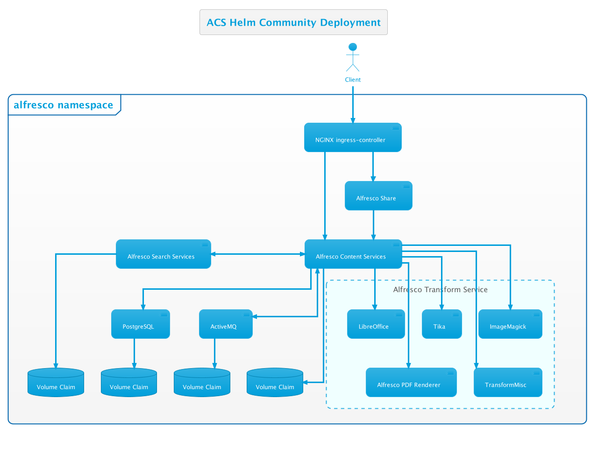

# Alfresco Content Services Helm Deployment

Alfresco Content Services (ACS) is an Enterprise Content Management (ECM) system that is used for document and case management, project collaboration, web content publishing, and compliant records management.  The flexible compute, storage, and database services that Kubernetes offers make it an ideal platform for Alfresco Content Services. This helm chart presents an enterprise-grade Alfresco Content Services configuration that you can adapt to virtually any scenario with the ability to scale up, down or out, depending on your use case.

The Helm chart in this repository supports deploying the Enterprise or Community Edition of ACS.

The Enterprise configuration will deploy the following system:


The Community configuration will deploy the following system:



## Considerations

Alfresco provides tested Helm charts as a "deployment template" for customers who want to take advantage of the container orchestration benefits of Kubernetes. These Helm charts are undergoing continual development and improvement, and should not be used "as is" for your production environments, but should help you save time and effort deploying Alfresco Content Services for your organisation.

The Helm charts in this repository provide a PostgreSQL database in a Docker container and do not configure any logging. This design has been chosen so that they can be installed in a Kubernetes cluster without changes and are still flexible to be adopted to your actual environment.

For your environment, you should use these charts as a starting point and modify them so that ACS integrates into your infrastructure. You typically want to remove the PostgreSQL container and connect the cs-repository directly to your database (might require [custom images](../docker-compose/examples/customisation-guidelines.md) to get the required JDBC driver in the container).

Another typical change would be the integration of your company-wide monitoring and logging tools.

## Deploy

For the best results we recommend [deploying ACS to AWS EKS](./eks-deployment.md). If you have a machine with at least 16GB of memory you can also [deploy using Docker for Desktop](./docker-desktop-deployment.md).

There are also several [examples](./examples) showing how to deploy with various configurations:

* [Deploy with AWS Services (S3, RDS and MQ)](./examples/with-aws-services.md)
* [Deploy with Intelligence Services](./examples/with-ai.md)
* [Deploy with Microsoft 365 Connector (Office Online Integration)](./examples/with-ooi.md)
* [Enable access to Search Services](./examples/search-external-access.md)
* [Enable Email Services](./examples/email-enabled.md)
* [Use a custom metadata keystore](./examples/custom-metadata-keystore.md)

## Configure

An autogenerated list of helm values used in the chart and their default values can be found here: [Alfresco Content Services Helm Chart](./../../helm/alfresco-content-services/README.md)

Since the Alfresco Content Services chart also has local chart dependencies you can find the list of values that can be configured for these charts in their respective base folder:
- [Alfresco ActiveMQ Helm Chart](./../../helm/alfresco-content-services/charts/activemq/README.md)
- [Alfresco Search Helm Chart](./../../helm/alfresco-content-services/charts/alfresco-search/README.md)
- [Alfresco Insight Zeppelin Helm Chart](./../../helm/alfresco-content-services/charts/alfresco-search/charts/alfresco-insight-zeppelin/README.md)
- [Alfresco Sync Service Helm Chart](./../../helm/alfresco-content-services/charts/alfresco-sync-service/README.md)

> :warning: **As of chart version 5.2.0 (ACS 7.2.0) it is now required to pass a shared secret for solr and repo to authenticate to each other** (see below)

```yaml
global:
  tracking:
    auth: secret
    sharedsecret: 50m3S3cretTh4t!s5tr0n6
```

> :warning: **If you want to deploy ACS pre 7.2.0 with charts version 5.2.0+ make sure to add the values below to your `values.yml` file.** starting from ACS 7.2.0 the configuration below will not work anymore.

```yaml
global:
  tracking:
    auth: none
```

> :information_source: **Due to protocol and ingress restrictions FTP is not exposed via the Helm chart.**

## Customise

To customise the Helm deployment, for example applying AMPs, we recommend following the best practice of creating your own custom Docker image(s). The [Customisation Guide](./examples/customisation-guidelines.md) walks you through this process.

## Troubleshooting

### Lens

The easiest way to troubleshoot issues on a Kubernetes deployment is to use the [Lens](https://k8slens.dev) desktop application, which is available for Mac, Windows and Linux. Follow the [getting started guide](https://docs.k8slens.dev/v4.0.3/getting-started) to configure your environment.


### Kubernetes Dashboard

Alternatively, the traditional Kubernetes dashboard can also be used. Presuming you have deployed the dashboard in the cluster you can use the following steps to explore your deployment:

1. Retrieve the service account token with the following command:

    ```bash
    kubectl -n kube-system describe secret $(kubectl -n kube-system get secret | grep eks-admin | awk '{print $1}')
    ```

2. Run the kubectl proxy:

    ```bash
    kubectl proxy &
    ```

3. Open a browser and navigate to: `http://localhost:8001/api/v1/namespaces/kubernetes-dashboard/services/https:kubernetes-dashboard:/proxy/#/login`

4. Select "Token", enter the token retrieved in step 1 and press the "Sign in" button

5. Select "alfresco" from the "Namespace" drop-down menu, click the "Pods" link and click on a pod name. To view the logs press the Menu icon in the toolbar as highlighted in the screenshot below:

    

### Port-Forwarding To A Pod

This approach allows to connect to a specific application in the cluster.
See [kubernetes documentation](https://kubernetes.io/docs/tasks/access-application-cluster/port-forward-access-application-cluster) for details.

Any component of the deployment that is not exposed via ingress rules can be accessed in this way, for example Alfresco Search, DB or individual transformers.

### Viewing Log Files Via Command Line

Log files for individual pods can also be viewed from the command line using the kubectl utility.

Retrieve the list of pods in the alfresco namespace by using the following command:

```bash
kubectl get pods -n alfresco
```

Then to retrieve the logs for a pod using the following command (replacing the pod name appropriately):

```bash
kubectl logs acs-alfresco-cs-repository-69545958df-6wzl6 -n alfresco
```

To continually follow the log file for a pod use the `-f` options as follows:

```bash
kubectl logs -f acs-alfresco-cs-repository-69545958df-6wzl6 -n alfresco
```

### Changing Log Levels

If you wish to change the log levels for a specific Java package or class in a running content-repository these can be changed via the Admin Console. However, please be aware that the changes are applied only to one content-repository node, the one from which the Admin console is launched. Use the following URL to access the log settings page: `https://<host>/alfresco/service/enterprise/admin/admin-log-settings`

To add additional repository log statements across the whole cluster use the `extraLogStatements` property via the values file as shown in the example below:

```yaml
repository:
  ...
  extraLogStatements:
    org.alfresco.repo.content.transform.TransformerDebug: debug
    org.alfresco.repo.security.authentication.identityservice: debug
```

**NOTE:** ACS deployment does not include any log aggregation tools. The logs generated by pods will be lost once the pods are terminated.

### JMX Dump

This tool allows you to download a ZIP file containing information useful for troubleshooting and supporting your system. Issue a GET request (Admin only) to: `https://<host>/alfresco/service/api/admin/jmxdump`
