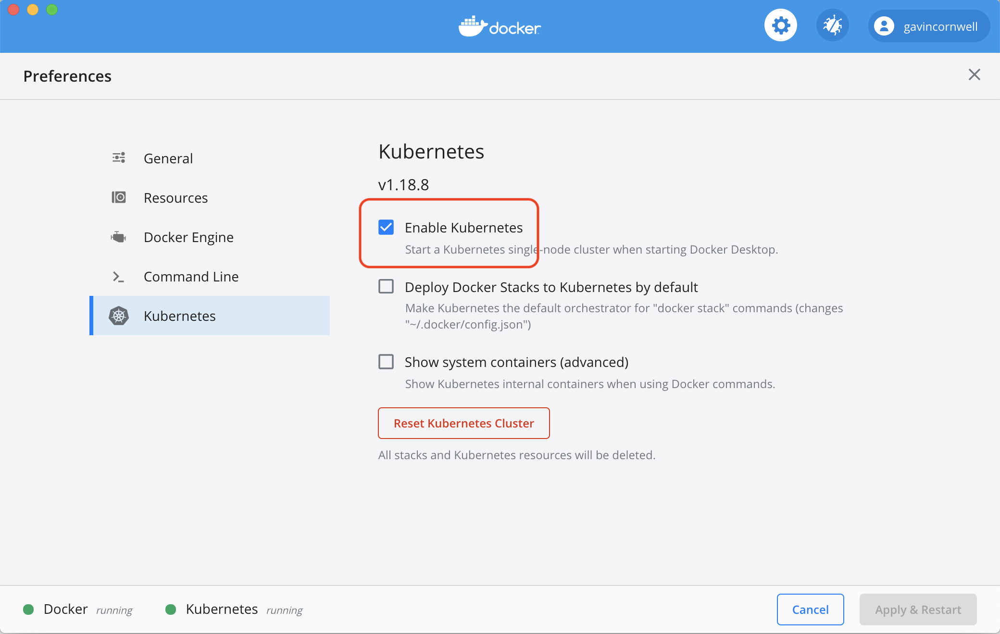

# Alfresco Content Services Helm Deployment with Docker For Desktop

This page describes how to deploy Alfresco Content Services (ACS) Enterprise or Community using [Helm](https://helm.sh) onto [Docker for Desktop](https://docs.docker.com/desktop/).

## Prerequisites

- You've read the projects [main README](/README.md#prerequisites) prerequisites section
- You've read the [main Helm README](./README.md) page
- You are proficient in Kubernetes
- A machine with at least 16GB memory
- [Docker for Desktop](https://docs.docker.com/desktop/) for container management installed
- Latest version of [Kubectl](https://kubernetes.io/docs/tasks/tools/install-kubectl) is installed
- Latest version of [Helm](https://helm.sh/docs/intro/install) is installed

The following instructions are also applicable to [Rancher Desktop](https://rancherdesktop.io/) users. Rancher desktop will provide `kubectl` and `helm` out of the box. it is open source but less mature than Docker desktop.

## Configure Docker for Desktop

In order to deploy onto Docker for Desktop we need to configure it with as much CPU and memory as possible on the "Resources" tab in Docker for Desktop's preferences pane as shown in the screenshot below. Similar resource requirement apply to Rancher Desktop.


### Docker for Desktop specific configuration

To deploy the Helm charts Kubernetes needs to be enabled, this can be done from the "Kubernetes" tab, as shown in the screenshot below. Press the "Apply & Restart" button to confirm.



### Rancher Desktop specific configuration

Uncheck `Enable Traefik` from the `Kubernetes Settings` page to disable Traefik. You may need to exit and restart Rancher Desktop for the change to take effect. Ref: [Setup NGINX Ingress Controller](https://docs.rancherdesktop.io/how-to-guides/setup-NGINX-Ingress-Controller)

## Deploy

Once Docker for Desktop is running follow the steps in the following sections to deploy ACS (Enterprise or Community) to your local machine.

### Namespace

Namespaces in Kubernetes isolate workloads from each other, create a namespace to host ACS inside the cluster using the following command (we'll then use the `alfresco` namepsace throughout the rest of the tutorial):

```bash
kubectl create namespace alfresco
```

### Ingress

Add the chart repository using the following command:

```bash
helm repo add ingress-nginx https://kubernetes.github.io/ingress-nginx
helm repo update
```

Deploy an ingress controller into the alfresco namespace using the command below:

```bash
helm install acs-ingress ingress-nginx/ingress-nginx --version=4.4.0 \
--set controller.scope.enabled=true \
--set controller.scope.namespace=alfresco \
--set rbac.create=true \
--atomic \
--namespace alfresco
```

> NOTE: The command will wait until the deployment is ready so please be patient.

```bash
# Verify NGINX is up and running
kubectl get pods --namespace alfresco

NAME                                                    READY   STATUS    RESTARTS   AGE
acs-ingress-ingress-nginx-controller-77b76b95f7-hf9hq   1/1     Running   0          2m55s

# Verify expose localhost:80
kubectl get svc --namespace alfresco

NAME                                             TYPE           CLUSTER-IP     EXTERNAL-IP     PORT(S)                      AGE
acs-ingress-ingress-nginx-controller-admission   ClusterIP      10.43.244.72   <none>          443/TCP                      69m
acs-ingress-ingress-nginx-controller             LoadBalancer   10.43.182.81   192.168.1.146   80:31155/TCP,443:32209/TCP   69m
```

### ACS

This repository allows you to either deploy a system using released stable artifact or the latest in-progress development artifacts.

To use a released version of the Helm chart add the stable chart repository using the following command:

```bash
helm repo add alfresco https://kubernetes-charts.alfresco.com/stable
helm repo update
```

Alternatively, to use the latest in-progress development version of the Helm chart add the incubator chart repository using the following command:

```bash
helm repo add alfresco https://kubernetes-charts.alfresco.com/incubator
helm repo update
```

Now decide whether you want to install the Community or Enterprise edition and follow the steps in the relevant section below.

#### Community

To install the latest version of Community we need to use the [community_values.yaml file](../../helm/alfresco-content-services). Once downloaded execute the command below to deploy.

```bash
helm install acs alfresco/alfresco-content-services \
  --values=community_values.yaml \
  --set externalPort="80" \
  --set externalProtocol="http" \
  --set externalHost="localhost" \
  --set global.tracking.sharedsecret=$(openssl rand -hex 24) \
  --atomic \
  --timeout 10m0s \
  --namespace=alfresco
```

> NOTE: The command will wait until the deployment is ready so please be patient.

#### Enterprise localhost deployment

See the [registry authentication](registry-authentication.md) page to configure
credentials to access the Alfresco Enterprise registry.

The Enterprise Helm deployment is intended for a Cloud based Kubernetes cluster
and therefore requires a large amount of resources out-of-the-box. To reduce the
size of the deployment so it can run on a single machine we'll need to reduce
the number of pods deployed and the memory requirements for several others.

To install the Enterprise on localhost we need to use the local-dev-values.yaml

```bash
curl -fO https://raw.githubusercontent.com/Alfresco/acs-deployment/master/docs/helm/values/local-dev-values.yaml
```

Once downloaded execute the command below to deploy.

```bash
helm install acs alfresco/alfresco-content-services \
  --values local-dev-values.yaml \
  --set global.tracking.sharedsecret=$(openssl rand -hex 24) \
  --atomic \
  --timeout 10m0s \
  --namespace alfresco
```

> NOTE: The command will wait until the deployment is ready so please be patient. See below for [troubleshooting](./docker-desktop-deployment.md#troubleshooting) tips.

The command above installs the latest version of ACS Enterprise.

#### Enterprise deployment for previous versions

To deploy a previous version of ACS Enterprise follow the steps below.

1. Download the version specific values file you require from [this folder](../../helm/alfresco-content-services)
2. Deploy the specific version of ACS by running the following command:

   ```bash
   helm install acs alfresco/alfresco-content-services \
   --values MAJOR.MINOR.N_values.yaml \
   --values local-dev-values.yaml \
   --atomic \
   --timeout 10m0s \
   --namespace alfresco
   ```

> NOTE: The command will wait until the deployment is ready so please be patient. See below for [troubleshooting](./docker-desktop-deployment.md#troubleshooting) tips.

## Access

When the deployment has completed the following URLs will be available:

- Repository: `http://localhost/alfresco`
- Share: `http://localhost/share`
- API Explorer: `http://localhost/api-explorer`

If you deployed Enterprise you'll also have access to:

- ADW: `http://localhost/workspace/`
- Sync Service: `http://localhost/syncservice/healthcheck`

## Cleanup

1. Remove the `acs` and `acs-ingress` deployments by running the following command:

   ```bash
   helm uninstall -n alfresco acs acs-ingress
   ```

2. Delete the Kubernetes namespace using the command below:

   ```bash
   kubectl delete namespace alfresco
   ```

## Troubleshooting

If your deployment fails it's most likely to be caused by resource limitations, please refer to the sections below for more information. Please also consult the [Helm Troubleshooting section](./README.md#Troubleshooting) for more generic troubleshooting tips and tricks.

### Lack Of Resources

The most common reason for deployment failures with Docker for Desktop is lack of memory or disk space. Check the "Resources" tab in Docker for Desktop's preferences pane, increase the allocation if you can and re-try.

To save the deployment of two more pods you can also try disabling the Sync Service, to do that provide the additional `--set` option below with your helm install command:

```bash
--set alfresco-sync-service.enabled=false
```

If you need to reduce the memory footprint further the JVM memory settings in most pods use the `MaxRAMPercentage` option so lowering the various `limits.memory` and `requests.memory` values will also reduce the JVM memory allocation.

### Timeout

If the deployment fails and rolls back with following error:

```bash
Error: release acs failed, and has been uninstalled due to atomic being set: timed out waiting for the condition
```

You may should check resources above and then re-run the deployment with either an increased timeout, eg. --timeout 15m0s. Alteratively run without following:

```bash
--atomic --timeout 10m0s
```

and then monitor the logs for any failing pods. Please also consult the [Helm Troubleshooting section](./README.md#Troubleshooting) for deploying Kubernetes Dashboard and more generic troubleshooting tips and tricks.
