# Alfresco Content Services Helm Deployment with AWS EKS

This page describes how to deploy Alfresco Content Services (ACS) Enterprise or
Community using [Helm](https://helm.sh) onto [EKS](https://aws.amazon.com/eks).

Amazon's EKS (Elastic Container Service for Kubernetes) makes it easy to deploy,
manage, and scale containerized applications using Kubernetes on AWS. EKS runs
the Kubernetes management infrastructure for you across multiple AWS
availability zones to eliminate a single point of failure.

The Enterprise configuration will deploy the following system:


The Community configuration will deploy the following system:

```mermaid
graph LR

classDef alf fill:#0b0,color:#fff
classDef aws fill:#fa0,color:#fff
classDef k8s fill:#326ce5,stroke:#326ce5,stroke-width:2px,color:#fff
classDef thrdP fill:#e098a6,color:#000

Client("👥 Clients")

subgraph Helm community
  PersistentVolumeClaim_activemq-default-pvc(PersistentVolumeClaim: activemq-default-pvc):::k8s
  PersistentVolumeClaim_repository-default-pvc(PersistentVolumeClaim: repository-default-pvc):::k8s
  PersistentVolumeClaim_solr-default-pvc(PersistentVolumeClaim: solr-default-pvc):::k8s
  PersistentVolumeClaim_data-acs-postgresql(PersistentVolumeClaim: data-acs-postgresql):::k8s
  Deployment_activemq(Deployment: activemq):::thrdP
  Deployment_alfresco-cc(Deployment: alfresco-cc):::alf
  Deployment_alfresco-repository(Deployment: alfresco-repository):::alf
  Deployment_solr(Deployment: solr):::alf
  Deployment_share(Deployment: share):::alf
  StatefulSet_postgresql-acs(StatefulSet: postgresql-acs):::thrdP
  Ingress_alfresco-cc(Ingress: alfresco-cc):::k8s
  Ingress_alfresco-repository(Ingress: alfresco-repository):::k8s
  Ingress_share(Ingress: share):::k8s
  subgraph "Alfresco Transform Service"
    Deployment_imagemagick(Deployment: imagemagick):::alf
    Deployment_libreoffice(Deployment: libreoffice):::alf
    Deployment_pdfrenderer(Deployment: pdfrenderer):::alf
    Deployment_tika(Deployment: tika):::alf
    Deployment_transform-misc(Deployment: transform-misc):::alf
  end
end

subgraph AWS
  EBS:::aws
  EFS:::aws
  S3:::aws
end

Client ----> Ingress_alfresco-cc --> Deployment_alfresco-cc
Client --> Ingress_alfresco-repository --> Deployment_alfresco-repository
Client --> Ingress_share --> Deployment_share

Deployment_alfresco-cc --> Deployment_alfresco-repository
Deployment_share --> Deployment_alfresco-repository

Deployment_alfresco-repository --> Deployment_solr
Deployment_alfresco-repository --> StatefulSet_postgresql-acs --> PersistentVolumeClaim_data-acs-postgresql --> EBS
Deployment_alfresco-repository --> Deployment_activemq
Deployment_alfresco-repository --> Deployment_imagemagick
Deployment_alfresco-repository --> Deployment_libreoffice
Deployment_alfresco-repository --> Deployment_pdfrenderer
Deployment_alfresco-repository --> Deployment_tika
Deployment_alfresco-repository --> Deployment_transform-misc

Deployment_alfresco-repository ---> PersistentVolumeClaim_repository-default-pvc --> EFS
PersistentVolumeClaim_repository-default-pvc --> S3
Deployment_activemq --> PersistentVolumeClaim_activemq-default-pvc --> EBS
Deployment_solr --> PersistentVolumeClaim_solr-default-pvc --> EBS
```



## Prerequisites

* You've read the projects [main README](/README.md#prerequisites)
  prerequisites section
* You've read the [main Helm README](./README.md) page
* You are proficient in AWS and Kubernetes

Make sure to have installed:

* [kubectl](https://docs.aws.amazon.com/eks/latest/userguide/install-kubectl.html)
* [eksctl](https://docs.aws.amazon.com/eks/latest/userguide/eksctl.html)
* [helm](https://docs.aws.amazon.com/eks/latest/userguide/helm.html)

To better troubleshoot any issue, you may want to install applications such as:

* [lens](https://k8slens.dev/) (GUI)
* [k9s](https://k9scli.io/) (CLI)

## Setup An EKS Cluster

There are multiple ways to setup an EKS cluster, but one of the most simple is
by using `eksctl`. This section will guide you in creating a new EKS cluster
that satisfy the minimum requirements to have a basic ACS installation up and
running.

Set the default region you want to work on, to avoid having to add `--region` to
every command:

```sh
export AWS_DEFAULT_REGION=eu-west-1
```

Set the cluster name in an environment variable that can be reused later:

```sh
EKS_CLUSTER_NAME=my-alfresco-eks
```

Create the cluster using a supported version (we are currently testing against
1.24). Most common choices for instance types are `m5.xlarge` and `t3.xlarge`:

```sh
eksctl create cluster --name $EKS_CLUSTER_NAME --version 1.24 --instance-types t3.xlarge
```

Enable the OIDC provider that is necessary to install further EKS addons later:

```sh
eksctl utils associate-iam-oidc-provider --cluster=$EKS_CLUSTER_NAME —approve
```

For further information please refer to the [Getting started with Amazon EKS –
eksctl](https://docs.aws.amazon.com/eks/latest/userguide/getting-started-eksctl.html)
guide.

## Prepare The Cluster For ACS

Now that we have an EKS cluster up and running, there are a few one time steps
that we need to perform to prepare the cluster for ACS to be installed.

### DNS

1. Create a hosted zone in Route53 using [these
   steps](https://docs.aws.amazon.com/Route53/latest/DeveloperGuide/CreatingHostedZone.html)
   if you don't already have one available.

2. Create a public certificate for the hosted zone created in step 1 in
   Certificate Manager using [these
   steps](https://docs.aws.amazon.com/acm/latest/userguide/gs-acm-request-public.html)
   if you don't have one already available and make a note of the certificate
   ARN for use later.

3. Create a file called `external-dns.yaml` with the text below (replacing
   `YOUR-DOMAIN-NAME` with the domain name you created in step 1). This manifest
   defines a service account and a cluster role for managing DNS.

    ```yaml
    apiVersion: v1
    kind: ServiceAccount
    metadata:
      name: external-dns
    ---
    apiVersion: rbac.authorization.k8s.io/v1
    kind: ClusterRole
    metadata:
      name: external-dns
    rules:
    - apiGroups: [""]
      resources: ["services","endpoints","pods"]
      verbs: ["get","watch","list"]
    - apiGroups: ["extensions"]
      resources: ["ingresses"]
      verbs: ["get","watch","list"]
    - apiGroups: [""]
      resources: ["nodes"]
      verbs: ["list","watch"]
    ---
    apiVersion: rbac.authorization.k8s.io/v1
    kind: ClusterRoleBinding
    metadata:
      name: external-dns-viewer
    roleRef:
      apiGroup: rbac.authorization.k8s.io
      kind: ClusterRole
      name: external-dns
    subjects:
    - kind: ServiceAccount
      name: external-dns
      namespace: kube-system
    ---
    apiVersion: apps/v1
    kind: Deployment
    metadata:
      name: external-dns
    spec:
      strategy:
        type: Recreate
      selector:
        matchLabels:
          app: external-dns
      template:
        metadata:
          labels:
            app: external-dns
        spec:
          serviceAccountName: external-dns
          containers:
          - name: external-dns
            image: registry.opensource.zalan.do/teapot/external-dns:latest
            args:
            - --source=service
            - --domain-filter=YOUR-DOMAIN-NAME
            - --provider=aws
            - --policy=sync
            - --aws-zone-type=public
            - --registry=txt
            - --txt-owner-id=acs-deployment
            - --log-level=debug
    ```

4. Use the kubectl command to deploy the external-dns service.

   ```bash
   kubectl apply -f external-dns.yaml -n kube-system
   ```

5. Find the name of the nodegroup created by running the following command
   (replacing `YOUR-CLUSTER-NAME` with the name you gave your cluster):

    ```bash
    eksctl get nodegroup --cluster=`YOUR-CLUSTER-NAME`
    ```

6. Find the name of the role used by the nodes by running the following command
   (replacing `YOUR-CLUSTER-NAME` with the name you gave your cluster, and
   `YOUR-NODE-GROUP` with the nodegroup from the step above):

    ```bash
    aws eks describe-nodegroup \
      --cluster-name YOUR-CLUSTER-NAME \
      --nodegroup-name YOUR-NODE-GROUP \
      --query "nodegroup.nodeRole" \
      --output text
    ```

7. In the [IAM console](https://console.aws.amazon.com/iam/home) find the role
   discovered in the previous step and attach the "AmazonRoute53FullAccess"
   managed policy as shown in the screenshot below:

    

### Storage

There are multiple storage options available when deploying on AWS.

For the main
[content-store](https://docs.alfresco.com/content-services/latest/admin/content-stores/),
you can alternatively:

* Use an Elastic File System, installing the ([EFS CSI driver](#efs-csi-driver))
  (the default we suggest, see `storageClass="nfs-client"` values in [helm
  install section](#latest-enterprise-version))
* Use an EBS block-storage, enabling [EBS CSI driver](#ebs-csi-driver) (not
  possible with Enterprise in clustered mode)
* Use a bucket on [S3](examples/with-aws-services.md#s3)

For the
[database](https://docs.alfresco.com/content-services/latest/config/databases/),
you can alternatively:

* Use the embedded postgres instance provided by the helm chart by default,
  enabling [EBS CSI driver](#ebs-csi-driver)
* Use [RDS](examples/with-aws-services.md#rds)

For the [messaging
broker](https://docs.alfresco.com/content-services/latest/config/activemq/),
you can alternatively:

* Use the embedded activemq provided by the helm chart by default, enabling
  [EBS CSI driver](#ebs-csi-driver)
* Use [Amazon MQ](examples/with-aws-services.md#amazon-mq)

#### EFS CSI Driver

1. Create an Elastic File System in the VPC created by EKS using [these
   steps](https://docs.aws.amazon.com/efs/latest/ug/creating-using-create-fs.html)
   ensuring a mount target is created in each subnet. Make a note of the File
   System ID (circled in the screenshot below).

    

2. Find The ID of VPC created when your cluster was built using the command
   below (replacing `YOUR-CLUSTER-NAME` with the name you gave your cluster):

    ```bash
    aws eks describe-cluster \
      --name YOUR-CLUSTER-NAME \
      --query "cluster.resourcesVpcConfig.vpcId" \
      --output text
    ```

3. Find The CIDR range of VPC using the command below (replacing `VPC-ID` with
   the ID retrieved in the previous step):

    ```bash
    aws ec2 describe-vpcs \
      --vpc-ids VPC-ID \
      --query "Vpcs[].CidrBlock" \
      --output text
    ```

4. Go to the [Security Groups section of the VPC
   Console](https://console.aws.amazon.com/vpc/home#SecurityGroups) and search
   for the VPC using the ID retrieved in step 2, as shown in the screenshot
   below:

    

5. Click on the default security group for the VPC (highlighted in the
   screenshot above) and add an inbound rule for NFS traffic from the VPC CIDR
   range as shown in the screenshot below:

    

6. Deploy the AWS EFS csi storage driver using the following commands,
   replacing `fs-SOMEUUID` with the string "file-system-id" where
   file-system-id is the ID retrieved in step 1 and aws-region is the region
   you're using e.g. "fs-72f5e4f1" (this step replace previous deployment of
   the now obsolete nfs-client-provisioner):

    ```bash
    cat > aws-efs-values.yml <<EOT
    storageClasses:
      - mountOptions:
        - tls
        name: nfs-client
        parameters:
          directoryPerms: "700"
          uid: 33000
          gid: 1000
          fileSystemId: fs-SOMEUUID
          provisioningMode: efs-ap
        reclaimPolicy: Retain
        volumeBindingMode: Immediate
    EOT
    helm repo add aws-efs-csi-driver https://kubernetes-sigs.github.io/aws-efs-csi-driver
    helm upgrade aws-efs-csi-driver aws-efs-csi-driver/aws-efs-csi-driver \
      --install \
      --namespace kube-system \
      -f aws-efs-values.yml
    ```

> Note: the `storageClass` is set to `Retain` for obvious safety reasons. That
> however means kubernetes administrator need to take care of volume cleanup.

#### EBS CSI Driver

> Since EKS 1.24 it is mandatory to install EBS CSI Driver for the dynamic
> provisioning via the default `gp2` storage class. Upgrading from 1.23 without
> it will break any existing PVC.

Set the aws account id in an environment variable that can be reused later:

```sh
AWS_ACCOUNT_ID=$(aws sts get-caller-identity --query Account --output text)
```

Create the IAM Service Account with access to EBS that will be used by the driver:

```sh
eksctl create iamserviceaccount \
  --name ebs-csi-controller-sa \
  --namespace kube-system \
  --cluster $EKS_CLUSTER_NAME \
  --attach-policy-arn arn:aws:iam::aws:policy/service-role/AmazonEBSCSIDriverPolicy \
  --approve \
  --role-only \
  --role-name AmazonEKS_EBS_CSI_DriverRole
```

Enable the addon referencing the IAM role created previously:

```sh
eksctl create addon \
  --name aws-ebs-csi-driver \
  --cluster $EKS_CLUSTER_NAME \
  --service-account-role-arn arn:aws:iam::$AWS_ACCOUNT_ID:role/AmazonEKS_EBS_CSI_DriverRole \
  --force
```

At this point the provisioning of EBS volumes using the default GP2
storageClass will be handled by this driver.

For further information please refer to the official [Amazon EBS CSI driver](
ttps://docs.aws.amazon.com/eks/latest/userguide/ebs-csi.html) guide.

## Deploy

Now the EKS cluster is setup we can deploy ACS.

### Namespace

Namespaces in Kubernetes isolate workloads from each other, create a namespace
to host ACS inside the cluster using the following command (we'll then use the
`alfresco` namespace throughout the rest of the tutorial):

```bash
kubectl create namespace alfresco
```

### Ingress

1. Create a file called `ingress-rbac.yaml` with the text below:

    ```yaml
    apiVersion: rbac.authorization.k8s.io/v1
    kind: Role
    metadata:
      name: acs:psp
      namespace: alfresco
    rules:
    - apiGroups:
      - policy
      resourceNames:
      - kube-system
      resources:
      - podsecuritypolicies
      verbs:
      - use
    ---
    apiVersion: rbac.authorization.k8s.io/v1
    kind: RoleBinding
    metadata:
      name: acs:psp:default
      namespace: alfresco
    roleRef:
      apiGroup: rbac.authorization.k8s.io
      kind: Role
      name: acs:psp
    subjects:
    - kind: ServiceAccount
      name: default
      namespace: alfresco
    ---
    apiVersion: rbac.authorization.k8s.io/v1
    kind: RoleBinding
    metadata:
      name: acs:psp:acs-ingress
      namespace: alfresco
    roleRef:
      apiGroup: rbac.authorization.k8s.io
      kind: Role
      name: acs:psp
    subjects:
    - kind: ServiceAccount
      name: acs-ingress
      namespace: alfresco
    ```

2. Use the kubectl command to create the cluster roles required by the ingress service.

    ```bash
    kubectl apply -f ingress-rbac.yaml -n alfresco
    ```

3. Deploy the ingress using the following commands (replacing
   `ACM_CERTIFICATE_ARN` and `YOUR-DOMAIN-NAME` with the ARN of the certificate
   and hosted zone created earlier in the DNS section):

    ```bash
    helm repo add ingress-nginx https://kubernetes.github.io/ingress-nginx
    helm repo update

    helm install acs-ingress ingress-nginx/ingress-nginx --version=4.0.18 \
    --set controller.scope.enabled=true \
    --set controller.scope.namespace=alfresco \
    --set rbac.create=true \
    --set controller.config."proxy-body-size"="100m" \
    --set controller.service.targetPorts.https=80 \
    --set controller.service.annotations."service\.beta\.kubernetes\.io/aws-load-balancer-backend-protocol"="http" \
    --set controller.service.annotations."service\.beta\.kubernetes\.io/aws-load-balancer-ssl-ports"="https" \
    --set controller.service.annotations."service\.beta\.kubernetes\.io/aws-load-balancer-ssl-cert"="ACM_CERTIFICATE_ARN" \
    --set controller.service.annotations."external-dns\.alpha\.kubernetes\.io/hostname"="acs.YOUR-DOMAIN-NAME" \
    --set controller.service.annotations."service\.beta\.kubernetes\.io/aws-load-balancer-ssl-negotiation-policy"="ELBSecurityPolicy-TLS-1-2-2017-01" \
    --set controller.publishService.enabled=true \
    --set controller.admissionWebhooks.enabled=false \
    --atomic \
    --namespace alfresco
    ```

    > NOTE: The command will wait until the deployment is ready so please be patient.

### ACS

This repository allows you to either deploy a system using released stable
artefacts or the latest in-progress development artefacts.

To use a released version of the Helm chart add the stable repository using the
following command:

```bash
helm repo add alfresco https://kubernetes-charts.alfresco.com/stable
helm repo update
```

Alternatively, to use the latest in-progress development version of the Helm
chart add the incubator repository using the following command:

```bash
helm repo add alfresco https://kubernetes-charts.alfresco.com/incubator
helm repo update
```

Now decide whether you want to install the latest version of ACS (Enterprise or
Community) or a previous version and follow the steps in the relevant section below.

#### Latest Enterprise Version

See the [registry authentication](registry-authentication.md) page to configure
credentials to access the Alfresco Enterprise registry.

Deploy the latest version of ACS by running the following command (replacing
`YOUR-DOMAIN-NAME` with the hosted zone you created earlier):

```bash
helm install acs alfresco/alfresco-content-services \
  --set alfresco-repository.persistence.enabled=true \
  --set alfresco-repository.persistence.storageClass="nfs-client" \
  --set alfresco-transform-service.filestore.persistence.enabled=true \
  --set alfresco-transform-service.filestore.persistence.storageClass="nfs-client" \
  --set global.known_urls=https://acs.YOUR-DOMAIN-NAME \
  --set global.alfrescoRegistryPullSecrets=quay-registry-secret \
  --set global.search.sharedSecret=$(openssl rand -hex 24) \
  --atomic \
  --timeout 10m0s \
  --namespace=alfresco
```

> NOTE: The command will wait until the deployment is ready so please be patient.

#### Latest Community Version

1. Download the Community values file from [here](../../helm/alfresco-content-services/community_values.yaml).

2. Deploy ACS Community by running the following command (replacing
   `YOUR-DOMAIN-NAME` with the hosted zone you created earlier):

    ```bash
    helm install acs alfresco/alfresco-content-services \
    --values=community_values.yaml \
    --set global.known_urls=https://acs.YOUR-DOMAIN-NAME \
    --set alfresco-repository.persistence.enabled=true \
    --set alfresco-repository.persistence.storageClass="nfs-client" \
    --atomic \
    --timeout 10m0s \
    --namespace=alfresco
    ```

    > NOTE: The command will wait until the deployment is ready so please be patient.

#### Previous Enterprise Version

1. Download the version specific values file you require from [this folder](../../helm/alfresco-content-services).

2. Deploy the specific version of ACS by running the following command
   (replacing `YOUR-DOMAIN-NAME` with the hosted zone you created earlier and
   `MAJOR` & `MINOR` with the appropriate values):

    ```bash
    helm install acs alfresco/alfresco-content-services \
    --values=MAJOR.MINOR.N_values.yaml \
    --set global.known_urls=https://acs.YOUR-DOMAIN-NAME \
    --set alfresco-repository.persistence.enabled=true \
    --set alfresco-repository.persistence.storageClass="nfs-client" \
    --set alfresco-transform-service.filestore.persistence.enabled=true \
    --set alfresco-transform-service.filestore.persistence.storageClass="nfs-client" \
    --set global.alfrescoRegistryPullSecrets=quay-registry-secret \
    --set global.search.sharedSecret=$(openssl rand -hex 24) \
    --atomic \
    --timeout 10m0s \
    --namespace=alfresco
    ```

    > NOTE: The command will wait until the deployment is ready so please be patient.

## Access

When the deployment has completed the following URLs will be available
(replacing `YOUR-DOMAIN-NAME` with the hosted zone you created earlier):

* Repository: `https://acs.YOUR-DOMAIN-NAME/alfresco`
* Share: `https://acs.YOUR-DOMAIN-NAME/share`
* API Explorer: `https://acs.YOUR-DOMAIN-NAME/api-explorer`

If you deployed Enterprise you'll also have access to:

* ADW: `https://acs.YOUR-DOMAIN-NAME/workspace/`
* Sync Service: `https://acs.YOUR-DOMAIN-NAME/syncservice/healthcheck`

If you requested an extended trial license navigate to the Admin Console and
apply your license:

* [https://acs.YOUR-DOMAIN-NAME/alfresco/service/enterprise/admin/admin-license](http://localhost:8080/alfresco/service/enterprise/admin/admin-license)
* Default username and password is ```admin```
* See [Uploading a new
  license](https://docs.alfresco.com/content-services/latest/admin/license/#uploadlicense)
  for more details

## Configure

By default, this tutorial installs an out-of-the-box setup, however there are
many configurations options described [here](./README.md#configure). There are
also several [examples](./examples) covering various use cases.

This deployment is also not fully secured by default, to learn about and apply
further restrictions including pod security, network policies etc. please refer
to the [EKS Best Practices for
Security](https://aws.github.io/aws-eks-best-practices/).

## Cleanup

1. Remove the `acs` and `acs-ingress` deployments by running the following command:

     ```bash
     helm uninstall -n alfresco acs acs-ingress
     ```

2. Delete the Kubernetes namespace using the command below:

    ```bash
    kubectl delete namespace alfresco
    ```

3. Go to the [EFS Console](https://console.aws.amazon.com/efs), select the file
   system we created earlier and press the "Delete" button to remove the mount
   targets and file system.

4. Go to the [IAM console](https://console.aws.amazon.com/iam/home) and remove
   the AmazonRoute53FullAccess managed policy we added to the NodeInstanceRole
   in the File System section otherwise the cluster will fail to delete in the
   next step.

5. Finally, delete the EKS cluster using the command below (replacing
   `YOUR-CLUSTER-NAME` with the name you gave your cluster):

    ```bash
    eksctl delete cluster --name YOUR-CLUSTER-NAME
    ```
