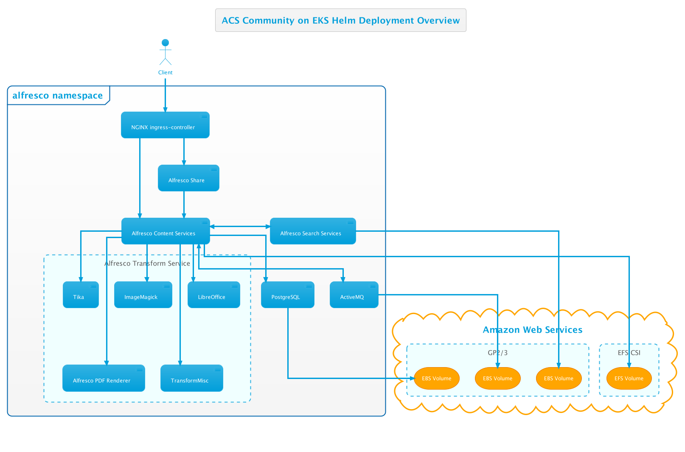

# Alfresco Content Services Helm Deployment with AWS EKS

This page describes how to deploy Alfresco Content Services (ACS) Enterprise or Community using [Helm](https://helm.sh) onto [EKS](https://aws.amazon.com/eks).

Amazon's EKS (Elastic Container Service for Kubernetes) makes it easy to deploy, manage, and scale containerized applications using Kubernetes on AWS. EKS runs the Kubernetes management infrastructure for you across multiple AWS availability zones to eliminate a single point of failure.

The Enterprise configuration will deploy the following system:


The Community configuration will deploy the following system:



## Prerequisites

* You've read the projects [main README](/README.md#prerequisites) prerequisites section
* You've read the [main Helm README](./README.md) page
* You are proficient in AWS and Kubernetes

## Setup An EKS Cluster

Follow the [AWS EKS Getting Started Guide](https://docs.aws.amazon.com/eks/latest/userguide/getting-started-eksctl.html) to create a cluster and prepare your local machine to connect to the cluster. Use the "Managed nodes - Linux" option and specify a `--node-type` of at least m5.xlarge.

As we'll be using Helm to deploy the ACS chart follow the [Using Helm with EKS](https://docs.aws.amazon.com/eks/latest/userguide/helm.html) instructions to setup helm on your local machine.

Optionally, to help troubleshoot issues with your cluster either follow the tutorial to [deploy the Kubernetes Dashboard](https://docs.aws.amazon.com/eks/latest/userguide/dashboard-tutorial.html) to your cluster or download and use the [Lens application](https://k8slens.dev) from your local machine.

## Prepare The Cluster For ACS

Now we have an EKS cluster up and running there are a few one time steps we need to perform to prepare the cluster for ACS to be installed.

### DNS

1. Create a hosted zone in Route53 using [these steps](https://docs.aws.amazon.com/Route53/latest/DeveloperGuide/CreatingHostedZone.html) if you don't already have one available.

2. Create a public certificate for the hosted zone created in step 1 in Certificate Manager using [these steps](https://docs.aws.amazon.com/acm/latest/userguide/gs-acm-request-public.html) if you don't have one already available and make a note of the certificate ARN for use later.

3. Create a file called `external-dns.yaml` with the text below (replacing `YOUR-DOMAIN-NAME` with the domain name you created in step 1). This manifest defines a service account and a cluster role for managing DNS.

    ```yaml
    apiVersion: v1
    kind: ServiceAccount
    metadata:
      name: external-dns
    ---
    apiVersion: rbac.authorization.k8s.io/v1
    kind: ClusterRole
    metadata:
      name: external-dns
    rules:
    - apiGroups: [""]
      resources: ["services","endpoints","pods"]
      verbs: ["get","watch","list"]
    - apiGroups: ["extensions"]
      resources: ["ingresses"]
      verbs: ["get","watch","list"]
    - apiGroups: [""]
      resources: ["nodes"]
      verbs: ["list","watch"]
    ---
    apiVersion: rbac.authorization.k8s.io/v1
    kind: ClusterRoleBinding
    metadata:
      name: external-dns-viewer
    roleRef:
      apiGroup: rbac.authorization.k8s.io
      kind: ClusterRole
      name: external-dns
    subjects:
    - kind: ServiceAccount
      name: external-dns
      namespace: kube-system
    ---
    apiVersion: apps/v1
    kind: Deployment
    metadata:
      name: external-dns
    spec:
      strategy:
        type: Recreate
      selector:
        matchLabels:
          app: external-dns
      template:
        metadata:
          labels:
            app: external-dns
        spec:
          serviceAccountName: external-dns
          containers:
          - name: external-dns
            image: registry.opensource.zalan.do/teapot/external-dns:latest
            args:
            - --source=service
            - --domain-filter=YOUR-DOMAIN-NAME
            - --provider=aws
            - --policy=sync
            - --aws-zone-type=public
            - --registry=txt
            - --txt-owner-id=acs-deployment
            - --log-level=debug
    ```

4. Use the kubectl command to deploy the external-dns service.

   ```bash
   kubectl apply -f external-dns.yaml -n kube-system
   ```

4. Find the name of the nodegroup created by running the following command (replacing `YOUR-CLUSTER-NAME` with the name you gave your cluster):

    ```bash
    eksctl get nodegroup --cluster=`YOUR-CLUSTER-NAME` 
    ```

5. Find the name of the role used by the nodes by running the following command (replacing `YOUR-CLUSTER-NAME` with the name you gave your cluster, and `YOUR-NODE-GROUP` with the nodegroup from the step above):

    ```bash
    aws eks describe-nodegroup --cluster-name YOUR-CLUSTER-NAME --nodegroup-name YOUR-NODE-GROUP --query "nodegroup.nodeRole" --output text
    ```

6. In the [IAM console](https://console.aws.amazon.com/iam/home) find the role discovered in the previous step and attach the "AmazonRoute53FullAccess" managed policy as shown in the screenshot below:

    

### File System

1. Create an Elastic File System in the VPC created by EKS using [these steps](https://docs.aws.amazon.com/efs/latest/ug/creating-using-create-fs.html) ensuring a mount target is created in each subnet. Make a note of the File System ID (circled in the screenshot below).

    

2. Find The ID of VPC created when your cluster was built using the command below (replacing `YOUR-CLUSTER-NAME` with the name you gave your cluster):

    ```bash
    aws eks describe-cluster --name YOUR-CLUSTER-NAME --query "cluster.resourcesVpcConfig.vpcId" --output text
    ```

3. Find The CIDR range of VPC using the command below (replacing `VPC-ID` with the ID retrieved in the previous step):

    ```bash
    aws ec2 describe-vpcs --vpc-ids VPC-ID --query "Vpcs[].CidrBlock" --output text
    ```

4. Go to the [Security Groups section of the VPC Console](https://console.aws.amazon.com/vpc/home#SecurityGroups) and search for the VPC using the ID retrieved in step 2, as shown in the screenshot below:

    

5. Click on the default security group for the VPC (highlighted in the screenshot above) and add an inbound rule for NFS traffic from the VPC CIDR range as shown in the screenshot below:

    

6. Deploy the AWS EFS csi storage driver using the following commands, replacing `fs-SOMEUUID` with the string "file-system-id" where file-system-id is the ID retrieved in step 1 and aws-region is the region you're using e.g. "fs-72f5e4f1" (this step replace previous deployment of the now obsolete nfs-client-provisioner):

    ```bash
    cat > aws-efs-values.yml <<EOT
    storageClasses:
      - mountOptions:
        - tls
        name: nfs-client
        parameters:
          directoryPerms: "700"
          fileSystemId: fs-SOMEUUID
          provisioningMode: efs-ap
        reclaimPolicy: Delete
        volumeBindingMode: Immediate
    EOT
    helm repo add aws-efs-csi-driver https://kubernetes-sigs.github.io/aws-efs-csi-driver
    helm upgrade --install aws-efs-csi-driver --namespace kube-system aws-efs-csi-driver/aws-efs-csi-driver -f aws-efs-values.yml
    ```

Make sure the associated storage class
## Deploy

Now the EKS cluster is setup we can deploy ACS.

### Namespace

Namespaces in Kubernetes isolate workloads from each other, create a namespace to host ACS inside the cluster using the following command (we'll then use the `alfresco` namespace throughout the rest of the tutorial):

```bash
kubectl create namespace alfresco
```

### Ingress

1. Create a file called `ingress-rbac.yaml` with the text below:

    ```yaml
    apiVersion: rbac.authorization.k8s.io/v1
    kind: Role
    metadata:
      name: acs:psp
      namespace: alfresco
    rules:
    - apiGroups:
      - policy
      resourceNames:
      - kube-system
      resources:
      - podsecuritypolicies
      verbs:
      - use
    ---
    apiVersion: rbac.authorization.k8s.io/v1
    kind: RoleBinding
    metadata:
      name: acs:psp:default
      namespace: alfresco
    roleRef:
      apiGroup: rbac.authorization.k8s.io
      kind: Role
      name: acs:psp
    subjects:
    - kind: ServiceAccount
      name: default
      namespace: alfresco
    ---
    apiVersion: rbac.authorization.k8s.io/v1
    kind: RoleBinding
    metadata:
      name: acs:psp:acs-ingress
      namespace: alfresco
    roleRef:
      apiGroup: rbac.authorization.k8s.io
      kind: Role
      name: acs:psp
    subjects:
    - kind: ServiceAccount
      name: acs-ingress
      namespace: alfresco
    ```

2. Use the kubectl command to create the cluster roles required by the ingress service.

    ```bash
    kubectl apply -f ingress-rbac.yaml -n alfresco
    ```

3. Deploy the ingress using the following commands (replacing `ACM_CERTIFICATE_ARN` and `YOUR-DOMAIN-NAME` with the ARN of the certificate and hosted zone created earlier in the DNS section):

    ```bash
    helm repo add ingress-nginx https://kubernetes.github.io/ingress-nginx
    helm repo update

    helm install acs-ingress ingress-nginx/ingress-nginx --version=3.7.1 \
    --set controller.scope.enabled=true \
    --set controller.scope.namespace=alfresco \
    --set rbac.create=true \
    --set controller.config."proxy-body-size"="100m" \
    --set controller.service.targetPorts.https=80 \
    --set controller.service.annotations."service\.beta\.kubernetes\.io/aws-load-balancer-backend-protocol"="http" \
    --set controller.service.annotations."service\.beta\.kubernetes\.io/aws-load-balancer-ssl-ports"="https" \
    --set controller.service.annotations."service\.beta\.kubernetes\.io/aws-load-balancer-ssl-cert"="ACM_CERTIFICATE_ARN" \
    --set controller.service.annotations."external-dns\.alpha\.kubernetes\.io/hostname"="acs.YOUR-DOMAIN-NAME" \
    --set controller.service.annotations."service\.beta\.kubernetes\.io/aws-load-balancer-ssl-negotiation-policy"="ELBSecurityPolicy-TLS-1-2-2017-01" \
    --set controller.publishService.enabled=true \
    --set controller.admissionWebhooks.enabled=false \
    --atomic \
    --namespace alfresco
    ```

    > NOTE: The command will wait until the deployment is ready so please be patient.

### Docker Registry Secret

Create a docker registry secret to allow the protected images to be pulled from Quay.io by running the following command (replacing `YOUR-USERNAME` and `YOUR-PASSWORD` with your credentials):

```bash
kubectl create secret docker-registry quay-registry-secret --docker-server=quay.io --docker-username=YOUR-USERNAME --docker-password=YOUR-PASSWORD -n alfresco
```

Alternatively, if you require credentials for more than one docker registry you can login and then create a generic secret using the `--from-file` option, as shown below.

```bash
docker login docker.io
docker login quay.io
kubectl create secret generic my-registry-secrets --from-file=.dockerconfigjson=/your-home/.docker/config.json --type=kubernetes.io/dockerconfigjson -n alfresco
```

> If you use this approach remember to replace `quay-registry-secret` with `my-registry-secrets` in your helm install command!

### ACS

This repository allows you to either deploy a system using released stable artefacts or the latest in-progress development artefacts.

To use a released version of the Helm chart add the stable repository using the following command:

```bash
helm repo add alfresco https://kubernetes-charts.alfresco.com/stable
helm repo update
```

Alternatively, to use the latest in-progress development version of the Helm chart add the incubator repository using the following command:

```bash
helm repo add alfresco https://kubernetes-charts.alfresco.com/incubator
helm repo update
```

Now decide whether you want to install the latest version of ACS (Enterprise or Community) or a previous version and follow the steps in the relevant section below.

#### Latest Enterprise Version

Deploy the latest version of ACS by running the following command (replacing `YOUR-DOMAIN-NAME` with the hosted zone you created earlier):

```bash
helm install acs alfresco/alfresco-content-services \
--set externalPort="443" \
--set externalProtocol="https" \
--set externalHost="acs.YOUR-DOMAIN-NAME" \
--set persistence.enabled=true \
--set persistence.storageClass.enabled=true \
--set persistence.storageClass.name="nfs-client" \
--set global.alfrescoRegistryPullSecrets=quay-registry-secret \
--atomic \
--timeout 10m0s \
--namespace=alfresco
```

> NOTE: The command will wait until the deployment is ready so please be patient.

#### Latest Community Version

1. Download the Community values file from [here](../../helm/alfresco-content-services/community_values.yaml).

2. Deploy ACS Community by running the following command (replacing `YOUR-DOMAIN-NAME` with the hosted zone you created earlier):

    ```bash
    helm install acs alfresco/alfresco-content-services \
    --values=community_values.yaml \
    --set externalPort="443" \
    --set externalProtocol="https" \
    --set externalHost="acs.YOUR-DOMAIN-NAME" \
    --set persistence.enabled=true \
    --set persistence.storageClass.enabled=true \
    --set persistence.storageClass.name="nfs-client" \
    --atomic \
    --timeout 10m0s \
    --namespace=alfresco
    ```

    > NOTE: The command will wait until the deployment is ready so please be patient.

#### Previous Enterprise Version

1. Download the version specific values file you require from [this folder](../../helm/alfresco-content-services).

2. Deploy the specific version of ACS by running the following command (replacing `YOUR-DOMAIN-NAME` with the hosted zone you created earlier and `MAJOR` & `MINOR` with the appropriate values):

    ```bash
    helm install acs alfresco/alfresco-content-services \
    --values=MAJOR.MINOR.N_values.yaml \
    --set externalPort="443" \
    --set externalProtocol="https" \
    --set externalHost="acs.YOUR-DOMAIN-NAME" \
    --set persistence.enabled=true \
    --set persistence.storageClass.enabled=true \
    --set persistence.storageClass.name="nfs-client" \
    --set global.alfrescoRegistryPullSecrets=quay-registry-secret \
    --atomic \
    --timeout 10m0s \
    --namespace=alfresco
    ```

    > NOTE: The command will wait until the deployment is ready so please be patient.

## Access

When the deployment has completed the following URLs will be available (replacing `YOUR-DOMAIN-NAME` with the hosted zone you created earlier):

* Repository: `https://acs.YOUR-DOMAIN-NAME/alfresco`
* Share: `https://acs.YOUR-DOMAIN-NAME/share`
* API Explorer: `https://acs.YOUR-DOMAIN-NAME/api-explorer`

If you deployed Enterprise you'll also have access to:

* ADW: `https://acs.YOUR-DOMAIN-NAME/workspace/`
* Sync Service: `https://acs.YOUR-DOMAIN-NAME/syncservice/healthcheck`

If you requested an extended trial license navigate to the Admin Console and apply your license:

* [https://acs.YOUR-DOMAIN-NAME/alfresco/service/enterprise/admin/admin-license](http://localhost:8080/alfresco/service/enterprise/admin/admin-license)
* Default username and password is ```admin```
* See [Uploading a new license](https://docs.alfresco.com/6.1/tasks/at-adminconsole-license.html) for more details

## Configure

By default, this tutorial installs an out-of-the-box setup, however there are many configurations options described [here](./README.md#configure). There are also several [examples](./examples) covering various use cases.

This deployment is also not fully secured by default, to learn about and apply further restrictions including pod security, network policies etc. please refer to the [EKS Best Practices for Security](https://aws.github.io/aws-eks-best-practices/).

## Cleanup

1. Remove the `acs` and `acs-ingress` deployments by running the following command:

     ```bash
     helm uninstall -n alfresco acs acs-ingress
     ```

2. Delete the Kubernetes namespace using the command below:

    ```bash
    kubectl delete namespace alfresco
    ```

3. Go to the [EFS Console](https://console.aws.amazon.com/efs), select the file system we created earlier and press the "Delete" button to remove the mount targets and file system.

4. Go to the [IAM console](https://console.aws.amazon.com/iam/home) and remove the AmazonRoute53FullAccess managed policy we added to the NodeInstanceRole in the File System section otherwise the cluster will fail to delete in the next step.

5. Finally, delete the EKS cluster using the command below (replacing `YOUR-CLUSTER-NAME` with the name you gave your cluster):

    ```bash
    eksctl delete cluster --name YOUR-CLUSTER-NAME
    ```
