# Alfresco Content Services Helm Deployment with AWS EKS

This page describes how to deploy Alfresco Content Services (ACS) Enterprise or
Community using [Helm](https://helm.sh) onto [EKS](https://aws.amazon.com/eks).

Amazon's EKS (Elastic Container Service for Kubernetes) makes it easy to deploy,
manage, and scale containerized applications using Kubernetes on AWS. EKS runs
the Kubernetes management infrastructure for you across multiple AWS
availability zones to eliminate a single point of failure.

## Architectures

### Enterprise edition

The Enterprise configuration will deploy the following system (Alfresco
Transform Service and Alfresco Search Enterprise are detailed in the next
diagrams):

```mermaid
graph LR

classDef alf fill:#0b0,color:#fff
classDef aws fill:#fa0,color:#fff
classDef k8s fill:#326ce5,stroke:#326ce5,stroke-width:2px,color:#fff
classDef thrdP fill:#e098a6,color:#000

Client("👥 Clients")

subgraph Helm enterprise
  direction LR
  subgraph storage
    PersistentVolumeClaim_activemq-default-pvc(PersistentVolumeClaim: activemq-default-pvc):::k8s
    PersistentVolumeClaim_data-acs-postgresql(PersistentVolumeClaim: data-acs-postgresql):::k8s
    PersistentVolumeClaim_data-sync-postgresql(PersistentVolumeClaim: data-sync-postgresql):::k8s
    PersistentVolumeClaim_repository-default-pvc(PersistentVolumeClaim: repository-default-pvc):::k8s
  end

  subgraph workloads
    Deployment_activemq(Deployment: activemq):::thrdP
    Deployment_alfresco-cc(Deployment: alfresco-cc):::alf
    Deployment_alfresco-dw(Deployment: alfresco-dw):::alf
    Deployment_alfresco-repository(Deployment: alfresco-repository):::alf
    Deployment_alfresco-sync-service(Deployment: alfresco-sync-service):::alf
    Deployment_share(Deployment: share):::alf

    StatefulSet_elasticsearch-master(StatefulSet: elasticsearch-master):::thrdP
    StatefulSet_postgresql-sync(StatefulSet: postgresql-sync):::thrdP
    StatefulSet_postgresql-acs(StatefulSet: postgresql-acs):::thrdP
  end

  subgraph ingress
    Ingress_alfresco-cc(Ingress: alfresco-cc):::k8s
    Ingress_alfresco-dw(Ingress: alfresco-dw):::k8s
    Ingress_alfresco-repository(Ingress: alfresco-repository):::k8s
    Ingress_alfresco-sync-service(Ingress: alfresco-sync-service):::k8s
    Ingress_share(Ingress: share):::k8s
  end
end

subgraph AWS
  EFS[(EFS: Datastore)]:::aws
  EBS-acs[(EBS: Alfresco)]:::aws
  EBS-sync[(EBS: Sync)]:::aws
  EBS-mq[(EBS: ActiveMQ)]:::aws
end

Client ---> Ingress_alfresco-cc --> Deployment_alfresco-cc
Client ---> Ingress_alfresco-dw --> Deployment_alfresco-dw
Client --> Ingress_alfresco-repository --> Deployment_alfresco-repository
Client --> Ingress_share --> Deployment_share
Client --> Ingress_alfresco-sync-service --> Deployment_alfresco-sync-service

Deployment_share --> Deployment_alfresco-repository

Deployment_alfresco-repository --> StatefulSet_postgresql-acs --> PersistentVolumeClaim_data-acs-postgresql --> EBS-acs
Deployment_alfresco-repository --> Deployment_activemq
Deployment_alfresco-repository --> StatefulSet_elasticsearch-master

Deployment_alfresco-sync-service --> StatefulSet_postgresql-sync --> PersistentVolumeClaim_data-sync-postgresql --> EBS-sync
Deployment_alfresco-sync-service --> Deployment_activemq
Deployment_alfresco-sync-service --> Deployment_alfresco-repository

Deployment_alfresco-repository --> PersistentVolumeClaim_repository-default-pvc --> EFS
Deployment_activemq --> PersistentVolumeClaim_activemq-default-pvc --> EBS-mq
```



#### Alfresco Transform Services


#### Search Enterprise


### Community edition

The Community configuration will deploy the following architecture:

```mermaid
graph LR

classDef alf fill:#0b0,color:#fff
classDef aws fill:#fa0,color:#fff
classDef k8s fill:#326ce5,stroke:#326ce5,stroke-width:2px,color:#fff
classDef thrdP fill:#e098a6,color:#000

Client("👥 Clients")

subgraph Helm community
  subgraph storage
    PersistentVolumeClaim_activemq-default-pvc(PersistentVolumeClaim: activemq-default-pvc):::k8s
    PersistentVolumeClaim_repository-default-pvc(PersistentVolumeClaim: repository-default-pvc):::k8s
    PersistentVolumeClaim_solr-default-pvc(PersistentVolumeClaim: solr-default-pvc):::k8s
    PersistentVolumeClaim_data-acs-postgresql(PersistentVolumeClaim: data-acs-postgresql):::k8s
  end
  subgraph workloads
    Deployment_activemq(Deployment: activemq):::thrdP
    Deployment_alfresco-cc(Deployment: alfresco-cc):::alf
    Deployment_alfresco-repository(Deployment: alfresco-repository):::alf
    Deployment_solr(Deployment: solr):::alf
    Deployment_share(Deployment: share):::alf
    StatefulSet_postgresql-acs(StatefulSet: postgresql-acs):::thrdP
  end
  subgraph ingress
    Ingress_alfresco-cc(Ingress: alfresco-cc):::k8s
    Ingress_alfresco-repository(Ingress: alfresco-repository):::k8s
    Ingress_share(Ingress: share):::k8s
  end
  subgraph "Alfresco Transform Service"
    Deployment_imagemagick(Deployment: imagemagick):::alf
    Deployment_libreoffice(Deployment: libreoffice):::alf
    Deployment_pdfrenderer(Deployment: pdfrenderer):::alf
    Deployment_tika(Deployment: tika):::alf
    Deployment_transform-misc(Deployment: transform-misc):::alf
  end
end

subgraph AWS
  EBS-acs[(EBS: Alfresco)]:::aws
  EBS-mq[(EBS: ActiveMQ)]:::aws
  EBS-solr[(EBS: Solr)]:::aws
  EFS[(EFS: Datastore)]:::aws
end

Client ----> Ingress_alfresco-cc --> Deployment_alfresco-cc
Client --> Ingress_alfresco-repository --> Deployment_alfresco-repository
Client --> Ingress_share --> Deployment_share

Deployment_share --> Deployment_alfresco-repository

Deployment_alfresco-repository --> Deployment_solr
Deployment_alfresco-repository --> StatefulSet_postgresql-acs --> PersistentVolumeClaim_data-acs-postgresql --> EBS-acs
Deployment_alfresco-repository --> Deployment_activemq
Deployment_alfresco-repository --> Deployment_imagemagick
Deployment_alfresco-repository --> Deployment_libreoffice
Deployment_alfresco-repository --> Deployment_pdfrenderer
Deployment_alfresco-repository --> Deployment_tika
Deployment_alfresco-repository --> Deployment_transform-misc

Deployment_alfresco-repository ---> PersistentVolumeClaim_repository-default-pvc --> EFS
Deployment_activemq --> PersistentVolumeClaim_activemq-default-pvc --> EBS-mq
Deployment_solr --> PersistentVolumeClaim_solr-default-pvc --> EBS-solr
```



## Prerequisites

* You've read the projects [main README](../index.md#prerequisites)
  prerequisites section
* You've read the [main Helm README](./README.md) page
* You are proficient in AWS and Kubernetes

Make sure to have installed:

* [kubectl](https://docs.aws.amazon.com/eks/latest/userguide/install-kubectl.html)
* [eksctl](https://docs.aws.amazon.com/eks/latest/userguide/eksctl.html)
* [helm](https://docs.aws.amazon.com/eks/latest/userguide/helm.html)

To better troubleshoot any issue, you may want to install applications such as:

* [lens](https://k8slens.dev/) (GUI)
* [k9s](https://k9scli.io/) (CLI)

## Create the EKS cluster

There are multiple ways to set up an EKS cluster, but one of the most simple is
by using `eksctl`. This section will guide you in creating a new EKS cluster
that satisfy the minimum requirements to have a basic ACS installation up and
running.

Set the default region you want to work on, to avoid having to add `--region` to
every command:

```sh
export AWS_DEFAULT_REGION=eu-west-1
```

Set the cluster name in an environment variable that can be reused later:

```sh
EKS_CLUSTER_NAME=my-alfresco-eks
```

Create the cluster using the latest supported version - check the main [README](https://github.com/Alfresco/acs-deployment/blob/master/README.md).
Most common choices for instance types are `m5.xlarge` and `t3.xlarge`:

```sh
eksctl create cluster --name $EKS_CLUSTER_NAME --version 1.31 --instance-types t3.xlarge --nodes 3
```

Enable the OIDC provider that is necessary to install further EKS addons later:

```sh
eksctl utils associate-iam-oidc-provider --cluster=$EKS_CLUSTER_NAME --approve
```

For further information please refer to the [Getting started with Amazon EKS –
eksctl](https://docs.aws.amazon.com/eks/latest/userguide/getting-started-eksctl.html)
guide.

## Set up ACS infrastructure dependencies

Now that we have an EKS cluster up and running, there are a few one time steps
that we need to perform before ACS can be successfully installed.

### Storage

There are multiple storage options available when deploying on AWS.

For the main content-store, you can alternatively:

* Use an Elastic File System, installing the ([EFS CSI driver](#efs-csi-driver))
  (the default, as documented below, required when repository replicas are more
  than 1)
* Use an EBS block-storage, enabling [EBS CSI driver](#ebs-csi-driver) (when
  repository replicas are just one and with node groups in the same availability
  zone - not meant for production)
* Use an [S3](examples/with-aws-services.md#s3) bucket

For the database, you can alternatively:

* Use the embedded postgres instance provided by the helm chart by default,
  enabling [EBS CSI driver](#ebs-csi-driver)
* Use [RDS](examples/with-aws-services.md#rds)

For the messaging broker, you can alternatively:

* Use the embedded activemq provided by the helm chart by default, enabling
  [EBS CSI driver](#ebs-csi-driver)
* Use [Amazon MQ](examples/with-aws-services.md#amazon-mq)

Please checkout the [Alfresco Products Official
Documentation][alfresco-docs-site] for more details on how to configure content
stores, databases and ActiveMQ.

#### EFS CSI Driver

1. Create an Elastic File System in the VPC created by EKS using [these
   steps](https://docs.aws.amazon.com/efs/latest/ug/creating-using-create-fs.html)
   ensuring a mount target is created in each subnet. Make a note of the File
   System ID (circled in the screenshot below).

    

2. Find The ID of VPC created when your cluster was built using the command
   below (replacing `YOUR-CLUSTER-NAME` with the name you gave your cluster):

    ```sh
    aws eks describe-cluster \
    --name $EKS_CLUSTER_NAME \
    --query "cluster.resourcesVpcConfig.vpcId" \
    --output text
    ```

3. Find The CIDR range of VPC using the command below (replacing `VPC-ID` with
   the ID retrieved in the previous step):

    ```sh
    aws ec2 describe-vpcs \
    --vpc-ids VPC-ID \
    --query "Vpcs[].CidrBlock" \
    --output text
    ```

4. Go to the [Security Groups section of the VPC
   Console](https://console.aws.amazon.com/vpc/home) and search
   for the VPC using the ID retrieved in step 2, as shown in the screenshot
   below:

    

5. Click on the default security group for the VPC (highlighted in the
   screenshot above) and add an inbound rule for NFS traffic from the VPC CIDR
   range as shown in the screenshot below:

    

6. Deploy the AWS EFS csi storage driver using the following commands,
   replacing `fs-SOMEUUID` with the string "file-system-id" where
   file-system-id is the ID retrieved in step 1 and aws-region is the region
   you're using e.g. "fs-72f5e4f1" (this step replace previous deployment of
   the now obsolete nfs-client-provisioner):

    ```sh
    cat > aws-efs-values.yml <<EOT
    storageClasses:
      - mountOptions:
        - tls
        name: nfs-client
        parameters:
          directoryPerms: "700"
          uid: 33000
          gid: 1000
          fileSystemId: fs-SOMEUUID
          provisioningMode: efs-ap
        reclaimPolicy: Retain
        volumeBindingMode: Immediate
    EOT
    helm repo add aws-efs-csi-driver https://kubernetes-sigs.github.io/aws-efs-csi-driver
    helm upgrade aws-efs-csi-driver aws-efs-csi-driver/aws-efs-csi-driver \
      --install \
      --namespace kube-system \
      -f aws-efs-values.yml
    ```

> Note: the `storageClass` is set to `Retain` for obvious safety reasons. That
> however means kubernetes administrator need to take care of volume cleanup.

#### EBS CSI Driver

> Since EKS 1.24 it is **mandatory** to install EBS CSI Driver for the dynamic
> provisioning via the default `gp2` storage class. Upgrading from 1.23 without
> it will break any existing PVC.
> Since 1.30 EKS no longer includes the `default` annotation on the `gp2`
> StorageClass resource applied to newly created clusters. After installing
> aws-ebs-csi-driver addon you have to create default StorageClass.

Set the aws account id in an environment variable that can be reused later:

```sh
AWS_ACCOUNT_ID=$(aws sts get-caller-identity --query Account --output text)
```

Create the IAM Service Account with access to EBS that will be used by the driver:

```sh
eksctl create iamserviceaccount \
--name ebs-csi-controller-sa \
--namespace kube-system \
--cluster $EKS_CLUSTER_NAME \
--attach-policy-arn arn:aws:iam::aws:policy/service-role/AmazonEBSCSIDriverPolicy \
--approve \
--role-only \
--role-name AmazonEKS_EBS_CSI_DriverRole
```

Enable the addon referencing the IAM role created previously:

```sh
eksctl create addon \
--name aws-ebs-csi-driver \
--cluster $EKS_CLUSTER_NAME \
--service-account-role-arn arn:aws:iam::${AWS_ACCOUNT_ID}:role/AmazonEKS_EBS_CSI_DriverRole \
--force
```

Create default storage class:

```sh
kubectl apply -f - <<EOF
apiVersion: storage.k8s.io/v1
kind: StorageClass
metadata:
  name: ebs-csi-default-sc
  annotations:
    storageclass.kubernetes.io/is-default-class: "true"
provisioner: ebs.csi.aws.com
volumeBindingMode: WaitForFirstConsumer
allowVolumeExpansion: true
EOF
```

At this point the provisioning of EBS volumes using the default GP3
storageClass will be handled by this driver.

For further information please refer to the official
[Amazon EBS CSI driver](https://docs.aws.amazon.com/eks/latest/userguide/ebs-csi.html) guide.

## Deploy

Now the EKS cluster is set up, we can start to provision Kubernetes resources on
top of it.

### Ingress

See [ingress-nginx](ingress-nginx.md) section.

### DNS

In order to access Alfresco once installed, you need to set up a DNS record that
resolve to the ELB hostname that has been provisioned by `ingress-nginx`.

This is a typical architecture, which you can learn more about at
[Exposing Kubernetes Applications article](https://aws.amazon.com/blogs/containers/exposing-kubernetes-applications-part-3-nginx-ingress-controller/).

To retrieve the automatically assigned hostname of the ELB you need to inspect
the ingress resources:

```sh
kubectl get service -n ingress-nginx
```

which will return an output like the following:

```sh
NAME                       TYPE           CLUSTER-IP       EXTERNAL-IP                       PORT(S)                      AGE
ingress-nginx-controller   LoadBalancer   10.100.132.184   ???.eu-west-1.elb.amazonaws.com   80:31780/TCP,443:32152/TCP   3m
```

Now you can proceed to creating a new DNS record in `YOUR-DOMAIN-NAME` zone, like:

* Record name: `acs`
* Record type: `CNAME`
* Value: `???.eu-west-1.elb.amazonaws.com`

Wait a few minutes before trying to access `http://acs.YOUR-DOMAIN-NAME` in your
browser to allow the new record to propagate. Once ready, you should get the
default `404 Not Found` nginx error page.

Set an environment variable with the hostname which will be useful later.

```sh
export ACS_HOSTNAME=acs.YOUR-DOMAIN-NAME
```

### HTTPS

The simplest way to access applications running on Kubernetes behind HTTPS is
using [cert-manager](https://cert-manager.io/) to request on-the-fly a
[LetsEncrypt](https://letsencrypt.org/) certificate.
This is an optional but recommended step.

> In case you have a private PKI, you may want to take a look at providing a
> [custom certificate without cert-manager](https://kubernetes.io/docs/concepts/services-networking/ingress/#tls)
> instead.

Add the cert-manager helm repository:

```sh
helm repo add jetstack https://charts.jetstack.io --force-update
helm repo update
```

Install it:

```sh
helm install \
cert-manager jetstack/cert-manager \
--namespace cert-manager \
--create-namespace \
--set installCRDs=true
```

Create a `ClusterIssuer` resource which will automatically register a new
account on LetsEncrypt production directory, generate a private key and be ready
to request certificates for any ingress that will contain a reference to it:

```sh
kubectl apply -n cert-manager -f - <<EOF
apiVersion: cert-manager.io/v1
kind: ClusterIssuer
metadata:
  name: letsencrypt-prod
spec:
  acme:
    server: https://acme-v02.api.letsencrypt.org/directory
    privateKeySecretRef:
      name: letsencrypt-key
    solvers:
    - http01:
        ingress:
          ingressClassName: nginx
EOF
```

Download the values file and automatically replace the `${ACS_HOSTNAME}` variable.
When running the `helm install` command later, you will provide it with `--values letsencrypt_values.yaml` argument:

```sh
curl https://raw.githubusercontent.com/Alfresco/acs-deployment/master/docs/helm/values/letsencrypt_values.yaml | envsubst > letsencrypt_values.yaml
```

### Set up namespace

Namespaces in Kubernetes logically groups resources, so it's good practice to
create a namespace dedicated to alfresco using the following command (we'll then
use the `alfresco` namespace throughout the rest of the tutorial):

```sh
kubectl create namespace alfresco
```

### Get charts

This repository allows you to either deploy a system using released stable
artefacts or the latest in-progress development artefacts.

To use a released version of the Helm chart add the stable repository using the
following command:

```sh
helm repo add alfresco https://kubernetes-charts.alfresco.com/stable
helm repo update
```

#### Development version of charts

Alternatively, to use the latest in-progress development version of the Helm
charts, you can clone the git repository or grab the master zip directly from
[GitHub](https://github.com/Alfresco/acs-deployment).

Enter the `helm/alfresco-content-services` folder and fetch dependencies with:

```sh
cd acs-deployment/helm/alfresco-content-services
helm dep build
```

Now you can run the next `helm` commands using `.` instead of
`alfresco/alfresco-content-services`.

### Install charts

Choose your desired ACS version (Enterprise or Community) - latest or previous -
and proceed to the corresponding section below for installation instructions.

Please note that we are using `helm upgrade --install` instead of the usual
`helm install` so you can simply re-run the command as many times as you want and
upgrade an eventually existing deployment after tuning values.

#### Latest Enterprise Version

See the [registry authentication](registry-authentication.md) page to configure
credentials to access the Alfresco Enterprise registry.

Deploy the latest version of ACS by running the following command (replacing
`YOUR-DOMAIN-NAME` with the hosted zone you created earlier):

```sh
helm upgrade --install acs alfresco/alfresco-content-services \
--set alfresco-repository.persistence.enabled=true \
--set alfresco-repository.persistence.storageClass="nfs-client" \
--set alfresco-transform-service.filestore.persistence.enabled=true \
--set alfresco-transform-service.filestore.persistence.storageClass="nfs-client" \
--set global.known_urls=https://${ACS_HOSTNAME} \
--set global.alfrescoRegistryPullSecrets=quay-registry-secret \
--values letsencrypt_values.yaml \
--namespace=alfresco
```

#### Latest Community Version

Download the Community values file with:

```sh
curl -fO https://raw.githubusercontent.com/Alfresco/acs-deployment/master/helm/alfresco-content-services/community_values.yaml
```

Deploy ACS Community by running the following command:

```sh
helm upgrade --install acs alfresco/alfresco-content-services \
--values=community_values.yaml \
--set alfresco-repository.persistence.enabled=true \
--set alfresco-repository.persistence.storageClass="nfs-client" \
--set global.known_urls=https://${ACS_HOSTNAME} \
--set global.search.sharedSecret=$(openssl rand -hex 24) \
--values letsencrypt_values.yaml \
--namespace=alfresco
```

#### Previous Enterprise Versions

Use the above helm commands and pass an additional argument as described in this [section](./README.md#previous-versions).

### Wait for successful deployment

You can monitor the progress of deployments with:

```sh
kubectl get pod -n alfresco
```

In a few minutes, each pod should be in `Running` in the `Status` column and
showing `1/1` in the `Ready` column.

If it doesn't happen, you can first describe the pod not in the Running state yet
and look for the events section at the end:

```sh
kubectl describe pod acs-alfresco-repository-???-??? -n alfresco
```

If the pod is in the running state but can't achieve the `1/1` Ready before the
readiness probe fails as many times the readiness threshold allows, you should
take a look at the logs with:

```sh
kubectl logs acs-alfresco-repository-???-??? -n alfresco
```

## Access

When the deployment has completed the following URLs will be available
(replacing `YOUR-DOMAIN-NAME` with the hosted zone you created earlier):

* Repository: `https://acs.YOUR-DOMAIN-NAME/alfresco`
* Share: `https://acs.YOUR-DOMAIN-NAME/share`
* API Explorer: `https://acs.YOUR-DOMAIN-NAME/api-explorer`

If you deployed Enterprise you'll also have access to:

* ADW: `https://acs.YOUR-DOMAIN-NAME/workspace/`
* Sync Service: `https://acs.YOUR-DOMAIN-NAME/syncservice/healthcheck`

If you requested an extended trial license navigate to the Admin Console and
apply your license:

* `https://acs.YOUR-DOMAIN-NAME/alfresco/service/enterprise/admin/admin-license`
* Default username and password is ```admin```
* See [Uploading a new license][alfresco-docs-site] for more details

## Configure

By default, this tutorial installs an out-of-the-box setup, however there are
many configurations options described [here](./README.md#configure). There are
also several [examples](../helm-examples.md) covering various use cases.

This deployment is also not fully secured by default, to learn about and apply
further restrictions including pod security, network policies etc. please refer
to the [EKS Best Practices for
Security](https://aws.github.io/aws-eks-best-practices/).

## Uninstall

Remove the `acs` deployments by running the following command:

```sh
helm uninstall acs -n alfresco
```

Delete the Kubernetes namespace using the command below:

```sh
kubectl delete namespace alfresco
```

If you created an EFS filesystem before, go to the [EFS
Console](https://console.aws.amazon.com/efs), select the file system and press
the "Delete" button to remove the mount targets and file system.

Finally, delete the EKS cluster:

```sh
eksctl delete cluster --name $EKS_CLUSTER_NAME
```

[alfresco-docs-site]: https://support.hyland.com/r/alfresco
