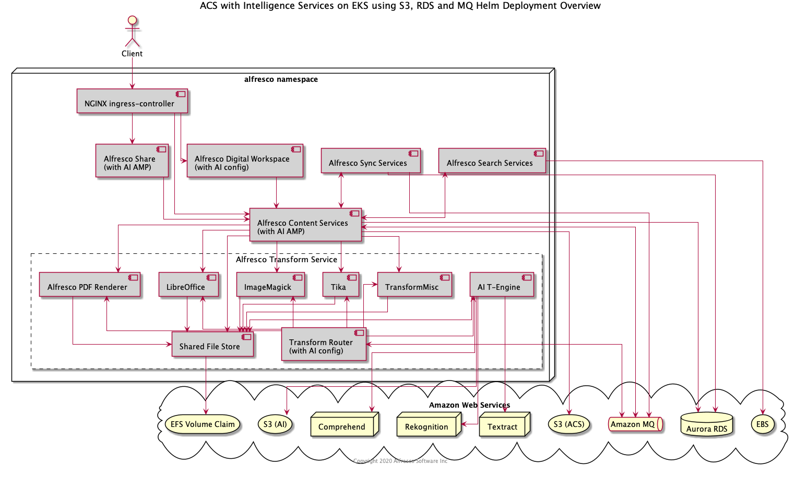

# ACS Helm Deployment with Intelligence Services

By default, [Alfresco Intelligence
Services](https://docs.alfresco.com/intelligence/concepts/ai-welcome.html)
feature is disabled, this example describes how to deploy ACS onto
[EKS](https://aws.amazon.com/eks) with AIS enabled.

The diagram below shows the deployment produced by this example:



## Prerequisites

Follow the [AWS Services](with-aws-services.md) example up until the
[Deploy](with-aws-services.md#deploy) section and return to this page.

## Setup S3 Bucket

Follow the steps in the official documentation to [setup an IAM user and an S3
bucket](https://docs.alfresco.com/intelligence/concepts/aws-setup.html) for use
by AIS.

## Deploy

When we bring all this together we can deploy ACS using the command below
(replacing all the `YOUR-XZY` properties with the values gathered during the
setup of the services):

```bash
helm install acs alfresco/alfresco-content-services \
  --set alfresco-repository.persistence.enabled=false \
  --set filestore.persistence.enabled=true \
  --set filestore.persistence.storageClass="nfs-client" \
  --set global.known_urls=https://acs.YOUR-DOMAIN-NAME \
  --set global.search.sharedSecret:=$(openssl rand -hex 24) \
  --set global.alfrescoRegistryPullSecrets=quay-registry-secret \
  --set alfresco-repository.image.repository="quay.io/alfresco/alfresco-content-repository-aws" \
  --set share.image.repository="quay.io/alfresco/alfresco-share-aws" \
  --set postgresql.enabled=false \
  --set database.external=true \
  --set database.driver="org.postgresql.Driver" \
  --set database.url="jdbc:postgresql://YOUR-DATABASE-ENDPOINT:5432/" \
  --set database.user="alfresco" \
  --set database.password="YOUR-DATABASE-PASSWORD" \
  --set activemq.enabled=false \
  --set messageBroker.url="YOUR-MQ-ENDPOINT" \
  --set messageBroker.user="alfresco" \
  --set messageBroker.password="YOUR-MQ-PASSWORD" \
  --set global.ai.enabled=true \
  --set ai.aws.accessKey="YOUR-AI-AWS-ACCESS-KEY-ID" \
  --set ai.aws.secretAccessKey="YOUR-AI-AWS-SECRET-KEY" \
  --set ai.aws.region="YOUR-AWS-REGION" \
  --set ai.aws.s3Bucket="YOUR-AI-BUCKET-NAME" \
  --set ai.aws.comprehendRoleARN="YOUR-AI-AWS-COMPREHEND-ROLE-ARN" \
  --atomic \
  --timeout 10m0s \
  --namespace=alfresco
```
