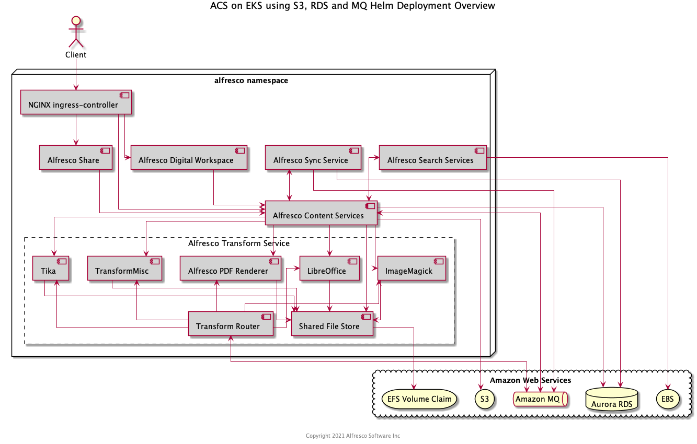
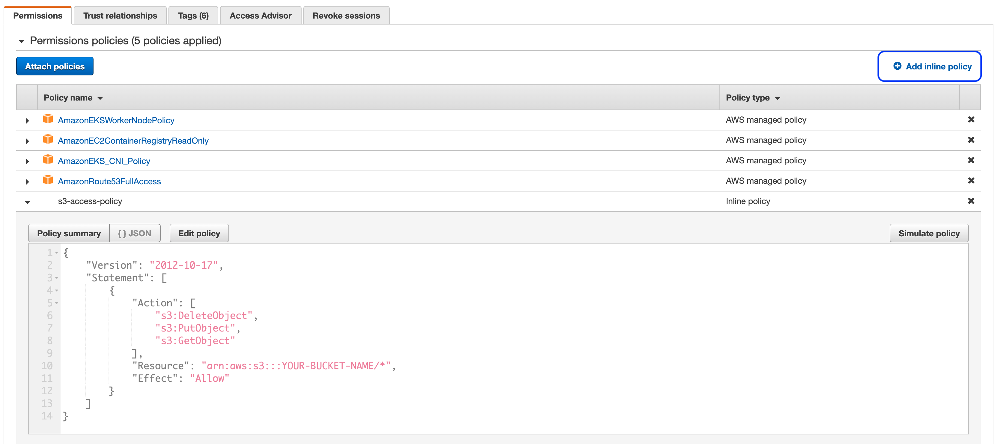
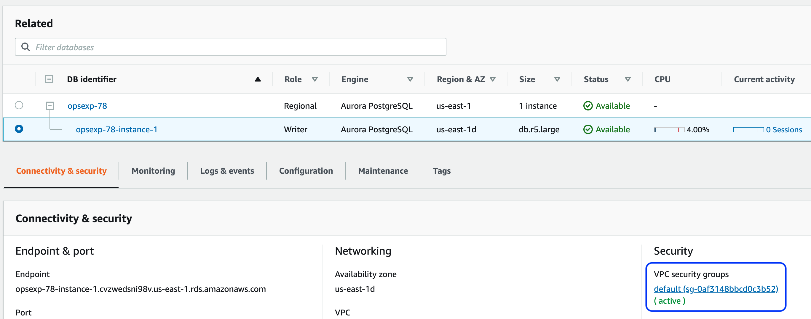
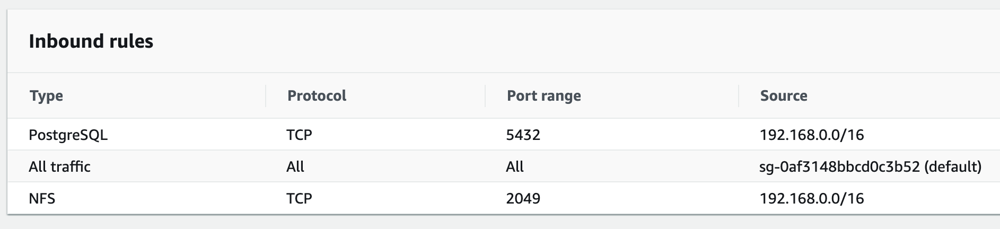
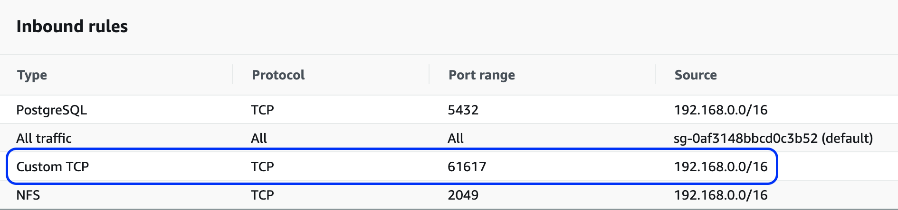

# Alfresco Content Services Helm Deployment with AWS Services

This example describes how to deploy ACS onto [EKS](https://aws.amazon.com/eks) and use [S3](https://aws.amazon.com/s3) for content storage, [RDS](https://aws.amazon.com/rds) as an external database and [Amazon MQ](https://aws.amazon.com/amazon-mq) as an external message broker.

The diagram below shows the deployment produced by this example:



## Prerequisites

Follow the [EKS deployment](../eks-deployment.md) guide up until the [ACS](../eks-deployment.md#acs) section, once the docker registry secret is installed return to this page.

## Setup Services

The following sections describe how to setup the AWS services and highlights the information required to deploy ACS.

### S3

1. Create an S3 bucket in the same region as your cluster using the following command (replacing `YOUR-BUCKET-NAME` with a name of your choice):

    ```bash
    aws s3 mb s3://YOUR-BUCKET-NAME
    ```

2. Enable versioning using the following command (replacing `YOUR-BUCKET-NAME` with the name you chose in the previous step):

    ```bash
    aws s3api put-bucket-versioning --bucket YOUR-BUCKET-NAME --versioning-configuration Status=Enabled
    ```

3. Find the name of the role used by the nodes by running the following command (replacing `YOUR-CLUSTER-NAME` with the name you gave your cluster):

    ```bash
    aws eks describe-nodegroup --cluster-name YOUR-CLUSTER-NAME --nodegroup-name linux-nodes --query "nodegroup.nodeRole" --output text
    ```

4. In the [IAM console](https://console.aws.amazon.com/iam/home) find the role discovered in the previous step and create a new inline policy (highlighted in the screenshot below) using the JSON content below (replacing `YOUR-BUCKET-NAME` with the name you chose in the step one):

    ```json
    {
        "Version": "2012-10-17",
        "Statement": [
            {
                "Action": [
                    "s3:DeleteObject",
                    "s3:PutObject",
                    "s3:GetObject"
                ],
                "Resource": "arn:aws:s3:::YOUR-BUCKET-NAME/*",
                "Effect": "Allow"
            }
        ]
    }
    ```

    The end result should resemble something similar to the screenshot below:

    

### RDS

1. Create an Aurora cluster using the "Create database" wizard in the [RDS Console](https://console.aws.amazon.com/rds/home).

    * Select the "Standard Create" option so you can choose the VPC later
    * Select the "Amazon Aurora with PostgreSQL compatibility" Edition
    * Select "14.3" for the Version
    * Provide a "DB cluster identifier" of your choosing
    * Change the "Master username" to `alfresco`
    * In the "Connectivity" section select the VPC created by eksctl that contains your EKS cluster
    * Expand the "Additional configuration" section and provide a "Initial database name" of `alfresco`
    * Leave all other options set to the default
    * Press the orange "Create database" button

2. Once the cluster has been created (it can take a few minutes) make a note of the generated master password using the "View credentials details" button in the header banner.
3. Select the database with the "Writer" role and click on the default security group link (as shown in the screenshot below)

    

4. Add an inbound rule for PostgreSQL traffic from the VPC CIDR range (it will be the same as the NFS rule setup earlier) as shown in the screenshot below:

    

5. Finally, take a note of the database Endpoint (shown in the screenshot in step 3)

### Amazon MQ

1. Create an Amazon MQ broker using the "Create brokers" wizard in the [MQ Console](https://console.aws.amazon.com/amazon-mq/home).

    * Select "Single-instance broker" option and press the Next button
    * Provide a "Broker name" of your choosing
    * In the "ActiveMQ Access" section specify `alfresco` as the "Username" and a "Password" of your choice
    * In the "Additional settings" section choose the "Select existing VPC and subnet(s)" option
    * Select the VPC created by eksctl that contains your EKS cluster
    * Choose the "Select existing security groups" option and select the VPC's default security group from the list
    * Leave all other options set to the default
    * Press the orange "Create broker" button

2. Once the broker has been created (it can take a few minutes) view the broker details and click on the link to the security group.
3. Add an inbound rule for ActiveMQ traffic (TCP port 61617) from the VPC CIDR range (it will be the same as the NFS rule setup earlier) as shown in the screenshot below:

    

4. Finally, take a note of the OpenWire Endpoint displayed in the "Connections" section

## Deploy

In order to use the S3 connector and external database options, the S3 connector AMP and database drivers are required, respectively. Fortunately, a Docker image has been pre-packaged with the artifacts and can be used as-is for our deployment. To use the image we will override the `repository.image.repository` property.

To use the S3 connector, RDS and Amazon MQ we have to disable the internal default components via the Helm "set" command and additionally provide the service endpoints and credentials we made a note of in the previous sections.

When we bring all this together we can deploy ACS using the command below (replacing all the `YOUR-XZY` properties with the values gathered during the setup of the services):

```bash
helm install acs alfresco/alfresco-content-services \
--set externalPort="443" \
--set externalProtocol="https" \
--set externalHost="acs.YOUR-DOMAIN-NAME" \
--set persistence.enabled=true \
--set persistence.storageClass.enabled=true \
--set persistence.storageClass.name="nfs-client" \
--set global.alfrescoRegistryPullSecrets=quay-registry-secret \
--set repository.image.repository="quay.io/alfresco/alfresco-content-repository-aws" \
--set s3connector.enabled=true \
--set s3connector.config.bucketName="YOUR-BUCKET-NAME" \
--set s3connector.config.bucketLocation="YOUR-AWS-REGION" \
--set postgresql.enabled=false \
--set database.external=true \
--set database.driver="org.postgresql.Driver" \
--set database.url="jdbc:postgresql://YOUR-DATABASE-ENDPOINT:5432/" \
--set database.user="alfresco" \
--set database.password="YOUR-DATABASE-PASSWORD" \
--set activemq.enabled=false \
--set messageBroker.url="YOUR-MQ-ENDPOINT" \
--set messageBroker.user="alfresco" \
--set messageBroker.password="YOUR-MQ-PASSWORD" \
--atomic \
--timeout 10m0s \
--namespace=alfresco
```

> NOTE: Alternatively, Aurora MySQL can be used instead of PostgreSQL by selecting the "Amazon Aurora with MySQL compatibility" option and version "5.7.12" in the create database wizard. You'll also need to change the `database.driver` value to "org.mariadb.jdbc.Driver" and change the `database.url` to `"jdbc:mariadb:aurora//YOUR-DATABASE-ENDPOINT:3306/alfresco?useUnicode=yes&characterEncoding=UTF-8"`.

> NOTE: If your `database.url` contains semi-colons i.e. for SQL Server, you will need to escape them e.g. `"jdbc:sqlserver://YOUR-DATABASE-ENDPOINT:1433\\;databaseName=alfresco\\;lockTimeout=1000\\;"`
