# Alfresco Content Services Helm Deployment with AWS Services

- [Alfresco Content Services Helm Deployment with AWS Services](#alfresco-content-services-helm-deployment-with-aws-services)
  - [Architecture diagrams](#architecture-diagrams)
    - [Alfresco Transform Services](#alfresco-transform-services)
    - [Search Enterprise](#search-enterprise)
  - [Prerequisites](#prerequisites)
  - [Setup Services](#setup-services)
    - [S3](#s3)
    - [RDS](#rds)
    - [Amazon MQ](#amazon-mq)
    - [Amazon Opensearch](#amazon-opensearch)
  - [Deploy](#deploy)

This example describes how to deploy ACS onto [EKS](https://aws.amazon.com/eks)
and use [S3](https://aws.amazon.com/s3) for content storage,
[RDS](https://aws.amazon.com/rds) as an external database and
[Amazon MQ](https://aws.amazon.com/amazon-mq) as an external message broker.

## Architecture diagrams

The diagram below shows the deployment produced by this example:

```mermaid
graph LR

classDef alf fill:#0b0,color:#fff
classDef aws fill:#fa0,color:#fff
classDef k8s fill:#326ce5,stroke:#326ce5,stroke-width:2px,color:#fff
classDef thrdP fill:#e098a6,color:#000

Client("👥 Clients")

subgraph Helm enterprise
  direction LR

  subgraph workloads
    Deployment_alfresco-cc(Deployment: alfresco-cc):::alf
    Deployment_alfresco-dw(Deployment: alfresco-dw):::alf
    Deployment_alfresco-repository(Deployment: alfresco-repository):::alf
    Deployment_alfresco-sync-service(Deployment: alfresco-sync-service):::alf
    Deployment_share(Deployment: share):::alf
  end

  subgraph ingress
    Ingress_alfresco-cc(Ingress: alfresco-cc):::k8s
    Ingress_alfresco-dw(Ingress: alfresco-dw):::k8s
    Ingress_alfresco-repository(Ingress: alfresco-repository):::k8s
    Ingress_alfresco-sync-service(Ingress: alfresco-sync-service):::k8s
    Ingress_share(Ingress: share):::k8s
  end
end

subgraph AWS
  mq[Amazon MQ]:::aws
  opensearch[OpenSearch]:::aws
  rds[Aurora RDS]:::aws
  s3[S3 Bucket]:::aws
end

Client ---> Ingress_alfresco-cc --> Deployment_alfresco-cc
Client ---> Ingress_alfresco-dw --> Deployment_alfresco-dw
Client --> Ingress_alfresco-repository --> Deployment_alfresco-repository
Client --> Ingress_share --> Deployment_share
Client --> Ingress_alfresco-sync-service --> Deployment_alfresco-sync-service

Deployment_share --> Deployment_alfresco-repository

Deployment_alfresco-repository --> rds
Deployment_alfresco-repository --> mq
Deployment_alfresco-repository --> opensearch

Deployment_alfresco-sync-service --> rds
Deployment_alfresco-sync-service --> mq
Deployment_alfresco-sync-service --> Deployment_alfresco-repository

Deployment_alfresco-repository --> s3
```



### Alfresco Transform Services


### Search Enterprise


## Prerequisites

Follow the [EKS deployment](../eks-deployment.md) guide up until the
[ACS](../eks-deployment.md#development-version-of-charts) section, once the docker registry secret is
installed return to this page.

:information_source: In the EKS installation documentation mentioned above, the
EFS volume is used in order to persist both the ACS contentstore and the
transformations shared file store. Here S3 is the contentstore's backend so the
EFS volume is only used by the SFS service. Persistence for SFS can actually be
withdrawn so no EFS volume is needed anymore. Please make sure you understand
the implications below:

- Renditions performed for "in-flight" documents may be lost. By "in-flight" we
  mean documents that are currently being uploaded to the repository.
  Generation of these renditions can be retried, and this retry will happen
  when using Alfresco UI and trying to access the content again.
- Without a truly persistent volume you can only have one single SFS pod. A
  single pod is the default configuration as we do not anticipate high load for
  this component and we rely on Kubernetes orchestration to in case the pod
  crashes. Though if your use-case requires higher availability standards, you
  may want to have multiple SFS pods in the deployment and stick with EFS.

The rest of this document assume EFS is used for SFS. To disable it replace
the values below:

```yaml
alfresco-transform-service:
  filestore:
    persistence:
      enabled: true
      storageClass: nfs-client
```

with:

```yaml
alfresco-transform-service:
  filestore:
    persistence:
      enabled: false  # or use helm CLI --set alfresco-transform-service.filestore.persistence.enabled=false
```

## Setup Services

The following sections describe how to setup the AWS services and highlights
the information required to deploy ACS.

### S3

1. Create an S3 bucket in the same region as your cluster using the following
   command (replacing `YOUR-BUCKET-NAME` with a name of your choice):

    ```bash
    aws s3 mb s3://YOUR-BUCKET-NAME
    ```

2. Enable versioning using the following command (replacing `YOUR-BUCKET-NAME`
   with the name you chose in the previous step):

    ```bash
    aws s3api put-bucket-versioning --bucket YOUR-BUCKET-NAME \
      --versioning-configuration Status=Enabled
    ```

3. Find the name of the role used by the nodes by running the following command
   (replacing `YOUR-CLUSTER-NAME` with the name you gave your cluster):

    ```bash
    aws eks describe-nodegroup --cluster-name YOUR-CLUSTER-NAME \
      --nodegroup-name linux-nodes --query "nodegroup.nodeRole" --output text
    ```

4. In the [IAM console](https://console.aws.amazon.com/iam/home) find the role
   discovered in the previous step and create a new inline policy (highlighted
   in the screenshot below) using the JSON content below (replacing
   `YOUR-BUCKET-NAME` with the name you chose in the step one):

    ```json
    {
        "Version": "2012-10-17",
        "Statement": [
            {
                "Action": [
                    "s3:DeleteObject",
                    "s3:PutObject",
                    "s3:GetObject"
                ],
                "Resource": "arn:aws:s3:::YOUR-BUCKET-NAME/*",
                "Effect": "Allow"
            }
        ]
    }
    ```

    The end result should resemble something similar to the screenshot below:

    

### RDS

1. Create an Aurora cluster using the "Create database" wizard in the
   [RDS Console](https://console.aws.amazon.com/rds/home).

   - Select the "Standard Create" option so you can choose the VPC later
   - Select the "Amazon Aurora with PostgreSQL compatibility" Edition
   - Select "14.3" for the Version
   - Provide a "DB cluster identifier" of your choosing
   - Change the "Master username" to `alfresco`
   - In the "Connectivity" section select the VPC created by eksctl that
     contains your EKS cluster
   - Expand the "Additional configuration" section and provide a "Initial
     database name" of `alfresco`
   - Leave all other options set to the default
   - Press the orange "Create database" button

2. Once the cluster has been created (it can take a few minutes) make a note of
   the generated master password using the "View credentials details" button in
   the header banner.
3. Select the database with the "Writer" role and click on the default security
   group link (as shown in the screenshot below)

    

4. Add an inbound rule for PostgreSQL traffic from the VPC CIDR range (it will
   be the same as the NFS rule setup earlier) as shown in the screenshot below:

    

5. Finally, take a note of the database Endpoint (shown in the screenshot in
   step 3)

> Note: Alfresco Sync Service also needs to have its own schema. Either you'll
> want to create a second schema on the same RDS instance (and then use the
> same JDBC connection parameter but changeing the database name part), or you
> can repeat the same RDS instance creation and repository and syncservice will
> use different RDS instances.

### Amazon MQ

1. Create an Amazon MQ broker using the "Create brokers" wizard in the
   [MQ Console](https://console.aws.amazon.com/amazon-mq/home).

   - In "Broker engine types", select "Apache ActiveMQ"
   - In "Deployment Mode", select "Single-instance broker" if you are just
     testing or "Active/standby broker" option for production environments
   - Provide a "Broker name" of your choosing
   - In "Broker instance type", avoid any `mq.-.micro` type that has
     [limited_max_connections](https://docs.aws.amazon.com/amazon-mq/latest/developer-guide/amazon-mq-limits.html#broker-limits)
     and won't work with default Alfresco settings
   - In "ActiveMQ Access", specify an username and a password of your choice
   - In "Additional settings", choose the "Select existing VPC and subnet(s)" option
   - Select the VPC created by eksctl that contains your EKS cluster
   - Choose the "Select existing security groups" option and select the VPC's
     default security group from the list
   - Leave all other options set to the default
   - Proceed with "Create broker" button

2. Once the broker has been created (it takes 20 minutes on average) view the
   broker details and click on the link to the security group.
3. Add an inbound rule for ActiveMQ traffic (TCP port 61617) from the VPC CIDR
   range (it will be the same as the NFS rule setup earlier) as shown in the
   screenshot below:

    

4. Finally, take a note of the OpenWire Endpoint displayed in the "Connections"
   section

> :warning: make sure to use a failover URL. If you chose to use a
> "Single-instance broker", still wrap its URL in `failover:()`.

### Amazon Opensearch

1. Create an Elasticsearch domain using AWS web console.

   - Hit the "Create domain" button
   - In "Deployment type", choose between "Production" or "Development and
     testing" depending on your use case
   - In "Version", select "Elasticsearch 7.10"
   - Adjust "Data nodes" settings as you prefer, T3 instance types are the most
     affordable options for small clusters.
   - In "Network", select the EKS VPC or "Public access" if Alfresco will run
     outside AWS.
   - If required, select a security group with an inbound access for 443/tcp
     port
   - In "Fine-grained access control", select "Create master user" and specify
     your preferred username and password credentials
   - In "Access policy", select "Only use fine-grained access control".
   - Unfold the "Advanced cluster settings" and set "Max clause count" to `10240`
   - Hit "Create" button.

2. Once the domain has been created, take note of the "Domain endpoint"
3. If not already allowed, add 443/tcp access to the security group associated
   with the Domain.

## Deploy

In order to use the S3 connector and external database options, the S3
connector AMP and database drivers are required, respectively. Fortunately, a
Docker image has been pre-packaged with the artifacts and can be used as-is in
order to test deployments. To use the image we will override the
`repository.image.repository` property.

To use the S3 connector, RDS and Amazon MQ we have to disable the internal
default components via the Helm "set" command and additionally provide the
service endpoints and credentials we made a note of in the previous sections.
We also need to tell kubernetes that no persistent volume is needed for
repository deployments, as we're leveraging the S3 integration. A local
filesystem is still needed on repository pods, but it can be ephemeral (See
[Storage_doc](https://github.com/Alfresco/acs-deployment/blob/master/docs/helm/storage.md)).

When we bring all this together we can deploy ACS using the command below
(replacing all the `YOUR-XZY` properties with the values gathered during the
setup of the services).
Edit your `values.yml` file so it contains below elements:

```yaml
global:
  known_urls:
    - https://acs.YOUR-DOMAIN-NAME
  search:
    url: https://YOUR-DOMAIN-HOSTNAME/
    username: YOUR-DOMAIN-MASTER-USERNAME
    password: YOUR-DOMAIN-MASTER-PASSWORD
  alfrescoRegistryPullSecrets: quay-registry-secret
alfresco-repository:
  image:
    repository: quay.io/alfresco-content-repository-aws
  configuration:
    search:
      flavor: elasticsearch
      securecomms: https
  persistence:
    enabled: false
  environement:
    CATALINA_OPTS: >-
      -Ds3.bucketName=YOUR-BUCKET-NAME
      -Ds3.bucketLocation=YOUS_AWS_REGION
alfresco-transform-service:
  filestore:
    persistence:
      enabled: true
      storageClass: nfs-client
postgresql:
  enabled: false
database:
  external: true
  driver: org.postgresql.Driver
  url: jdbc:postgresql://YOUR-DATABASE-ENDPOINT:5432/
  user: alfresco
  password: YOUR-DATABASE-PASSWORD
activemq:
  enabled: false
messageBroker: &acs_messageBroker
  url: YOUR-MQ-ENDPOINT
  user: alfresco
  password: YOUR-MQ-PASSWORD
alfresco-search:
  enabled: false
alfresco-search-enterprise:
  enabled: true
elasticsearch:
  enabled: false
alfresco-sync-service:
  messageBroker: *acs_messageBroker
  database:
    url: jdbc:postgresql://SYNC-SERVICE-DATABASE-ENDPOINT:5432/
    user: alfresco
    password: YOUR-SYNCDB-PASSWORD
```

Then you can deploy using:

```bash
helm -n alfresco install acs ./alfresco/alfresco-content-services \
  --atomic --timeout 10m0s
```

If you're deploying from the registry of charts you can't update the
`values.yml` file. Instead you either:

- use a local copy of the `values.yml` file amended as shown above (and use the
  ```helm install -f my-values.yml ...```
- use ```--set``` options to pass individual values.

Note however that the main `values.yml` file uses
[YAML_anchors_and_aliases](https://yaml.org/spec/1.2.2/#3222-anchors-and-aliases)
to propagate configuration to subcharts if needed.
Using `--set` do not fill the yaml file with passed values and so aliases will
never point to a node filled with the values passed by the command line.
That means when using command line you must also pass aliased values as shown
below (at the end of the command):

```bash
helm -n alfresco install acs \
  --repo https://kubernetes-charts.alfresco.com/stable alfresco-content-services \
  --atomic --timeout 10m0s \
  --set global.known_urls=https://acs.YOUR-DOMAIN-NAME \
  --set global.alfrescoRegistryPullSecrets=quay-registry-secret \
  --set global.search.url=https://YOUR-DOMAIN-HOSTNAME \
  --set global.search.username=YOUR-DOMAIN-MASTER-USERNAME \
  --set global.search.password=YOUR-DOMAIN-MASTER-PASSWORD \
  --set alfresco-repository.persistence.enabled=false \
  --set alfresco-repository.image.repository=alfresco-content-repository-aws \
  --set alfresco-repository.configuration.search.flavor=elasticsearch \
  --set alfresco-repository.configuration.search.securecomms=https \
  --set alfresco-transform-service.filestore.persistence.enabled=true \
  --set alfresco-transform-service.filestore.persistence.storageClass="nfs-client" \
  --set alfresco-repository.image.repository="quay.io/alfresco/alfresco-content-repository-aws" \
  --set alfresco-repository.environment.CATALINA_OPTS="-Ds3.bucketName=YOUR-BUCKET-NAME -Ds3.bucketLocation=YOUS_AWS_REGION" \
  --set postgresql.enabled=false \
  --set database.external=true \
  --set database.driver="org.postgresql.Driver" \
  --set database.url="jdbc:postgresql://YOUR-DATABASE-ENDPOINT:5432/" \
  --set database.user="alfresco" \
  --set database.password="YOUR-DATABASE-PASSWORD" \
  --set activemq.enabled=false \
  --set messageBroker.url="YOUR-MQ-ENDPOINT" \
  --set messageBroker.user="alfresco" \
  --set messageBroker.password="YOUR-MQ-PASSWORD" \
  --set alfresco-sync-service.database.url="jdbc:postgresql://SYNC-SERVICE-DATABASE-ENDPOINT:5432/" \
  --set alfresco-sync-service.database.user="alfresco" \
  --set alfresco-sync-service.database.password="YOUR-SYNCDB-PASSWORD" \
  --set alfresco-sync-service.messageBroker.url="YOUR-MQ-ENDPOINT" \
  --set alfresco-sync-service.messageBroker.user="alfresco" \
  --set alfresco-sync-service.messageBroker.password="YOUR-MQ-PASSWORD" \
  --set alfresco-search.enabled=false \
  --set alfresco-search-enterprise.enabled=true
```

> NOTE: Alternatively, Aurora MySQL can be used instead of PostgreSQL by
> selecting the "Amazon Aurora with MySQL compatibility" option and version
> "5.7.12" in the create database wizard. You'll also need to change the
> `database.driver` value to "org.mariadb.jdbc.Driver" and change the
> `database.url` to
> `"jdbc:mariadb:aurora//YOUR-DATABASE-ENDPOINT:3306/alfresco?useUnicode=yes&characterEncoding=UTF-8"`.
>
> NOTE: If your `database.url` contains semi-colons i.e. for SQL Server, you
> will need to escape them e.g.
> `"jdbc:sqlserver://YOUR-DATABASE-ENDPOINT:1433\\;databaseName=alfresco\\;lockTimeout=1000\\;"`
