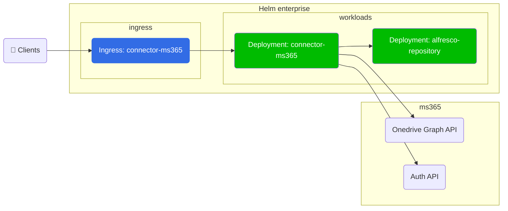

# ACS Helm Deployment with Microsoft 365 Connector

The [Alfresco Microsoft 365
Connector](https://docs.alfresco.com/officeonline/concepts/office-online-intro.html)
enables Office Online Integration (OOI) within Alfresco Digital Workspace such
that users can share and co-author Office documents stored within ACS using the
Microsoft 365. By default, this feature is disabled.

This example describes how to deploy ACS onto [EKS](https://aws.amazon.com/eks)
with OOI enabled.

## Architecture



## Prerequisites

Follow the [AWS Services](with-aws-services.md) example up until the
[Deploy](with-aws-services.md#deploy) section and return to this page.

## Deploy

When we bring all this together we can deploy ACS using the command below
(replacing all the `YOUR-XZY` properties with the values gathered during the
setup of the services):

```bash
helm install acs alfresco/alfresco-content-services \
  --set alfresco-repository.persistence.enabled=false \
  --set alfresco-transform-service.filestore.persistence.enabled=true \
  --set alfresco-transform-service.filestore.persistence.storageClass="nfs-client" \
  --set global.known_urls=https://acs.YOUR-DOMAIN-NAME \
  --set global.search.sharedSecret:=$(openssl rand -hex 24) \
  --set global.alfrescoRegistryPullSecrets=quay-registry-secret \
  --set postgresql.enabled=false \
  --set database.external=true \
  --set database.driver="org.postgresql.Driver" \
  --set database.url="jdbc:postgresql://YOUR-DATABASE-ENDPOINT:5432/" \
  --set database.user="alfresco" \
  --set database.password="YOUR-DATABASE-PASSWORD" \
  --set activemq.enabled=false \
  --set messageBroker.url="YOUR-MQ-ENDPOINT" \
  --set messageBroker.user="alfresco" \
  --set messageBroker.password="YOUR-MQ-PASSWORD" \
  --set alfresco-connector-ms365.enabled=true \
  --set-string alfresco-digital-workspace.env.APP_CONFIG_PLUGIN_MICROSOFT_ONLINE="true" \
  --set alfresco-digital-workspace.env.APP_CONFIG_MICROSOFT_ONLINE_OOI_URL="https://YOUR-EXTERNAL-HOST/ooi-service/api/-default-/private/office-integration/versions/1/edit-sessions/" \
  --set alfresco-digital-workspace.env.APP_CONFIG_MICROSOFT_ONLINE_CLIENTID="YOUR-ADW-MS-ONLINE-CLIENT-ID" \
  --set alfresco-digital-workspace.env.APP_CONFIG_MICROSOFT_ONLINE_AUTHORITY="https://login.microsoftonline.com/ADW-MS-ONLINE-TENANT-ID" \
  --set alfresco-digital-workspace.env.APP_CONFIG_MICROSOFT_ONLINE_REDIRECT="https://YOUR-EXTERNAL-HOST" \
  --atomic \
  --timeout 10m0s \
  --namespace=alfresco
```

> Note: as per the `helm install` example above, you will need to specify
> `--set-string alfresco-digital-workspace.env.APP_CONFIG_PLUGIN_MICROSOFT_ONLINE="true"`
> otherwise you may see an error such as

```sh
Error: template: alfresco-content-services/charts/adw/templates/deployment.yaml:48:28: executing "alfresco-content-services/charts/adw/templates/deployment.yaml" at <$val>: wrong type for value; expected string; got bool
```
