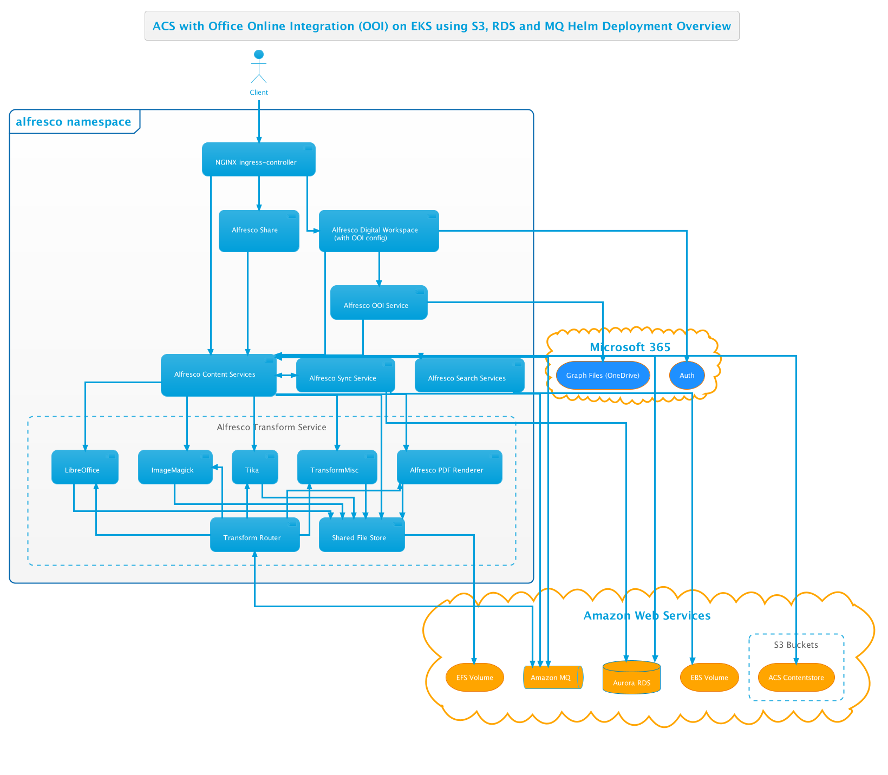

# Alfresco Content Services Helm Deployment with Microsoft 365 Connector (Office Online Integration)

By default, [Alfresco Microsoft 365 Connector](https://docs.alfresco.com/intelligence/concepts/ai-welcome.html) feature is disabled. The Microsoft 365 Connector  
enables Office Online Integration (OOI) within Alfresco Digital Workspace such that users can share and co-author Office documents stored within ACS using the Microsoft 365.

This example describes how to deploy ACS onto [EKS](https://aws.amazon.com/eks) with OOI enabled.

The diagram below shows the deployment produced by this example:



## Prerequisites

Follow the [AWS Services](with-aws-services.md) example up until the [Deploy](with-aws-services.md#deploy) section and return to this page.


## Deploy

When we bring all this together we can deploy ACS using the command below (replacing all the `YOUR-XZY` properties with the values gathered during the setup of the services):

```bash
helm install acs alfresco/alfresco-content-services --devel \
--set externalPort="443" \
--set externalProtocol="https" \
--set externalHost="acs.YOUR-DOMAIN-NAME" \
--set persistence.enabled=true \
--set persistence.storageClass.enabled=true \
--set persistence.storageClass.name="nfs-client" \
--set global.alfrescoRegistryPullSecrets=quay-registry-secret \
--set s3connector.enabled=true \
--set s3connector.config.bucketName="YOUR-BUCKET-NAME" \
--set s3connector.config.bucketLocation="YOUR-AWS-REGION" \
--set postgresql.enabled=false \
--set database.external=true \
--set database.driver="org.postgresql.Driver" \
--set database.url="jdbc:postgresql://YOUR-DATABASE-ENDPOINT:5432/" \
--set database.user="alfresco" \
--set database.password="YOUR-DATABASE-PASSWORD" \
--set activemq.enabled=false \
--set messageBroker.url="YOUR-MQ-ENDPOINT" \
--set messageBroker.user="alfresco" \
--set messageBroker.password="YOUR-MQ-PASSWORD" \
--set ooi.enabled=true \
--set ooiService.alfresco.baseUrl="YOUR-..." \
--set adw.env.APP_CONFIG_PLUGIN_MICROSOFT_ONLINE="true" \
--set adw.env.APP_CONFIG_MICROSOFT_ONLINE_OOI_URL="YOUR-..." \
--set adw.env.APP_CONFIG_MICROSOFT_ONLINE_CLIENTID="YOUR-..." \
--set adw.env.APP_CONFIG_MICROSOFT_ONLINE_AUTHORITY="YOUR-..." \
--set adw.env.APP_CONFIG_MICROSOFT_ONLINE_REDIRECT="YOUR-..." \
--atomic \
--timeout 10m0s \
--namespace=alfresco
```

TODO - test the above ! (and then remove this line)
