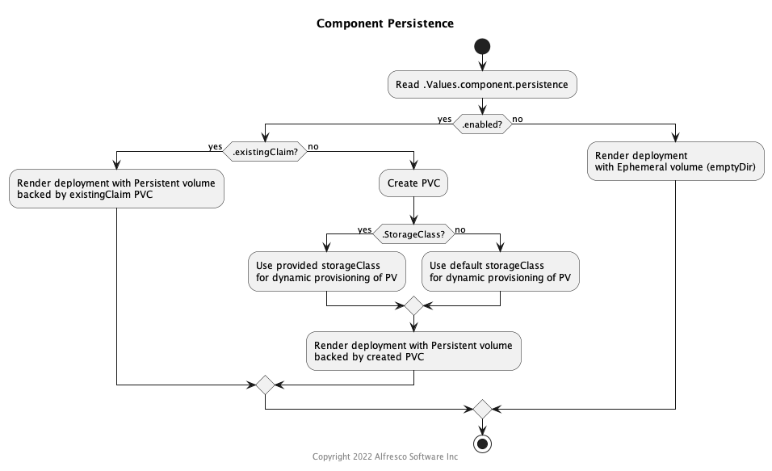

# ACS Storage persistence in kubernetes

ACS platform in order to serve users' requests, needs to persist several type
of data so it survives pods restart, cordons of worker nodes or even crashes.
This documents aims at providing guidance in setting up different kinds of
data persistence.

## Available storage options

There mainly 2 different options when setting up persistence in kubernetes:

* Static provisioning
* Dynamic provisioning

The charts Alfresco provides leverage a common mechanism to configure both options.
This mechanism can be reused by different charts or sub-charts in the same way.

> Note: direct usage of kubernetes volumes (without PVC) is not supported)

The logic used in the template is depicted b the diagram below:



Whatever the option you choose, start by enabling persistence under the
component which needs it:

```yaml
component:
  persistence:
    enabled: true
```

### Configuring static provisioning

This method requires the cluster administrator to provision in advance a
[physical volume claim (PVC)](https://kubernetes.io/docs/concepts/storage/volumes/#persistentvolumeclaim).
That PVC needs to fulfil requirements driven by  the cluster architecture. That
usually means:

* offering `ReadWriteMany`
  [accessModes](https://kubernetes.io/docs/concepts/storage/persistent-volumes/#access-modes)
  for components which have a `Deployment.replicas` > 1 and more than one
  schedule-able worker node.
* Providing sufficient speed and space for the workload
* Being given a [Reclaim
  Policy](https://kubernetes.io/docs/tasks/administer-cluster/change-pv-reclaim-policy/)
  that DO match environment type (you probably want to avoid using `Delete` in
  your production environment).

Plus all your other site-specific requirements.

To use static provisioning:

```yaml
component:
  persistence:
    enabled: true
    existingClaim: ecmVolume
```

That method can be convenient in production environment where the data pre-exists
the infrastructure. In that case a cluster admin might also want to [pre-bind PV and
PVC](https://kubernetes.io/docs/concepts/storage/persistent-volumes/#reserving-a-persistentvolume).

### Configuring dynamic provisioning

This method offers a dynamic provisioning approach so cluster admins do not need to
manually create PV and its corresponding PVC. Instead what they need to have is
a [storageClass](https://kubernetes.io/docs/concepts/storage/storage-classes/) which
has a [provisioner](https://kubernetes.io/docs/concepts/storage/storage-classes/#provisioner).

With that configuration ,if no volume exists when a deployments needs to spin up pods,
Kubernetes will use the `provisioner`to create one on-the-fly:

```yaml
component:
  persistence:
    enabled: true
    storageClass: dc1-nfs-exports
```

## Migrating from previous chart versions

Previous versions of the chart did not use that per-component approach to storage.
Instead, the default behavior was to create a PVC and rely by default on it for
any kind of data to persist). That approach has proven to cause problems and
that's why we're moving away from it.
However if you have already deployed using this approach and want to keep it
(which we don't recommend), you can do so by using the static provisioning approach
and set the `existingClaim` to the previously created PVC `alfresco-volume-claim`:

```yaml
postgresql:
  persistence:
    existingClaim: alfresco-volume-claim
```

Another option is to create a new volume and copy data to it from the old
volume bound to the old `alfresco-volume-claim`.
Details of this process depends on the type of storage and provisioner that
was used during deployment.

If you choose the second - and preferred - method, you'll then need to use
[static provisioning method](#configuring-static-provisioning) to create a new volume and
then instruct helm to search for a specific volume by claim name or
`storageClass`. Using `storageClass` requires creating a new PVC too, which
should reference the PV name to make sure a new volume is not dynamically
created.
Also,  applying `labels` to the PV and corresponding `selector` to the PVC
helps ensure the `storageClass` will only pick the intended volume.
