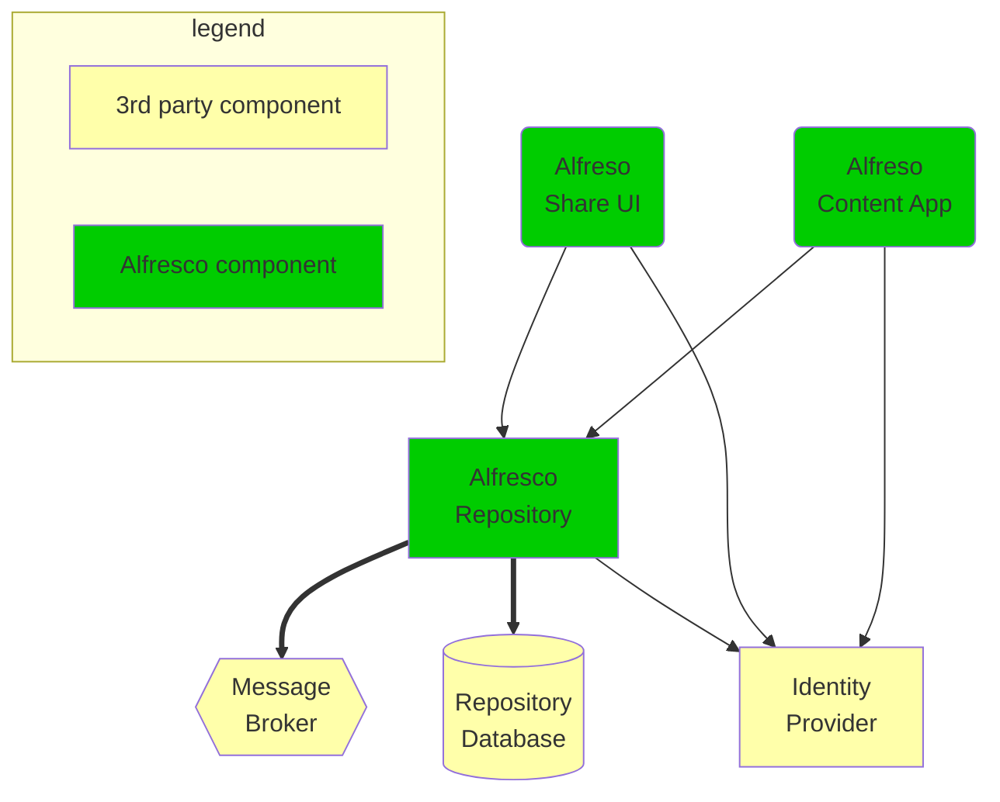

# SSO integration with Keycloak (vanilla)

This is an extension of the base setup presented in the [step by step guide](./step-by-step-guide.md). Make sure you have it running before reading
further (unless you just want to look at how to integrate Keycloak with ACS
component without trying it on your local machine).

## Architecture of the deployment

The following components are deployed by the example chart:



## Keycloak

As of Alfresco 23.1 Alfresco Identity Service is not required anymore. It is
possible to use a vanilla Keyloak distribution. In this document we will use the
[Codecentric Keyloak chart](https://github.com/codecentric/helm-charts/tree/keycloakx-2.3.0/charts/keycloakx)
so we can reuse similar patterns of integration we've been using earlier.

### Declaring the dependency

Add below lines in `Chart.yaml`

```yaml
dependencies:
  - name: keycloakx
    repository: https://codecentric.github.io/helm-charts
    version: 2.3.0
```

### Configure Keycloak

If you want to apply custom configuration as you build your own charts, refer to
the [chart README](https://artifacthub.io/packages/helm/codecentric/keycloakx).

In this example we'll start by simply adding the basic configuration in the
`values.yaml` file:

```yaml
keycloakx:
  nameOverride: keycloak
  command:
    - /opt/keycloak/bin/kc.sh
    - start
    - --http-enabled=true
    - --http-port=8080
    - --hostname-strict=false
    - --hostname-strict-https=false
    - --import-realm
  http:
    relativePath: /auth  # keycloak http api will be available under this path
  ingress:
    enabled: true  # enabled external access the keycloak
    tls: []  # disable https for this example
    rules:
      - host: >-
          {{ template "alfresco-common.external.host" $ }}  # external hostname
        paths:
          - path: "{{ .Values.http.relativePath }}"
            pathType: Prefix
  extraEnvFrom: |
    - configMapRef:
        name: keycloak
  extraEnv: |
    - name: JAVA_OPTS_APPEND
      value: >-
        -Djgroups.dns.query={{ include "keycloak.fullname" . }}-headless
```

And create a configmap for basic configuration:

```yaml
apiVersion: v1
kind: ConfigMap
metadata:
  name: keycloak
  labels: {{- include "acs-sso-example.labels" . | nindent 4 }}
data:
  KC_HOSTNAME: {{ template "alfresco-common.external.host" . }}
```

> Again here some named templates provided in the alfresco-common chart might
> come handy to avoid duplicating values.

This will start a keycloak instance with basic parameters and only a master
realm. To make it usable we need to give it an admin username & password and
also a realm Alfresco applications will be configured in as client(s).

#### Keycloak admin

Admin credentials can be passed as a kubernetes secret. Here we will create
this secret from the umbrella chart values which we'll add as shown below in
the same `values.yaml` file:

```yaml
keycloakx:
  nameOverride: keycloak
  admin:
    # -- Keycloak admin username
    username: admin
    # -- Keycloak admin password.
    password: null  # autogenerate
```

Now, let's create the secret we'll use to pass to the keycloakx chart in
`templates/secret-idp.yaml`:

```yaml
{{- if empty (lookup "v1" "Secret" $.Release.Namespace "keycloak") }}
apiVersion: v1
kind: Secret
metadata:
  name: keycloak
  labels: {{- include "acs-sso-example.labels" . | nindent 4 }}
  annotations:
    "helm.sh/resource-policy": keep
data:
  {{- with .Values.keycloakx }}
  KC_BOOTSTRAP_ADMIN_USERNAME: {{ .admin.username | default "admin" | b64enc | quote }}
  KC_BOOTSTRAP_ADMIN_PASSWORD: >-
    {{ (.admin.password | default (randAscii 16)) | b64enc }}
  {{- end }}
{{- end }}
```

#### Alfresco realm

In order to create a realm we need to:

- provide the json definition of the realm
- mount it in the `/opt/keycloak/data/import` folder in the pod
- ensure keycloak is started with the `--import` switch.

Again, in order to provide the realm definition we'll use values in the
umbrella chart `values.yaml`:

```yaml
keycloakx:
  extraEnvFrom: |
    - secretRef:
        name: keycloak
  realm:
    # -- Alfresco Realm definition
    - id: alfresco
      realm: alfresco
      enabled: true
      sslRequired: none
      loginTheme: alfresco
      clients:
        - clientId: alfresco
          enabled: true
          standardFlowEnabled: true
          implicitFlowEnabled: true
          publicClient: true
          redirectUris: >-
            {{- $redirectUris := list }}
            {{- range (index (include "alfresco-common.known.urls" $ | mustFromJson) "known_urls") }}
            {{- $redirectUris = append $redirectUris (printf "%s/*" .) }}
            {{- end }}
            {{- $redirectUris }}
          webOrigins: >-
            {{ index (include "alfresco-common.known.urls" $ | mustFromJson) "known_urls" }}
      users:
        - # -- default Alfresco admin user
          username: admin
          enabled: true
          credentials:
            - type: password
              # -- default Alfresco admin password
              value: secret
      internationalizationEnabled: true
      defaultLocale: en
      supportedLocales:
        - "ca"
        - "de"
        - "en"
        - "es"
        - "fr"
        - "it"
        - "ja"
        - "lt"
        - "nl"
        - "no"
        - "pt-BR"
        - "ru"
        - "sv"
        - "zh-CN"
```

And a new secret in `templates/secret-idp-realm.yaml`:

```yaml
apiVersion: v1
kind: Secret
metadata:
  name: keycloak-realm
  labels: {{- include "acs-sso-example.labels" . | nindent 4 }}
data:
  {{- with .Values.keycloakx.admin.realm }}
    {{- range . }}
      {{- range .clients }}
        {{- $_ := set . "redirectUris" (tpl .redirectUris $ | list) }}
        {{- $_ := set . "webOrigins" (tpl .webOrigins $ | list) }}
      {{- end }}
      {{- printf "%s.json" .id | nindent 2 }}: {{ mustToJson . | b64enc | quote }}
    {{- end }}
  {{- end }}
```

#### Alfresco theme

Importing a theme requires adding the theme's code to the `/opt/keycloak/themes`
directory. Configmap or Secrets are not well suited for that as this is a whole
directory structure we need to mount and also because such resources are also
limited in size. A good alternative is to create an [ephemeral
volume](https://kubernetes.io/docs/concepts/storage/ephemeral-volumes/) and use
an [init
container](https://kubernetes.io/docs/concepts/workloads/pods/init-containers/)
and use it to populate the ephemeral volume the main container of the keycloak
will use later on in the pod's lifecycle. All of this is done using values in
the `values.yaml` file as shown below:

```yaml
# Ephemeral volume
extraVolumes: |
  - name: theme
    emptyDir: {}
# volume mount for the main container
extraVolumeMounts: |
  - name: theme
    mountPath: /opt/keycloak/themes
extraInitContainers: |
  - image: busybox:1.37
    imagePullPolicy: IfNotPresent
    name: theme-fetcher
    command: [sh]
    args:
      - -c
      - |
        wget https://github.com/Alfresco/alfresco-keycloak-theme/releases/download/0.3.5/alfresco-keycloak-theme-0.3.5.zip -O alfresco.zip
        unzip -d /themes alfresco.zip
    volumeMounts:
      - name: theme
        mountPath: /themes
```

## Alfresco repository SSO configuration

Now let's amend the ACS config to enable SSO. Well do it using a feature of the
[alfresco-repository] chart which allow us use a configmap as the
`alfresco-global.properties` file.

The configmap needs to contains what you put in the `alfresco-global.properties`
file and you can use templating to populate it. E.g. in
`templates/configmap-repo.yaml`

```yaml
apiVersion: v1
kind: ConfigMap
metadata:
  name: repository-properties
  labels: {{- include "acs-sso-example.labels" . | nindent 4 }}
data:
  alfresco-global.properties: |
    authentication.chain = identity-service1:identity-service,alfrescoNtlm1:alfrescoNtlm
    identity-service.authentication.enabled = true
    identity-service.realm = alfresco
    {{- $kCtx := dict "Values" .Values.keycloakx "Chart" .Chart "Release" .Release }}
    identity-service.auth-server-url = http://{{ include "keycloak.fullname" $kCtx }}-http{{ .Values.keycloakx.http.relativePath }}
    identity-service.enable-basic-auth = true
```

`identity-service.realm` needs to match the name of the realm defined earlier.
To get the right `identity-service.auth-server-url` we are computing the context
of the keycloakx subcharts in `$kCtx` (using `nameOverride`) and pass that
context to the same templating code used in the subchart to give the service a
name. This is because here you here we're using localhost as a domain, but if
you use a true DNS domain the repo could point tpo this instead (which you can
set in `known_urls` and use `alfresco-common.external.url`).

Then in the `values.yaml` file add below configuration to `alfresco-repository`:

```yaml
alfresco-repository:
  configuration:
    repository:
      existingConfigMap: repository-properties
```

## Alfresco Share

For Share the approach is very similar.

### Declaring Share dependency

In `Chart.yaml`

```yaml
  - name: alfresco-share
    repository: https://alfresco.github.io/alfresco-helm-charts/
    version: 0.3.0
```

### Configuring Alfresco Share

In `values .yaml` we add the required config as per the
[share chart doc](https://github.com/Alfresco/alfresco-helm-charts/tree/main/charts/alfresco-share):

```yaml
alfresco-share:
  nameOverride: alfresco-share
  image:
    repository: alfresco/alfresco-share
    tag: 23.2.0-A13
  repository:
    existingConfigMap:
      name: share-repository
  extraVolumes:
    - name: share-properties
      configMap:
        name: share-properties
  extraVolumeMounts:
    - name: share-properties
      mountPath: >-
        /usr/local/tomcat/webapps/share/WEB-INF/classes/share-config.properties
      subPath: share.properties
  ingress:
    hosts:
      - host: localhost
        paths:
          - path: /share
            pathType: Prefix
```

Then we proceed in creating the few configmaps we need.

The first one to tell Share where the repo is in `templates/configmap-share.yaml`:

```yaml
apiVersion: v1
kind: ConfigMap
metadata:
  name: share-repository
  labels: {{- include "acs-sso-example.labels" . | nindent 4 }}
data:
  {{- with (index .Values "alfresco-repository") }}
  {{- $repoCtx := dict "Values" . "Chart" $.Chart "Release" $.Release }}
  {{- $reposvc := .service | default dict }}
  REPO_HOST: {{ template "alfresco-repository.fullname" $repoCtx }}
  REPO_PORT: {{ $reposvc.port | default 80 | quote }}
  {{- end }}
```

And the second one to hold the SSO config in `templates/configmap-share-properties.yaml`:

```yaml
apiVersion: v1
kind: ConfigMap
metadata:
  name: share-properties
  labels: {{- include "acs-sso-example.labels" . | nindent 4 }}
data:
  share.properties: |
    aims.enabled = true
    {{- with .Values.keycloakx }}
    {{- $kCtx := dict "Values" . "Chart" $.Chart "Release" $.Release }}
    aims.realm = {{ index .admin.realm 0 "realm" }}
    aims.resource = {{ index .admin.realm 0 "clients" 0 "clientId" }}
    aims.publicClient=true
    aims.principalAttribute=sub
    aims.authServerUrl = {{ printf "http://%s-http%s" (include "keycloak.fullname" $kCtx) .http.relativePath }}
    {{- end }}
```

## Alfresco Content App

### Declaring Content dependency

In `Chart.yaml:

```yaml
  - name: common
    alias: alfresco-content-app
    repository: https://activiti.github.io/activiti-cloud-helm-charts
    version: 8.2.0
```

### Configuring Alfresco Content App

The content-app basic and SSO configuration sits only in the `values.yaml` file.
Pay special attention to providing OAUTH2 urls that match your realm
configuration (realm name & client id).

```yaml
alfresco-content-app:
  nameOverride: alfresco-content-app
  enabled: true
  service:
    envType: frontend
  ingress:
    ingressClassName: nginx
    hostName: localhost
    path: /workspace
    annotations:
      nginx.ingress.kubernetes.io/proxy-body-size: 5g
      nginx.ingress.kubernetes.io/proxy-buffer-size: 8k
    tls: []
  image:
    repository: alfresco/alfresco-content-app
    tag: 4.3.0
    pullPolicy: IfNotPresent
  env:
    APP_CONFIG_PROVIDER: ECM
    APP_CONFIG_AUTH_TYPE: OAUTH
    APP_CONFIG_OAUTH2_HOST: "{protocol}//{hostname}{:port}/auth/realms/alfresco"
    APP_CONFIG_OAUTH2_CLIENTID: alfresco
    APP_CONFIG_OAUTH2_REDIRECT_SILENT_IFRAME_URI: "{protocol}//{hostname}{:port}/assets/silent-refresh.html"
  securityContext:
    runAsNonRoot: true
    runAsUser: 101
    capabilities:
      drop:
        - NET_RAW
        - ALL
  resources:
    requests:
      cpu: "0.25"
      memory: "256Mi"
    limits:
      cpu: "1"
      memory: "1024Mi"
```

## Deployment

We can now build and deploy the chart:

```bash
helm dep build # pull dependencies
helm install --generate-name --atomic .
```

[alfresco-repository]: https://github.com/Alfresco/alfresco-helm-charts/tree/main/charts/alfresco-repository
