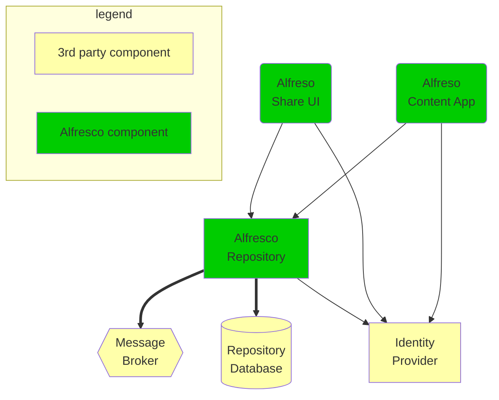

# SSO integration with Keycloak (vanilla)

This is an extension of the base setup presented in the [step by step
guide](./step-by-step-guide.md). Make sure you have it running before reading
further (unless you just want to look at how to integrate Keycloak with ACS
component without trying it on your local machine).

## Architecture of the deployment

The following components are deployed by the example chart:

