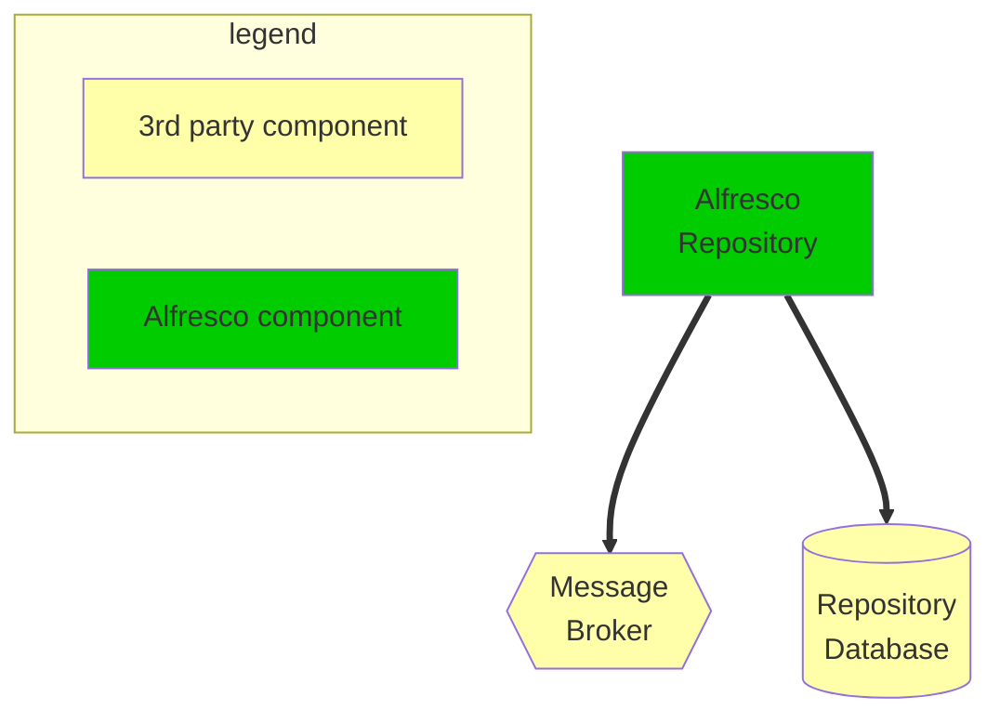

# Anatomy of the example chart (and how you can build your own)

This document explains the mechanisms used in this chart to build a Alfresco
platform to deploy on [Kubernetes](https://kubernetes.io/).

## Why an example charts when there is already the alfresco-content-services?

With [alfresco-content-services chart](../../alfresco-content-services/README.md) we
tried to provide something that can deploy most of our software components -
still not all of them are included - but also serves as a basis for
customization for real world scenarios. These two paradigms have actually
proven to fight one another and we think this chart is doing way too much
things to really be both understandable - and serve the example purpose and to
build upon - and to also offer an holistic and straight forward deployment
mean: There's no one size fit all configuration and when it comes to deployment
and configuration of a platform which involves so many different components,
including third party ones (database, message broker, Identity provider, ...).

For that reason we have started creating individual charts for Alfresco
components in the [alfresco-helm-charts
repository](https://github.com/Alfresco/alfresco-helm-charts/tree/main/charts) (more to
come and PR are welcome).

## High overview of the example chart

This example chart extensively leverages the concept of [chart
dependencies](https://helm.sh/docs/topics/charts/#chart-dependencies) in Helm.

One of the goal is to make this chart as simple as possible while still
providing way to deploy exactly the platform you. So most of the kubernetes
resources are actually provided in the individual component charts we declare
as dependencies and this chart is mostly creating the plumbing between each
components we want to use. This type of Helm chart is often referred to as an
*umbrella* chart.

Here we will see how to declare dependencies an configure them properly so they
work together.

### Architecture of the deployment

In the document bellow we discuss an initial basic setup as shown below:



> Note: there is no search component neither is there a transformation service.

This set up will be enriched with more components configured for SSO using
vanilla keycloak [here](./sso-guide.md)

## Pre-requisites

### Kubernetes

As this chart is meant to deploy on localhost if you want to use it you'll
need a kubernetes distribution setup on your local machine.

> We usually use
> [KinD](https://kind.sigs.k8s.io/docs/user/quick-start/#installation) but
> Docker-desktop, Podman or miinkube should be OK to use if properly configured.

Give your kubernetes setup 8GB of RAM and a few CPUs.

### Ingress

You will also need to have the [nginx-ingress](https://docs.nginx.com/nginx-ingress-controller/)
installed and configured to handle local traffic on port 80.

> :warning: If you use KinD, you need to install a patched version of the NGINX
> ingress as described
> [here](../../../docs/helm/kind-deployment.md#step-3-install-ingress-nginx)
> If using another kubernetes distribution check it doesn't come with a default
> ingress controller different from NGINX and if so, disable it. Once done
> install the [NGINX ingress
> controller](https://docs.nginx.com/nginx-ingress-controller/installation/installing-nic/)

Make sure the nginx ingress controller have the following settings enabled:

- `allow-snippet-annotations` set to `true`
- `annotations-risk-level` set to `Critical`
- `proxy-buffer-size` set to `12k`

You can do that at installation time using [nginx-ingress
annotations](https://docs.nginx.com/nginx-ingress-controller/configuration/ingress-resources/advanced-configuration-with-annotations/)
or after the installation of the ingress, using the command below (e.g. for KinD):

```bash
kubectl -n ingress-nginx patch cm ingress-nginx-controller -p \
  '{"data": {"annotations-risk-level":"Critical","allow-snippet-annotations":"true","proxy-buffer-size":"12k"}}'
```

### Helm

Make sure you have [Helm](https://helm.sh) installed on your machine. It is
often provided has part of the kubernetes desktop distributions but if you
don't have [install it](https://helm.sh/docs/intro/install/).

## Starting building the example (your) chart

### Base skeleton

Before we start referencing components' charts we need to create a [chart
structure](https://helm.sh/docs/topics/charts/#the-chart-file-structure).

To do that, use the command below:

```bash
helm create mychart && cd $_
```

As the chart we want to create is simply an umbrella chart, there are actually
too much things this command scaffolds. We'll continue and cleanup what we
don't need.

```bash
rm templates/*.yaml templates/NOTES.txt
```

Now we can give the chart some metadata, like a version, a description and so
on. Find more details in the [Helm doc](https://helm.sh/docs/topics/charts/#the-chartyaml-file).

### Repository Database

To start with, we need to give Alfresco a database. Here we will use the
[PostgreSQL Bitnami chart](https://github.com/bitnami/charts/tree/main/bitnami/postgresql).
It is simple and lightweight enough for the purpose of this example.

#### Declaring the dependency

Dependencies are declared in the `Chart.yaml` file adding the section below:

```yaml
dependencies:
  - name: postgresql
    repository: oci://registry-1.docker.io/bitnamicharts
    version: 13.4.0
    alias: repository-database
```

The charts declared as dependencies are also called "subcharts".

> If you're building your own chart to deploy on a production environment, you
> may want to use a database service that either lives outside of the kubernetes
> cluster (e.g. RDS) or use a more "production ready" deployment for Kubernetes
> (There are some very good PostgreSQL Kubernetes operators such as
> [CrunchyData](https://github.com/CrunchyData/postgres-operator)).

#### Configuring the database subchart

Now that the dependency is declared we can configure the subchart to match our
needs. Each chart should provide its own set of values, which are usually
documented in the main `README.md` file of the source repository.  In our case
the documentation useful to us is
[here](https://github.com/bitnami/charts/tree/main/bitnami/postgresql).

For example we want to:

- Set the database name
- Set the database username
- Set the database password
- Disable persistence

As per the documentation mentioned above, this translates to the yaml
configuration below in the values.yaml file of the umbrella chart:

```yaml
repository-database:
  nameOverride: repository-database
  auth:
    database: alfresco
    username: alfresco
    password: alfresco
  primary:
    persistence:
      enabled: false
```

The values documented for the chart we depend on are placed under a YAML key
named after the chart name or its declared alias (here `repository-database`).

Also note we set a `nameOverride` value. This ensures consistent resource naming
when the Helm template is rendered, and in particular when giving the service a
name (as this name is needed to tell other components how to connect to the
database).

### Message Broker

#### Declaring the broker dependency

For the message broker we will use an Alfresco provided chart. This is because
there no official or well maintained chart one can rely on. In a real world
scenario the best options remains to use a managed ActiveMQ instance outside of
the kubernetes cluster.

Just as for the database chart we declare the activemq chart as a dependency of
our umbrella chart.

```yaml
  - name: activemq
    repository: https://alfresco.github.io/alfresco-helm-charts/
    version: 3.4.1
```

#### Configuring the message broker subchart

Again, we start by taking a look at the [documented
values](https://github.com/Alfresco/alfresco-helm-charts/tree/main/charts/activemq)
for the chart we want to use.

For our example purpose we'll configure the message broker with:

- a defined username and password
- persistence disabled

So we're adding the values below in the `values.yaml`file of the umbrella chart:

```yaml
activemq:
  nameOverride: activemq
  persistence:
    enabled: false
  adminUser:
    user: alfresco
    password: alfresco
```

### Now step back and think

So far w have just setup 2 independent components. They don't interact together.
But at this point we need to wonder what are the key information generated by
this chart, that we'll need to configure other charts?

That's basically the connection details:

- database URL
- database username
- database password
- message broker URL
- message broker username
- message broker password

The credentials are statically defined in the values file so that's easy.
The URLs on the other hand, are slightly more tricky as they are built
dynamically by the each subchart.

All Alfresco components' charts support 2 ways to provide this type of configuration:

- through the usual values
- through configmaps and secrets

For example, if we want to tell the ACS repo where its database is located we
can use either of the following YAML data structure:

```yaml
# value based configuration
...
  database:
    url: url://...
    username: scott
    password: tiger
```

```yaml
# resource based configuration
...
  database:
    existingConfigMap:
      name: db-cm
      keys:
        url: DB_URL
    existingSecret:
      name: db-secret
      keys:
        username: DB_USER
        password: DB_PASS
```

> Note: the path to the `database` key may vary from one Alfreso chart to
> another, check each chart README page.

The key difference between values based config and resource based config is
that values can only take static strings, while resource can be pre-existing
configmaps or secrets, or can even be rendered  from template in the main
umbrella chart, thus allowing for a bit of manipulation. The later is the
approach we prefer using to configure Alfresco component charts.

### Alfresco Repository

#### Declaring the repository dependency

```yaml
  - name: alfresco-repository
    repository: https://alfresco.github.io/alfresco-helm-charts/
    version: 0.1.3
```

#### Configuring the repository subchart

The [Alfresco repository chart
documentation](https://github.com/Alfresco/alfresco-helm-charts/tree/main/charts/alfresco-repository)
shows how to configure the repo db and message broker using configmaps and secrets:

```yaml
alfresco-repository:
  nameOverride: alfresco-repository
  # Use Community
  replicaCount: 1
  image:
    repository: alfresco/alfresco-content-repository-community
  # Ensure Alfresco is served on the localhost domain
  ingress:
    hosts:
      - host: localhost
        paths:
          - path: /
            pathType: Prefix
          - path: /api-explorer
            pathType: Prefix
  # Actual component configuration
  configuration:
    db:
      existingConfigMap:
        name: repository-database
      existingSecret:
        name: repository-database
    messageBroker:
      existingConfigMap:
        name: repository-message-broker
      existingSecret:
        name: repository-message-broker
```

Here we omit the `*.keys.*` values as we will create both the configmap and the
secret and we have the freedom to use the default keys keys as documented in
the subchart README.

#### Creating the config resources

Let's first create the secrets where we credentials will be available to
components which needs them. To avoid spreading credentials where not needed,
we'll have one for each service:

- the database secret can be defined as follow in `templates/secret-db.yaml

  ```yaml
  apiVersion: v1
  kind: Secret
  metadata:
    name: repository-database
    labels: {{- include "acs-sso-example.labels" . | nindent 4 }}
  data:
  {{- with (index .Values "repository-database") }}
    DATABASE_USERNAME: {{ .auth.username | b64enc | quote }}
    DATABASE_PASSWORD: {{ .auth.password | b64enc | quote }}
  {{- end }}
  ```

- the message broker secret in `templates/secret-mq.yaml

  ```yaml
  apiVersion: v1
  kind: Secret
  metadata:
    name: repository-message-broker
    labels: {{- include "acs-sso-example.labels" . | nindent 4 }}
  data:
  {{- with .Values.activemq.adminUser }}
    BROKER_USERNAME: {{ .user | b64enc | quote }}
    BROKER_PASSWORD: {{ .password | b64enc | quote }}
  {{- end }}
  ```

Now we can create configmaps to compute the services URL:

- the database configmap in `templates/confgimap-db.yaml`

  ```yaml
  apiVersion: v1
  kind: ConfigMap
  metadata:
    name: repository-database
    labels: {{- include "acs-sso-example.labels" . | nindent 4 }}
  data:
    DATABASE_DRIVER: org.postgres.Driver
    {{- with (index .Values "repository-database") }}
    {{- $dbCtx := dict "Values" . "Chart" $.Chart "Release" $.Release }}
    {{- $dbHost := include "postgresql.v1.primary.fullname" $dbCtx }}
    DATABASE_URL: >-
      {{ printf "jdbc:postgresql://%s:5432/%s" $dbHost .auth.database }}
    {{- end }}
  ```

The URL is built dynamically using string concatenation and the very same [named
template](https://helm.sh/docs/chart_template_guide/named_templates/) that's
used in the postgresql subchart to define the postgresql service name: see the
[code](https://github.com/bitnami/charts/blob/fc36e80c9ae42fd6a423a567c7fa1f6dab44ffd3/bitnami/postgresql/templates/primary/svc.yaml).

> Note we are building a `$dbCtx` to mimic the context the subchart uses when
> evaluating `postgresql.v1.primary.fullname`. This is where it's important to
> have a `nameOverride`value defined for each subchart which provides a service
> that must be accessed by another subchart.

- message broker configmap in `templates/configmap-mq.yaml`

  ```yaml
  apiVersion: v1
  kind: ConfigMap
  metadata:
    name: repository-message-broker
    labels: {{- include "acs-sso-example.labels" . | nindent 4 }}
  data:
    {{- with .Values.activemq }}
    {{- $mqCtx := dict "Values" . "Chart" $.Chart "Release" $.Release }}
    {{- $mqUrl := printf "nio://%s-broker" (include "activemq.fullname" $mqCtx) }}
    BROKER_URL: >-
      {{ include "alfresco-common.activemq.url.withFailover" $mqUrl }}
    {{- end }}
  ```

We also provide [named template](https://helm.sh/docs/chart_template_guide/named_templates/)
one can use to ease creating config resources. Here we're using
`alfresco-common.activemq.url.withFailover` - which returns a valid failover
activemq URL as expected by Alfresco components - but there are some others you
may find handy in the
[alfresco-common](https://github.com/Alfresco/alfresco-helm-charts/tree/main/charts/alfresco-common/templates)
chart.

> The config resources presented here have been slightly simplified for the
> sake of readability, so for instance they do not support changing the default
> port in the postgresql or activemq chart but that doesn't change the higher
> level logic.

## First deployment

It is now time to test our deployment as we have a system that matches the
architecture we wanted and all the configured components should be configured
properly to work together.

```bash
helm dep build # pull dependencies
helm install --generate-name --atomic .
```

You can now open your browser on `http://localhost/alfresco`

## Next steps

To discover more ways to configure Alfresco components you can take a look at
the [SSO part](./sso-guide.md) of this chart. It explains how to use a vanilla
Keycloak chart with various Alfresco components, thus exposing other means to
tweak them for your needs.
