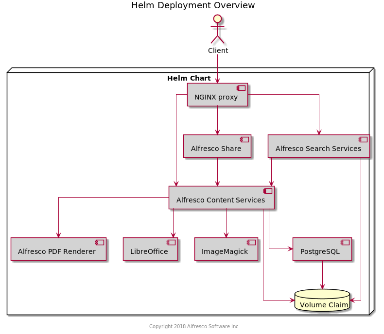

# Alfresco Content Services (ACS) Helm Chart

Alfresco Content Services is an Enterprise Content Management (ECM) system that is used for document and case management, project collaboration, web content publishing, and compliant records management.  The flexible compute, storage, and database services that Kubernetes offers make it an ideal platform for Alfresco Content Services. This helm chart presents an enterprise-grade Alfresco Content Services configuration that you can adapt to virtually any scenario, and scale up, down, or out, depending on your use case.

To use, add the `incubator` or `stable` repository to your local Helm.
```console
helm repo add alfresco-incubator http://kubernetes-charts.alfresco.com/incubator
helm repo add alfresco-stable http://kubernetes-charts.alfresco.com/stable
```
## Versioning

The versioning of the Helm Chart is based on [SemVer](https://semver.org/) as it is [supported by Helm](https://docs.helm.sh/developing_charts/#charts-and-versioning). There are a few ACS specific extensions to the rules. Please refer to [Helm versioning guide](../../docs/helm-versioning.md).

Stable charts are published in [stable repository](http://kubernetes-charts.alfresco.com/stable). Once a stable chart is published, an entry will be added to [releases table](../../docs/helm-chart-releases.md).

## To install the ACS cluster

```console
$ helm install alfresco-incubator/alfresco-content-services
```

## Introduction

This chart bootstraps an ACS deployment on a [Kubernetes](http://kubernetes.io) cluster using the [Helm](https://helm.sh) package manager.

## Prerequisites
  - [30-day trial](https://www.alfresco.com/platform/content-services-ecm/trial/download) for Enterprise
  - Kubernetes 1.4+ with Beta APIs enabled
  - Minimum of 16GB Memory to distribute among ACS Cluster nodes

## Structure



## Installing the Chart

To install the chart with the release name `my-acs`:

```console
# Alfresco Admin password should be encoded in MD5 Hash
export ALF_ADMIN_PWD=$(printf %s 'MyAdminPwd' | iconv -t UTF-16LE | openssl md4 | awk '{ print $1}')

# Alfresco Database (Postgresql) password
export ALF_DB_PWD='MyDbPwd'

$ helm install --name my-acs alfresco-incubator/alfresco-content-services \
               --set repository.adminPassword="$ALF_ADMIN_PWD" \
               --set postgresql.postgresPassword="$ALF_DB_PWD"
```

The command deploys ACS Cluster on the Kubernetes cluster in the default configuration (but with your chosen Alfresco administrator & database passwords). The [configuration](#configuration) section lists the parameters that can be configured during installation.

> **Tip**: List all releases using `helm list`

## Uninstalling the Chart

To uninstall/delete the `my-acs` deployment:

```console
$ helm delete my-acs --purge
```

The command removes all the Kubernetes components associated with the chart and deletes the release.

## Configuration

The following table lists the configurable parameters of the ACS chart and their default values.

Parameter | Description | Default
--- | --- | ---
`repository.adminPassword` | Administrator password for ACS in md5 hash format | md5: `209c6174da490caeb422f3fa5a7ae634` (of string `admin`)
`postgresql.enabled` | Enable the use of the postgres chart in the deployment | `true`
`postgresql.postgresUser` | Postgresql database user | `alfresco`
`postgresql.postgresPassword` | Postgresql database password | `alfresco`
`postgresql.postgresDatabase` | Postgresql database name | `alfresco`
`database.external` | Enable the use of an externally provisioned database | `false`
`database.driver` | External database driver | ``
`database.user` | External database user | ``
`database.password` | External database password | ``
`database.url` | External database jdbc url | ``
`alfresco-search.resources.requests.memory` | Alfresco Search Services requests memory | `250Mi`
`alfresco-search.ingress.enabled` | Enable external access for Alfresco Search Services | `false`
`alfresco-search.ingress.basicAuth` | If `alfresco-search.ingress.enabled` is `true`, user needs to provide a `base64` encoded `htpasswd` format user name & password (ex: `echo -n "$(htpasswd -nbm solradmin somepassword)"` where `solradmin` is username and `somepassword` is the password) | None
`alfresco-search.ingress.whitelist_ips` | If `alfresco-search.ingress.enabled` is `true`, user can restrict `/solr` to a list of IP addresses of CIDR notation | `0.0.0.0/0`
`persistence.repository.enabled` | Enable Volume Persistence on repository. | `true`
`s3connector.enabled` | Switch this to `true` if you have access to the S3 Connector AMP | `false`
`s3connector.config` | S3 configuration - see [S3 Connector properties reference](https://docs.alfresco.com/s3connector/references/s3-contentstore-ref-config-props.html). Example: `s3connector.config.bucketName: myS3Bucket` | `{}`
`s3connector.secrets` | S3 secrets configuration - see [S3 Connector properties reference](https://docs.alfresco.com/s3connector/references/s3-contentstore-ref-config-props.html). Example: `s3connector.secrets.accessKey: AJJJJJJJJ` | `{}`
`email.server.enabled` | Enables the email server - see [Inbound SMTP configuration properties](https://docs.alfresco.com/6.2/concepts/email-inboundsmtp-props.html)  | `false` |
`email.server.port` | Specifies the port number for the email server - see [Inbound SMTP configuration properties](https://docs.alfresco.com/6.2/concepts/email-inboundsmtp-props.html)  | `1125` |
`email.server.domain` | Specifies the name or the IP address of the network to bind the email server to - see [Inbound SMTP configuration properties](https://docs.alfresco.com/6.2/concepts/email-inboundsmtp-props.html)  |  |
`email.server.enableTLS`  | STARTTLS  is an extension to plain text communication protocols - see [Inbound SMTP Email Server Configuration](https://hub.alfresco.com/t5/alfresco-content-services-hub/inbound-smtp-email-server-configuration/ba-p/289370)  | `true` |
`email.server.hideTLS`  | STARTTLS  is an extension to plain text communication protocols - see [Inbound SMTP Email Server Configuration](https://hub.alfresco.com/t5/alfresco-content-services-hub/inbound-smtp-email-server-configuration/ba-p/289370)  | `false` |
`email.server.requireTLS` | STARTTLS  is an extension to plain text communication protocols - see [Inbound SMTP Email Server Configuration](https://hub.alfresco.com/t5/alfresco-content-services-hub/inbound-smtp-email-server-configuration/ba-p/289370)  | `false` |
`email.server.auth.enabled` | Authentication is turned on by setting the following property - see [Inbound SMTP configuration properties](https://docs.alfresco.com/6.2/concepts/email-inboundsmtp-props.html)  | `true` |
`email.server.connections.max`  | The maximum number of connections allowed.  Increase this number to favour the email subsystem at the expense of the rest of alfresco - see [Inbound SMTP configuration properties](https://docs.alfresco.com/6.2/concepts/email-inboundsmtp-props.html)  | `3` |
`email.server.allowed.senders`  | Provides a comma-separated list of email REGEX patterns of allowed senders - see [Inbound SMTP configuration properties](https://docs.alfresco.com/6.2/concepts/email-inboundsmtp-props.html)  |  |
`email.server.blocked.senders`  | Provides a comma-separated list of email REGEX patterns of blocked senders - see [Inbound SMTP configuration properties](https://docs.alfresco.com/6.2/concepts/email-inboundsmtp-props.html)  |  |
`email.inbound.enabled` | Enable/Disable the inbound email service - see [Inbound SMTP configuration properties](https://docs.alfresco.com/6.2/concepts/email-inboundsmtp-props.html)  | `false` |
`email.inbound.unknownUser` | The username to authenticate with when the sender address is not recognised in alfresco - see [Inbound SMTP configuration properties](https://docs.alfresco.com/6.2/concepts/email-inboundsmtp-props.html)  | `anonymous` |
`email.inbound.emailContributorsAuthority`  | Allow the email contributors to belong to an authority  - see [Inbound SMTP configuration properties](https://docs.alfresco.com/6.2/concepts/email-inboundsmtp-props.html)  |  |
`email.handler.folder.overwriteDuplicates`  | Should duplicate messages to a folder overwrite each other or be named with a (number) - see [Inbound SMTP configuration properties](https://docs.alfresco.com/6.2/concepts/email-inboundsmtp-props.html)  | `true` |
`mail.encoding` | Specifies UTF-8 encoding for email - see [Outbound SMTP configuration properties](https://docs.alfresco.com/6.2/concepts/email-outboundsmtp-props.html)  | `UTF-8` |
`mail.host` | Specifies the host name of the SMTP host, that is, the host name or IP address of the server to which email should be sent - see [Outbound SMTP configuration properties](https://docs.alfresco.com/6.2/concepts/email-outboundsmtp-props.html)  |  |
`mail.port` | Specifies the port number on which the SMTP service runs (the default is 25) - see [Outbound SMTP configuration properties](https://docs.alfresco.com/6.2/concepts/email-outboundsmtp-props.html)  | `25` |
`mail.protocol` | Specifies which protocol to use for sending email - see [Outbound SMTP configuration properties](https://docs.alfresco.com/6.2/concepts/email-outboundsmtp-props.html)  | `smtps` |
`mail.username` | Specifies the user name of the account that connects to the smtp server - see [Outbound SMTP configuration properties](https://docs.alfresco.com/6.2/concepts/email-outboundsmtp-props.html)  |  |
`mail.password` | Specifies the password for the user name used in mail.username - see [Outbound SMTP configuration properties](https://docs.alfresco.com/6.2/concepts/email-outboundsmtp-props.html)  |  |
`mail.from.default` | Specifies the email address from which email notifications are sent - see [Outbound SMTP configuration properties](https://docs.alfresco.com/6.2/concepts/email-outboundsmtp-props.html)  |  |
`mail.from.enabled` | If this property is set to false, then the value set in mail.from.default is always used - see [Outbound SMTP configuration properties](https://docs.alfresco.com/6.2/concepts/email-outboundsmtp-props.html)  |  |
`mail.smtp.auth`  | Specifies if authentication is required or not - see [Outbound SMTP configuration properties](https://docs.alfresco.com/6.2/concepts/email-outboundsmtp-props.html)  | `true` |
`mail.smtp.debug` | Specifies if debugging SMTP is required or not - see [Outbound SMTP configuration properties](https://docs.alfresco.com/6.2/concepts/email-outboundsmtp-props.html)  | `false` |
`mail.smtp.starttls.enable` | Specifies if the transport layer security needs to be enabled or not - see [Outbound SMTP configuration properties](https://docs.alfresco.com/6.2/concepts/email-outboundsmtp-props.html)  | `true` |
`mail.smtp.timeout` | Specifies the timeout in milliseconds for SMTP - see [Outbound SMTP configuration properties](https://docs.alfresco.com/6.2/concepts/email-outboundsmtp-props.html)  | `20000` |
`mail.smtps.auth` | Specifies if authentication for smtps is required or not - see [Outbound SMTP configuration properties](https://docs.alfresco.com/6.2/concepts/email-outboundsmtp-props.html)  | `true` |
`mail.smtps.starttls.enable`  | Specifies if the transport layer security for smtps needs to be enabled or not - see [Outbound SMTP configuration properties](https://docs.alfresco.com/6.2/concepts/email-outboundsmtp-props.html)  | `true` |
`imap.server.enabled` | Enables or disables the IMAP subsystem - see [Configuring the email client with IMAP](https://docs.alfresco.com/6.2/tasks/imap-enable.html)  | `false` |
`imap.server.port` | IMAP has a reserved port number of 143 - see [Configuring the email client with IMAP](https://docs.alfresco.com/6.2/tasks/imap-enable.html)  | `1143` |
`imap.server.host` | Replace this value with the IP address (or corresponding DNS name) of your external IP interface - see [Configuring the email client with IMAP](https://docs.alfresco.com/6.2/tasks/imap-enable.html)  | `0.0.0.0` |
`imap.server.imap.enabled` | Enables or disables the IMAP subsystem - see [Configuring the email client with IMAP](https://docs.alfresco.com/6.2/tasks/imap-enable.html)  | `true` |
`imap.server.imaps.enabled` | Enables or disables the IMAP subsystem - see [Configuring the email client with IMAP](https://docs.alfresco.com/6.2/tasks/imap-enable.html)  | `true` |
`imap.server.imaps.port` | IMAP has a reserved port number of 143 - see [Configuring the email client with IMAP](https://docs.alfresco.com/6.2/tasks/imap-enable.html)  | `1144` |
`imap.mail.from.default` | Configuring the email client with IMAP - see [Configuring the email client with IMAP](https://docs.alfresco.com/6.2/tasks/imap-enable.html)  |  |
`imap.mail.to.default` | Configuring the email client with IMAP - see [Configuring the email client with IMAP](https://docs.alfresco.com/6.2/tasks/imap-enable.html)  |  |
